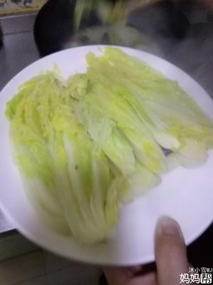

# 上湯娃娃菜 (Poached Baby Cabbage in Supreme Broth)

## 📋 基本資訊 / Recipe Overview
- **料理名稱 (繁體)**：上湯娃娃菜
- **料理名称 (简体)**：上汤娃娃菜
- **English Title**：Baby Chinese Cabbage Poached in Vegetarian Supreme Broth
- **素食流派 / Diet**：全素 / 纯素 Vegan (纯净素 / 无五辛)
- **料理分類 / Category**：01-蔬菜本味类 / 粤式上汤 / 清雅素筵
- **份量 / Servings**：2-3 人份
- **準備時間 / Prep Time**：10 分鐘
- **烹飪時間 / Cook Time**：8 分鐘
- **總計耗時 / Total Time**：18 分鐘
- **來源 / Source**：现代中华素菜 Top 100 · [01-蔬菜本味类.md](../01-蔬菜本味类.md) 第 6 道

## 📖 菜品特色 / Description
娃娃菜剖开，菌菇上汤或清汤浸熟，鲜嫩多汁。

---

## 🌿 食材與調味清單 / Ingredients & Seasonings

### 主料
- 鲜嫩娃娃菜 3 棵（约 400g）
- 鲜香菇 2 朵（洗净切小丁）
- 蟹味菇 / 白玉菇 50g（切小段）
- 纯素炸豆皮 / 素火腿 30g（切小丁，增香增醇）
- 宁夏枸杞 15 粒（温水泡软）
- 生姜 2 片（切细丝）

### 纯素上汤调配
- 纯素高汤（黄豆芽玉米香菇昆布慢熬高汤） 400ml
- 植物油 1 汤匙（约 15ml）
- 食盐 1/2 茶匙（约 3g）
- 白胡椒粉 1/4 茶匙（约 1g，提鲜去寒关键）
- 芝麻香油 1/4 茶匙（约 1.5ml）
- 水淀粉 1 汤匙（玉米淀粉 1/2 茶匙 + 清水 1 汤匙，薄芡）

---

## 🍳 烹飪步驟 / Step-by-Step Cooking Steps

### 步骤 1：娃娃菜改刀与处理
1. 娃娃菜剥去外层老叶，洗净后每棵纵向对半剖开，再将每一半纵剖为二（每棵切成 4 瓣长条），保持根部相连不散落。
2. **根部划刀**：在较厚的根部轻轻划一浅刀，便于受热与上汤完全渗透。

### 步骤 2：慢煸菌菇熬制奶白鲜汤
1. 炒锅烧热，倒入 1 汤匙植物油，下姜丝、香菇丁、白玉菇丁与素炸豆皮丁。
2. 中小火煸炒 2 分钟，将菌菇中的香气彻底炒出、油脂呈金黄色。
3. 倒入准备好的纯素高汤 400ml，大火烧至沸腾，转中火加盖慢熬 3 分钟，使菌菇鲜味与豆皮油香充分融入汤中。

### 步骤 3：上汤浸煨娃娃菜
1. 将切好的娃娃菜整齐平铺放入沸腾的上汤中，用汤勺将热汤反复浇淋在菜心上。
2. 加盖，保持中小火煨煮 3-4 分钟，至娃娃菜软透呈半透明状且吸足汤汁。
3. 用筷子小心将娃娃菜捞出，整齐排入较深的盘中。

### 步骤 4：调味收汁与浇淋
1. 锅内保留的原上汤中加入食盐 1/2 茶匙、白胡椒粉 1/4 茶匙和泡软的枸杞。
2. 淋入 1 汤匙薄水淀粉轻轻搅匀，待汤汁微浓泛亮，滴入几滴芝麻香油。
3. 将鲜美上汤连同菌菇、豆皮丁与红艳枸杞均匀浇淋在娃娃菜上即可。

---

## 💡 大厨秘诀 / Chef's Tips

1. **菌菇油煸出素鲜**：香菇与白玉菇必须先经油脂煸炒出香味，再加汤熬煮，汤色醇厚鲜甜，无需味精鸡精。
2. **娃娃菜根部连而不断**：纵剖成条既美观又能让纤维吸收高汤，根部划刀保证受热均匀不生硬。
3. **白胡椒粉点睛提鲜**：少许白胡椒粉能暖胃驱寒，并使整道上汤鲜味层次大幅升华。

---
*食谱归档时间：2026-08-20 · 收录于 20260818-vegetarianism 本地菜谱库 (1Top 精选)*
