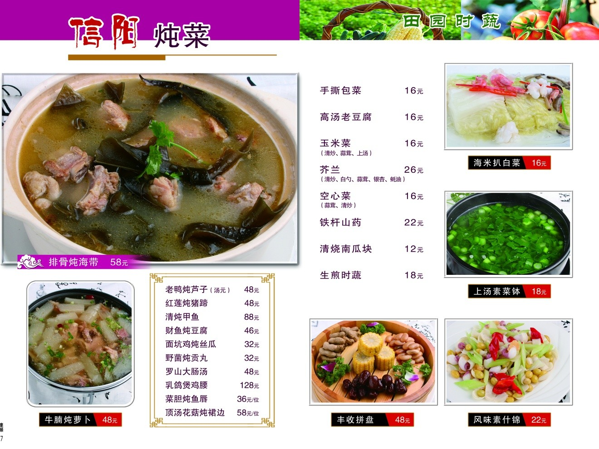

# 上汤浸时蔬 (Seasonal Greens Poached in Superior Vegetarian Broth)

## 📋 基本資訊 / Recipe Overview
- **料理名稱 (繁體)**：上湯浸時蔬
- **料理名称 (简体)**：上汤浸时蔬
- **English Title**：Seasonal Greens Poached in Superior Vegetarian Broth
- **素食流派 / Diet**：纯素 Vegan
- **料理分類 / Category**：01-蔬菜本味类 / 粤菜素席 / 上汤浸菜
- **份量 / Servings**：2-3 人份
- **準備時間 / Prep Time**：10 分鐘
- **烹飪時間 / Cook Time**：6 分鐘
- **總計耗時 / Total Time**：16 分鐘
- **來源 / Source**：现代中华素菜 Top 100 · [01-蔬菜本味类.md](../01-蔬菜本味类.md) 第 74 道

## 📖 菜品特色 / Description
时令菜浸上汤，粤式素席常见。

---

## 🌿 食材與調味清單 / Ingredients & Seasonings
### 主料（时令绿叶菜可选）
- 鲜嫩时令蔬菜 300g（如：豌豆尖、西洋菜、菜心、红苋菜、娃娃菜或菠菜）

### 素上汤醇香配料
- 鲜香菇 2 朵（洗净切小丁）
- 优质素火腿 / 杏鲍菇 30g（切小丁）
- 炸金黄蒜子 5-6 粒（整粒大蒜炸至金黄；纯净素换金花菜/鲜姜粒）
- 宁夏红枸杞 15 粒（温水泡发）
- 熟白果（银杏果，选配） 6 粒

### 素上汤底与调料
- 优质素高汤 400ml（由黄豆芽、干香菇、玉米、胡萝卜慢熬出的鲜汤）
- 烹调植物油 1 汤匙（约 15ml）
- 食盐 1/2 茶匙（约 3g）
- 白胡椒粉 1/4 茶匙（约 1g，去寒增香提鲜）
- 白砂糖 1/4 茶匙（约 1g）
- 纯正芝麻香油 1/2 茶匙（约 2.5ml）

---

## 🍳 烹飪步驟 / Step-by-Step Cooking Steps
### 步骤 1：时蔬清洗与预备
1. 时蔬择取最嫩茎叶，清洗干净彻底沥干。
2. 若选用质地较厚的菜心或娃娃菜，可在沸水油盐中先飞水 30 秒码入大汤碗中；若为极嫩豆苗或苋菜，可留待直接入上汤浸熟。

### 步骤 2：爆香菌菇与金蒜
1. 炒锅烧热下 1 汤匙油，下香菇丁、素火腿丁（或杏鲍菇丁）和炸金黄蒜子。
2. 中小火慢煸 1 分钟，爆出浓郁菌菇鲜香与蒜香。

### 步骤 3：滚煮金黄素上汤
1. 倒入 400ml 优质素高汤，转大火煮沸。
2. 保持中火滚煮 2-3 分钟，使菌菇与金蒜的精华彻底乳化融入汤中，汤色金黄醇厚。

### 步骤 4：调味与时蔬浸熟（“浸”字诀）
1. 加入 **食盐 1/2 茶匙**、**白胡椒粉 1/4 茶匙** 与 **白糖 1/4 茶匙**。
2. 倒入洗净的时蔬、泡发枸杞与熟白果，保持微沸中火浸煮 45-60 秒，至时蔬吸足上汤鲜美且保持翠绿。

### 步骤 5：出锅装碗
1. 先用筷子将时蔬捞出整齐盛入大汤碗中央。
2. 将锅内金黄菌菇粒、金蒜、枸杞及滚烫鲜美上汤浇入碗中，淋入几滴香油即成。

---

## 💡 大厨秘诀 / Chef's Tips
1. **金蒜与菌菇熬出素上汤精髓**：粤式上汤传统用金银蛋与老母鸡火腿，素菜大师以“炸金黄蒜子+香菇丁+素高汤”滚煮，汤色同样金黄乳润、醇厚回甘。
2. **“浸”熟而非久煮**：时蔬入汤后切忌久煮，以微滚上汤在 1 分钟内“浸熟”，方能叶绿挺拔、爽脆多汁。
3. **枸杞后放汤清亮**：枸杞在最后半分钟下锅，避免久煮破皮导致上汤变浑红。

---
*食谱归档时间：2026-08-20 · 收录于 20260818-vegetarianism 本地菜谱库 (1Top 精选)*
