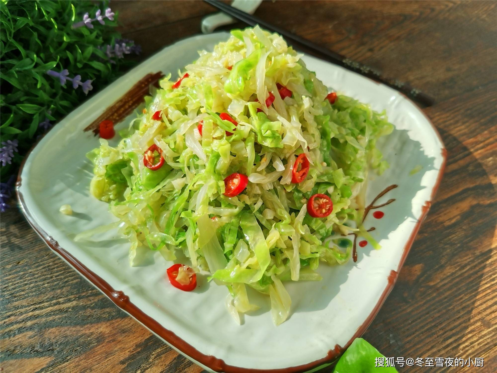

# 凉拌包菜丝 (Crispy Shredded Cabbage Salad)

## 📋 基本資訊 / Recipe Overview
- **料理名稱 (繁體)**：涼拌包菜絲
- **料理名称 (简体)**：凉拌包菜丝
- **English Title**：Crispy Shredded Cabbage Salad (Sweet, Sour & Spicy)
- **素食流派 / Diet**：全素 / 纯素 Vegan (含蒜、花椒、干辣椒；可去蒜做纯净素)
- **料理分類 / Category**：01-蔬菜本味类 / 经典凉菜 / 酸辣爽脆
- **份量 / Servings**：2-3 人份
- **準備時間 / Prep Time**：15 分鐘 (含盐渍杀水时间)
- **烹飪時間 / Cook Time**：2 分鐘 (热油激香)
- **總計耗時 / Total Time**：17 分鐘
- **來源 / Source**：现代中华素菜 Top 100 · [01-蔬菜本味类.md](../01-蔬菜本味类.md) 第 96 道

## 📖 菜品特色 / Description
包菜丝醋糖辣椒凉拌。经少许盐渍杀水挤干，热油激香干椒花椒蒜末，酸甜微辣，口感嘎嘣脆爽。

---

## 🌿 食材與調味清單 / Ingredients & Seasonings

### 主料
- 鲜嫩圆白菜 / 牛心包菜 350g
- 大蒜 3 瓣（剁成细碎蒜末）
- 干红辣椒 3 个（剪成细丝，抖去籽）
- 青花椒 / 红花椒 10-15 粒
- 熟白芝麻 1 茶匙（约 3g）

### 盐渍杀水用料
- 食盐 1 茶匙（约 5g，用于腌渍出水脱生）

### 经典酸甜凉拌汁配方
- 镇江香醋 / 纯酿陈醋 1.5 汤匙（约 22ml）
- 优质生抽 1 汤匙（约 15ml）
- 白砂糖 1 汤匙（约 12g）
- 芝麻香油 1/2 茶匙（约 2.5ml）

### 泼香热油
- 食用植物油 2 汤匙（约 30ml）

---

## 🍳 烹飪步驟 / Step-by-Step Cooking Steps

### 步骤 1：切细丝与盐渍杀水（脆爽核心）
1. 包菜洗净彻底沥干，对半切开挖去硬梗，卷紧切成约 0.2 厘米宽的均匀细丝。
2. 将包菜丝放入大盆中，撒入 **1 茶匙食盐** 抓拌均匀，静置腌制 8-10 分钟，使包菜丝出水变软脱生。

### 步骤 2：用力挤干水分
1. 用双手分批抓起包菜丝，用力挤干挤透多余的盐水水分。
2. 将挤干的包菜丝抖散，放入干净的拌菜大碗中（此时包菜丝质地极紧密爽脆）。

### 步骤 3：堆放调料与香料
1. 将剁好的蒜末、干辣椒丝、花椒粒与熟白芝麻堆在包菜丝正上方中央。

### 步骤 4：热油泼香激发香气
1. 小锅倒入 2 汤匙植物油，烧至 7 成热（冒青烟）。
2. 迅速将滚烫热油淋在干辣椒丝、蒜末与花椒上，“嗞啦”激发出扑鼻麻辣蒜香。

### 步骤 5：调味拌匀装盘
1. 趁热加入 **香醋 1.5 汤匙**、**生抽 1 汤匙**、**白糖 1 汤匙** 和 **香油 1/2 茶匙**。
2. 用筷子充分抓拌均匀，静置 3-5 分钟让风味渗透，装盘即可享用。

---

## 💡 大厨秘诀 / Chef's Tips

1. **盐渍挤干不焯水**：包菜焯水极易软塌无骨；用盐腌渍 10 分钟杀出水分再用力挤干，不仅能去除生涩气，还能打造“嘎嘣脆”的绝妙口感。
2. **热油激香去生辛**：滚油直接泼在干辣椒丝和蒜末上，能瞬间熟化香料，使麻辣蒜香深度融入拌汁。
3. **黄金糖醋比**：1.5 汤匙香醋配 1 汤匙白糖，酸甜适口、爽脆解腻。

---
*食谱归档时间：2026-08-20 · 收录于 20260818-vegetarianism 本地菜谱库 (1Top 精选)*
