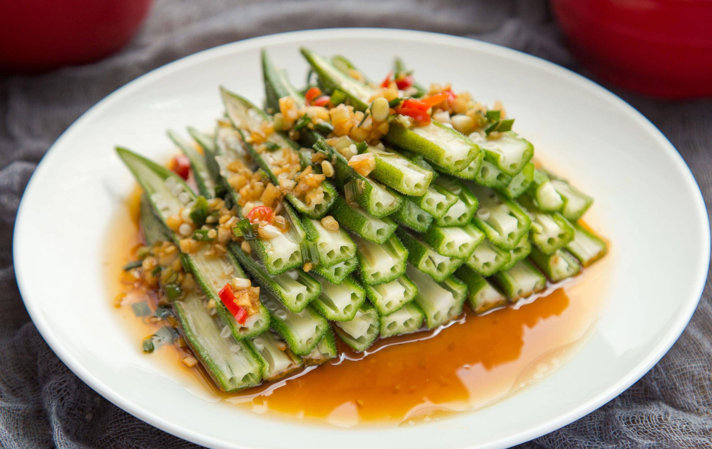

# 凉拌秋葵 (Chilled Okra Salad with Garlic Dressing)

## 📋 基本資訊 / Recipe Overview
- **料理名稱 (繁體)**：涼拌秋葵
- **料理名称 (简体)**：凉拌秋葵
- **English Title**：Chilled Okra Salad with Garlic Dressing
- **素食流派 / Diet**：全素 / 纯素 Vegan (含大蒜；五辛素，可去蒜改纯素)
- **料理分類 / Category**：01-蔬菜本味类 / 夏日凉菜 / 清爽低脂
- **份量 / Servings**：2-3 人份
- **準備時間 / Prep Time**：8 分鐘
- **烹飪時間 / Cook Time**：2 分鐘
- **總計耗時 / Total Time**：10 分鐘
- **來源 / Source**：现代中华素菜 Top 100 · [01-蔬菜本味类.md](../01-蔬菜本味类.md) 第 58 道

## 📖 菜品特色 / Description
焯水蒜蓉，清爽。整根秋葵焯透冰镇，剖半摆盘，淋上蒜蓉生抽香油热油调和汁，翠绿鲜亮，脆爽滑润，夏日开胃第一品。

---

## 🌿 食材與調味清單 / Ingredients & Seasonings

### 主料
- 新鲜嫩秋葵 300g
- 大蒜 5-6 瓣（剁成细蒜末）
- 小米辣 / 红椒 1 根（切小圈）

### 焯水调料
- 食盐 1/2 茶匙
- 食用油 1/2 汤匙

### 灵魂凉拌酱汁
- 优质生抽 2 汤匙（约 30ml）
- 优质香醋 / 陈醋 1 汤匙（约 15ml）
- 白砂糖 1/2 茶匙（约 2.5g）
- 素蚝油 1 茶匙（约 5ml）
- 纯芝麻香油 1 茶匙（约 5ml）
- 食用油 1 汤匙（约 15ml，泼油激香用）

---

## 🍳 烹飪步驟 / Step-by-Step Cooking Steps

### 步骤 1：整根焯水与冰水浸透
1. 秋葵用淡盐水轻搓洗净，保留完整形态不切蒂。
2. 沸水锅中加入 1/2 茶匙盐和少许油，整根秋葵下锅大火焯烫 1.5-2 分钟。
3. 捞出迅速投入冰水中浸泡冷却 3 分钟，彻底降温保持脆嫩。

### 步骤 2：改刀摆盘
1. 捞出秋葵沥干水分，切去顶端蒂头。
2. 从中间纵向一分为二剖开，截面朝上整齐码排在长盘中。

### 步骤 3：热油激蒜与调汁
1. 将剁好的蒜末和辣椒圈放入小耐热碗中。
2. 锅中烧热 1 汤匙食用油至微冒青烟，浇淋在蒜末辣椒上激发出扑鼻蒜香。
3. 碗中继续加入生抽 2 汤匙、香醋 1 汤匙、白糖 1/2 茶匙、素蚝油 1 茶匙与香油 1 茶匙，搅拌至白糖融化。

### 步骤 4：淋汁成菜
1. 将调好的蒜香酸甜味汁均匀浇淋在剖开的秋葵上，即可上桌享用。

---

## 💡 大厨秘诀 / Chef's Tips

1. **整根焯透再对半切**：整根焯水锁住黏液营养，冷却后纵向剖半能让果肉切面最大限度吸饱调味汁。
2. **冰镇急冷锁住碧绿**：冰水阻断余热，令秋葵表皮紧实清脆，防止放置发暗变软。
3. **香醋中和滑腻感**：调汁中加入适度香醋，酸香开胃，与秋葵天然黏滑果胶形成美妙的口感平衡。

---
*食谱归档时间：2026-08-20 · 收录于 20260818-vegetarianism 本地菜谱库 (1Top 精选)*
