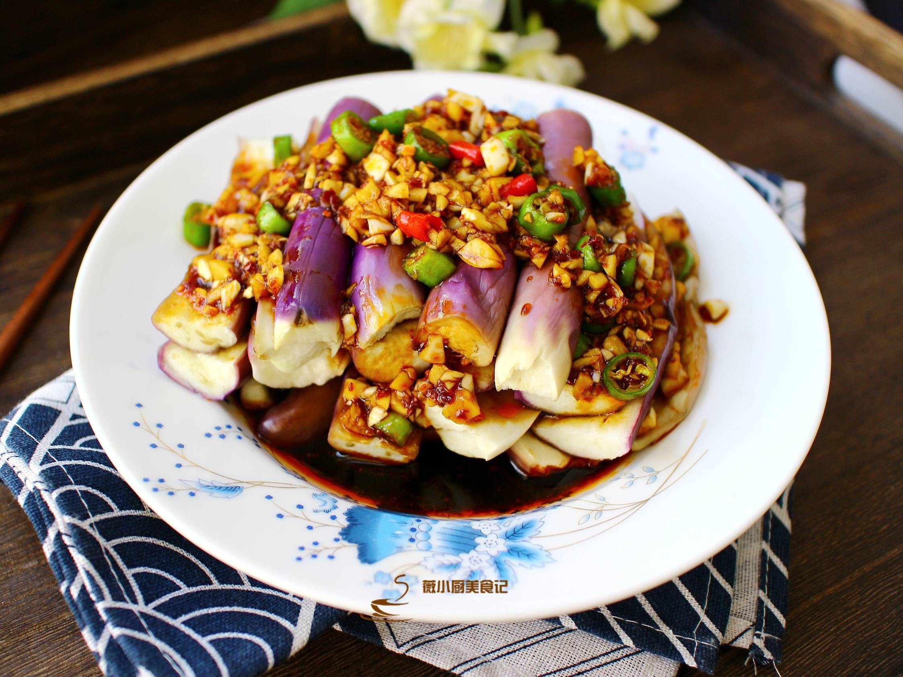

# 涼拌茄子 (Chinese Shredded Eggplant Salad)

## 📋 基本資訊 / Recipe Overview
- **料理名稱 (繁體)**：涼拌茄子
- **料理名称 (简体)**：凉拌茄子
- **English Title**：Northern-Style Shredded Eggplant Salad with Garlic Chili Dressing
- **素食流派 / Diet**：全素 / 纯素 Vegan (含蒜、香油、辣椒油)
- **料理分類 / Category**：01-蔬菜本味类 / 传统凉菜 / 软嫩开胃
- **份量 / Servings**：2-3 人份
- **準備時間 / Prep Time**：8 分鐘
- **烹飪時間 / Cook Time**：10 分鐘
- **總計耗時 / Total Time**：18 分鐘
- **來源 / Source**：现代中华素菜 Top 100 · [01-蔬菜本味类.md](../01-蔬菜本味类.md) 第 35 道

## 📖 菜品特色 / Description
蒸或烤软撕条，蒜醋辣椒油，东北、华北凉菜。

---

## 🌿 食材與調味清單 / Ingredients & Seasonings

### 主料
- 紫圆茄或长茄 2 根（约 450g）
- 新鲜大蒜 6 瓣（捣碎成蒜泥）
- 鲜青红尖椒 各半个（切细圈增脆微辣）
- 香菜 2 株（切小段）

### 北方经典拌汁
- 优质生抽 2 汤匙（约 30ml）
- 镇江陈醋 / 米醋 1.5 汤匙（约 22.5ml）
- 纯芝麻香油 1 汤匙（约 15ml）
- 油泼辣子 / 红油 1 汤匙（约 15ml）
- 食盐 1/2 茶匙（约 2.5g）
- 白糖 1/2 茶匙（约 2.5g）
- 炒熟花生碎（选配） 1 汤匙（增添坚果香脆）

---

## 🍳 烹飪步驟 / Step-by-Step Cooking Steps

### 步骤 1：蒸熟与彻底凉透
1. 茄子去蒂洗净，剖成厚瓣，大火水开后上蒸锅蒸 8-10 分钟至完全软透。
2. 取出茄子，倒掉盘底水分，放在通风处自然放凉（或放入冰箱冷藏 15 分钟使其爽口冰凉）。

### 步骤 2：手撕成条与挤压多余蒸馏水
1. 待茄子完全凉透后，用手顺着纤维撕成 1 厘米宽的长条。
2. 轻轻用双手按压挤出多余水分（挤干水分才能吸饱凉拌浓汁，入口浓郁而不寡淡水稀）。

### 步骤 3：调配味汁与泼香
1. 在大碗中放入手撕茄条、蒜泥、青红椒圈和香菜段。
2. 碗中加入生抽 2 汤匙、陈醋 1.5 汤匙、白糖 1/2 茶匙、食盐 1/2 茶匙、红油辣子和芝麻香油。
3. 戴上手套抓拌均匀，撒上熟花生碎即可上桌。

---

## 💡 大厨秘诀 / Chef's Tips

1. **手撕比刀切更挂汁**：手撕保留了茄肉纤维的毛羽状边缘，调料汁能紧紧吸附在上面。
2. **轻挤水分是入味关键**：蒸茄子内部含大量冷凝水，若不挤出，料汁一倒进去就被稀释变淡；挤水后吸汁饱满，口口爆汁。
3. **冰镇后拌食风味最佳**：将蒸好的茄条冷藏冰镇后再拌，软糯中带丝丝清凉，蒜香与红油碰撞，夏日第一开胃。

---
*食谱归档时间：2026-08-20 · 收录于 20260818-vegetarianism 本地菜谱库 (1Top 精选)*
