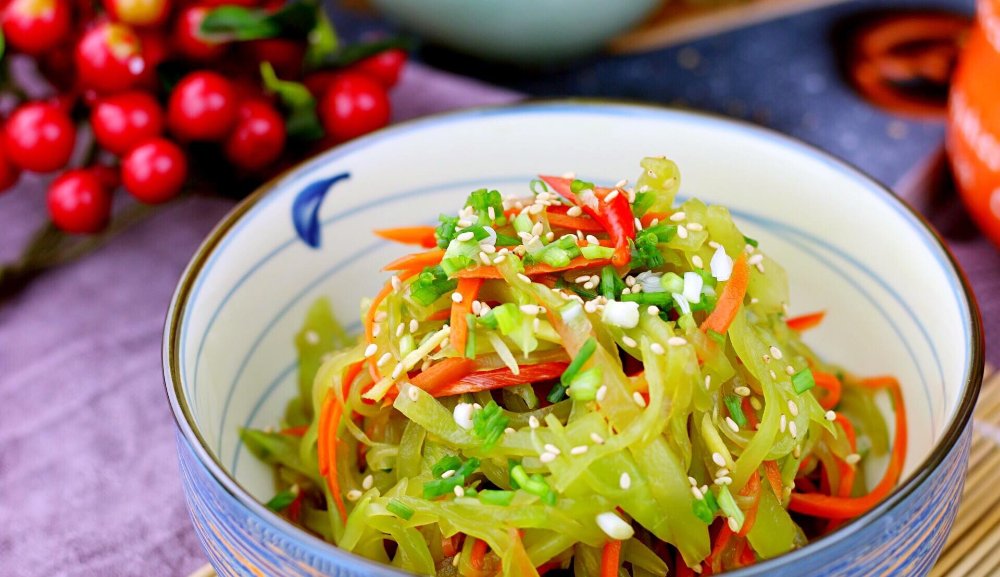

# 凉拌莴笋 (Chilled Crispy Celtuce Salad with Garlic and Sesame Oil)

## 📋 基本資訊 / Recipe Overview
- **料理名稱 (繁體)**：涼拌萵筍
- **料理名称 (简体)**：凉拌莴笋
- **English Title**：Chilled Crispy Celtuce Salad with Garlic and Sesame Oil
- **素食流派 / Diet**：全素 / 纯素 Vegan (含大蒜；五辛素，可去蒜改纯净素)
- **料理分類 / Category**：01-蔬菜本味类 / 夏日凉菜 / 清爽脆嫩
- **份量 / Servings**：2-3 人份
- **準備時間 / Prep Time**：15 分鐘
- **烹飪時間 / Cook Time**：1 分鐘 (热油激香)
- **總計耗時 / Total Time**：16 分鐘
- **來源 / Source**：现代中华素菜 Top 100 · [01-蔬菜本味类.md](../01-蔬菜本味类.md) 第 49 道

## 📖 菜品特色 / Description
盐醋蒜香油，夏天凉菜。莴笋切丝或薄片，经过腌制脱水与冰镇，拌入蒜香红油或香油醋汁，清凉解腻，脆爽开胃。

---

## 🌿 食材與調味清單 / Ingredients & Seasonings

### 主料
- 鲜嫩莴笋 1 根（去皮后约 300g）
- 大蒜 3 瓣（压成细腻蒜泥）
- 红椒 1/4 个（切极细丝点缀）

### 腌制杀水
- 食盐 1/2 茶匙（约 3g）

### 调味汁配方
- 优质香醋 / 米醋 1 汤匙（约 15ml）
- 优质生抽 1 茶匙（约 5ml）
- 白砂糖 1/2 茶匙（约 2.5g）
- 食盐 1/4 茶匙（约 1.5g）
- 纯芝麻香油 1 汤匙（约 15ml）
- 花椒油 1/2 茶匙（选配，增麻香）
- 食用油 1 汤匙（热油泼蒜用）

---

## 🍳 烹飪步驟 / Step-by-Step Cooking Steps

### 步骤 1：去皮切丝
1. 莴笋深层去皮，洗净后切成约 6-7cm 长的均匀细丝（亦可切成薄连刀片）。
2. 红椒切细丝；大蒜捣成蒜泥。

### 步骤 2：盐腌杀水与冰镇
1. 莴笋丝装入大碗，撒入 1/2 茶匙食盐抓拌均匀，腌制 10 分钟使莴笋丝出水变软。
2. 用凉开水漂洗去盐分，放入冰水中浸泡 3-5 分钟（冰水刺激让莴笋丝迅速紧致爽脆）。
3. 捞出莴笋丝，用干净纱布或厨房纸彻底挤干水分。

### 步骤 3：堆蒜泼油
1. 挤干的莴笋丝整齐放入盘中，顶上码放蒜泥与红椒丝。
2. 锅中烧热 1 汤匙植物油至微冒青烟，迅速泼在蒜泥上，“嗞啦”一声激发出浓厚熟蒜香。

### 步骤 4：浇汁拌匀
1. 小碗中混合香醋、生抽、白糖、调味盐、香油与花椒油，搅拌至糖盐融化。
2. 将调味汁均匀浇在莴笋丝上，食用前充分拌匀即可。

---

## 💡 大厨秘诀 / Chef's Tips

1. **盐腌+冰镇双重脆爽法**：盐腌脱去苦涩水分，冰镇激发物理脆性，做出如海蜇丝般脆嫩嘎嘣脆的口感。
2. **务必彻底挤干水分**：水分未挤干会导致调味汁被稀释，挂不住味道且口感水塌。
3. **热油泼蒜泥**：生蒜泥经滚烫热油激淋，辛辣冲鼻转化为醇和蒜香，与香醋和香油完美融合。

---
*食谱归档时间：2026-08-20 · 收录于 20260818-vegetarianism 本地菜谱库 (1Top 精选)*
