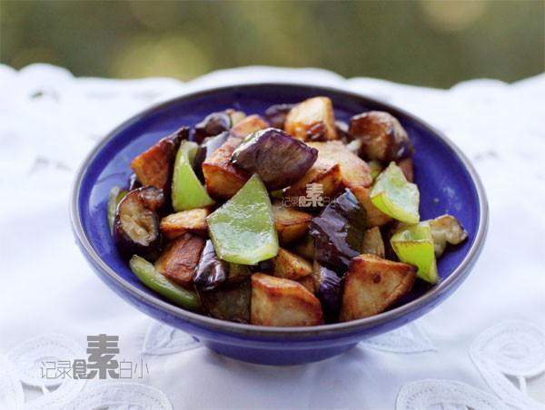

# 地三鮮 (Di San Xian / Stir-Fried Potato, Eggplant and Pepper)

## 📋 基本資訊 / Recipe Overview
- **料理名稱 (繁體)**：地三鮮
- **料理名称 (简体)**：地三鲜
- **English Title**：Di San Xian (Stir-Fried Potato, Eggplant and Green Pepper)
- **素食流派 / Diet**：全素 / 纯素 Vegan (含大蒜；可去蒜做纯净素)
- **料理分類 / Category**：01-蔬菜本味类 / 东北名菜 / 咸鲜浓郁
- **份量 / Servings**：2-3 人份
- **準備時間 / Prep Time**：12 分鐘
- **烹飪時間 / Cook Time**：10 分鐘
- **總計耗時 / Total Time**：22 分鐘
- **來源 / Source**：现代中华素菜 Top 100 · [01-蔬菜本味类.md](../01-蔬菜本味类.md) 第 32 道

## 📖 菜品特色 / Description
东北国民菜。茄、土豆、青椒过油再酱炒，外酥里嫩咸鲜回甜。

---

## 🌿 食材與調味清單 / Ingredients & Seasonings

### 主料（地里三宝）
- 黄心土豆 1 个（约 200g，去皮切滚刀块）
- 紫圆茄或长茄 1 根（约 250g，带皮切滚刀块）
- 绿尖椒或青圆椒 1 个（约 100g，手掰成小块）
- 大蒜 6-8 瓣（剁碎，分两次使用）
- 大葱花 1 汤匙
- 玉米淀粉（裹茄子） 2 汤匙

### 东北老式碗汁
- 优质生抽 2 汤匙（约 30ml）
- 优质老抽 1/2 汤匙（约 7.5ml，上诱人酱色）
- 素蚝油 1 汤匙（约 15ml）
- 白糖 1 汤匙（约 15g，咸鲜回甜灵魂）
- 食盐 1/2 茶匙（约 2.5g）
- 玉米淀粉 1 茶匙（约 5g）
- 清水 / 素高汤 5 汤匙（约 75ml）

### 烹调用油
- 食用植物油 适量（家庭可采用少油半煎炸法）

---

## 🍳 烹飪步驟 / Step-by-Step Cooking Steps

### 步骤 1：三鲜改刀与茄子拍粉
1. 土豆切滚刀块洗去表面淀粉沥干；青椒手掰成块；茄子切滚刀块，表面喷少许清水，裹上 2 汤匙干玉米淀粉拌匀。

### 步骤 2：分步煎炸成熟
1. 锅中倒入适量食用油烧至 6 成热。
2. **先炸土豆**：下入土豆块，中小火慢煎炸至表面金黄酥脆、内芯软面熟透（约 4 分钟），捞出控油。
3. **次炸茄子**：油温升至 7 成热，下入裹粉茄子，大火快炸至外壳焦黄硬挺（约 2 分钟），捞出控油。
4. **过青椒**：下入青椒块滑油 10 秒钟，断生变翠绿立即捞出。

### 步骤 3：爆香与调味翻炒
1. 锅内留底油 1 汤匙，下入葱花和一半蒜末爆出浓郁香味。
2. 将调好的东北老式碗汁搅拌均匀倒入锅中，大火烧开至汤汁冒大泡变浓稠。

### 步骤 4：合锅裹汁与出锅蒜
1. 迅速将控干油的土豆、茄子、青椒同时倒入锅中。
2. 大火快速颠锅翻炒 15-20 秒，让浓亮酱汁均匀包裹每一块食材。
3. 撒入剩余的生蒜末，颠炒 5 秒激出蒜香，即可出锅装盘。

---

## 💡 大厨秘诀 / Chef's Tips

1. **三鲜熟度各不同，分批过油**：土豆不易熟需中小火慢炸至透；茄子裹淀粉高油温快炸外酥里嫩；青椒过油数秒即可保脆绿。
2. **酱汁先调浓稠再下菜**：先将芡汁烧至黏稠发亮再下入炸好的食材，快速包裹翻炒，能最大程度保持外皮的焦酥感，不致软塌。
3. **出锅生蒜是东北菜灵魂**：起锅前撒入大量生蒜末，借酱汁余热爆出浓烈蒜香，咸鲜回甘，下饭一绝。

---
*食谱归档时间：2026-08-20 · 收录于 20260818-vegetarianism 本地菜谱库 (1Top 精选)*
