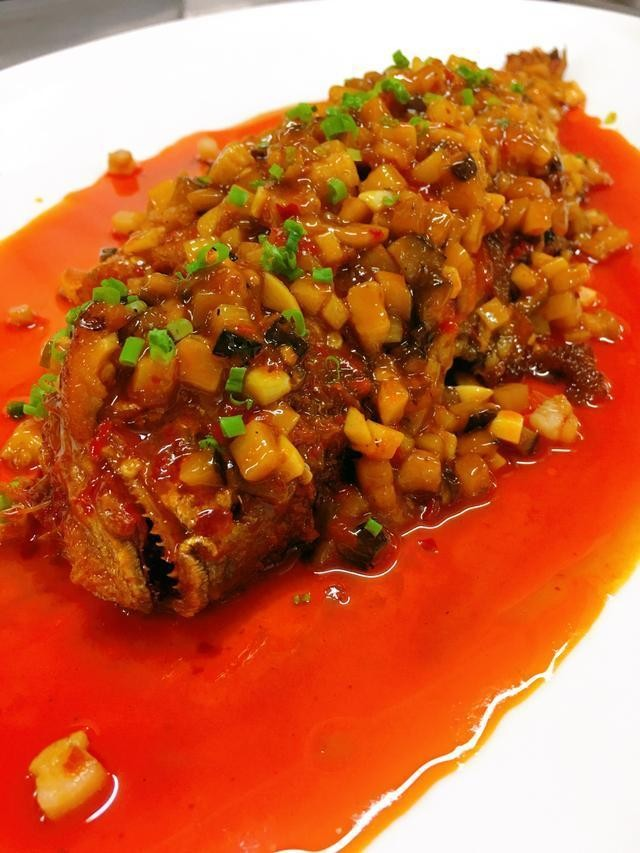

# 干烧冬笋 (Dry-Braised Winter Bamboo Shoots)

## 📋 基本資訊 / Recipe Overview
- **料理名稱 (繁體)**：乾燒冬筍
- **料理名称 (简体)**：干烧冬笋
- **English Title**：Dry-Braised Winter Bamboo Shoots
- **素食流派 / Diet**：全素 / 纯素 Vegan (五辛素/纯净素通用，含姜)
- **料理分類 / Category**：01-蔬菜本味类 / 浙派山珍 / 干烧名菜
- **份量 / Servings**：2-3 人份
- **準備時間 / Prep Time**：10 分鐘
- **烹飪時間 / Cook Time**：15 分鐘
- **總計耗時 / Total Time**：25 分鐘
- **來源 / Source**：现代中华素菜 Top 100 · [01-蔬菜本味类.md](../01-蔬菜本味类.md) 第 52 道

## 📖 菜品特色 / Description
浙菜山珍素菜，冬笋干烧鲜香浓郁。冬笋肉厚质细，经过煸炸后配以冬菇粒、素高汤小火干烧至汤汁完全被冬笋吸尽，汁干亮油，鲜美异常。

---

## 🌿 食材與調味清單 / Ingredients & Seasonings

### 主料
- 新鲜冬笋 450g
- 水发优质冬菇（香菇） 3 朵（切小丁）
- 熟榨菜丁 20g（增鲜咸爽）
- 红彩椒丁 15g（配色）
- 生姜末 10g

### 调味料
- 食用植物油 3 汤匙（约 45ml）
- 优质生抽 1.5 汤匙（约 22ml）
- 老抽 1/2 茶匙（约 2.5ml，调色）
- 白砂糖 1 汤匙（约 15g）
- 绍兴花雕酒 1 汤匙（约 15ml）
- 纯素高汤 / 香菇水 150ml
- 芝麻香油 1 茶匙（约 5ml）

---

## 🍳 烹飪步驟 / Step-by-Step Cooking Steps

### 步骤 1：冬笋改刀与焯水
1. 冬笋去壳削尽硬皮，切成 1cm 见方的小丁（或梳子片）。
2. 沸水中加 1 茶匙食盐，放入冬笋丁焯煮 3 分钟去除草酸涩味，捞出沥干。

### 步骤 2：滑油煸黄
1. 锅中倒入宽油烧至六成热，倒入冬笋丁中火煸炸 2-3 分钟，至笋丁表面微呈金黄脆壳，捞出沥油。

### 步骤 3：炒香配料底汁
1. 锅内留底油，下入姜末、冬菇丁、榨菜丁小火煸炒出浓郁香气。
2. 下入冬笋丁，沿锅边烹入 1 汤匙花雕酒，加入生抽 1.5 汤匙、老抽 1/2 茶匙与白糖 1 汤匙翻炒均匀。

### 步骤 4：小火干烧煨汁
1. 倒入素高汤（或泡香菇沉淀后的清香菇水） 150ml，大火烧开。
2. 转小火加盖煨煮 8 分钟，使高汤与香菇、榨菜的复合鲜味充分浸入冬笋肉中。

### 步骤 5：大火干烧至“汁尽油清”
1. 揭盖转大火收汁，不断翻铲至汤汁完全被冬笋吸干，锅内只剩清亮红油包裹食材。
2. 撒入红椒丁，淋入 1 茶匙香油翻匀，出锅装盘。

---

## 💡 大厨秘诀 / Chef's Tips

1. **干烧的最高境界“汁尽油清”**：不勾水芡，通过慢煨让冬笋把高汤鲜汁全部吃透，最后大火收干水分只留明亮油脂裹住食材。
2. **煸炸起壳更易吸汁**：冬笋先经油煸炸出金黄硬壳，内部孔隙张开，回锅干烧时能如海绵般吸饱鲜汁。
3. **冬菇榨菜复合提鲜**：香菇的天然鸟苷酸与榨菜的发酵鲜咸互相衬托，让纯素冬笋具有堪比山珍肉味的浓郁风味。

---
*食谱归档时间：2026-08-20 · 收录于 20260818-vegetarianism 本地菜谱库 (1Top 精选)*
