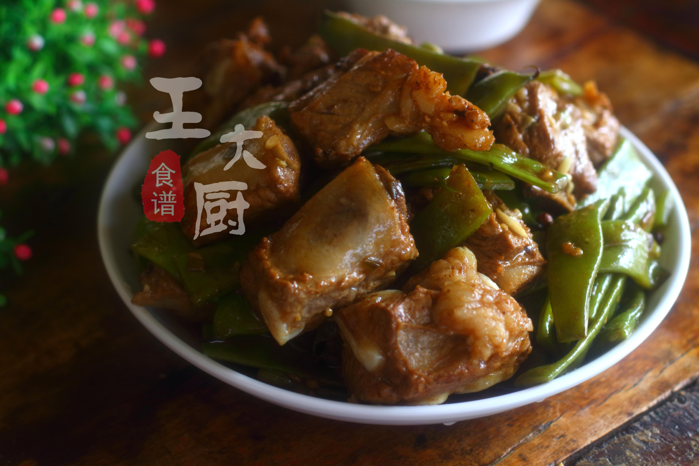

# 乾煸豇豆 (Dry-Fried Long Beans / Yardlong Beans)

## 📋 基本資訊 / Recipe Overview
- **料理名稱 (繁體)**：乾煸豇豆
- **料理名称 (简体)**：干煸豇豆
- **English Title**：Sichuan Dry-Fried Chinese Long Beans with Yibin Yacai
- **素食流派 / Diet**：全素 / 纯素 Vegan (含蒜五辛素；可依戒律去蒜做纯净素)
- **料理分類 / Category**：01-蔬菜本味类 / 川味经典 / 下饭神菜
- **份量 / Servings**：2-3 人份
- **準備時間 / Prep Time**：8 分鐘
- **烹飪時間 / Cook Time**：10 分鐘
- **總計耗時 / Total Time**：18 分鐘
- **來源 / Source**：现代中华素菜 Top 100 · [01-蔬菜本味类.md](../01-蔬菜本味类.md) 第 13 道

## 📖 菜品特色 / Description
长豇豆煸皱，可加芽菜或干椒，川式干香。

---

## 🌿 食材與調味清單 / Ingredients & Seasonings

### 主料
- 新鲜嫩长豇豆（长豆角） 400g
- 宜宾碎米芽菜 35g
- 大蒜 4 瓣（切蒜末）
- 生姜末 5g
- 干红辣椒 4-5 个（剪段去籽）
- 大红袍花椒 12 粒

### 调味料
- 食用植物油 2.5-3 汤匙（约 40ml）
- 优质生抽 1 汤匙（约 15ml）
- 白砂糖 1/3 茶匙（约 1.5g）
- 食盐 1/4 茶匙（约 1.5g）
- 陈醋 1/4 茶匙（锅边提香）
- 芝麻香油 1/2 茶匙（约 2.5ml）

---

## 🍳 烹飪步驟 / Step-by-Step Cooking Steps

### 步骤 1：豇豆精细处理
1. 长豇豆洗净，掐去头尾，彻底用干布擦干表面水分。
2. 切成 5-6cm 长的长段备用。

### 步骤 2：慢火油煸起泡
1. 锅中倒入 2.5-3 汤匙植物油，油温 5 成热下入豇豆段。
2. 转中小火不断翻炒慢煸 6-8 分钟，使豇豆内部水分蒸发，表皮全部起虎皮泡皱、豆身完全变软发透。
3. 捞出豇豆控油沥干。

### 步骤 3：炒香芽菜麻辣料
1. 锅留底油 1 汤匙，小火下花椒和干辣椒段炸香。
2. 加入姜末、蒜末和碎米芽菜，慢炒 1 分钟炒散出咸鲜干香。

### 步骤 4：回锅合炒入味
1. 倒入煸透的豇豆，转大火颠翻炒匀。
2. 烹入生抽、白糖、食盐，沿锅边烹入几滴陈醋增香。
3. 保持大火快速干煸翻炒 20 秒，淋入香油翻匀出锅。

---

## 💡 大厨秘诀 / Chef's Tips

1. **油煸至起泡发白**：豇豆肉质紧实，慢煸至表皮起虎皮气泡，能浓缩豆香并带来软韧干香口感。
2. **擦干水分防溅防烂**：下锅前水分擦净，避免油温骤降变水煮。
3. **锅边烹少许陈醋**：出锅前烹入极少许陈醋能瞬间提升复合焦香，而不留酸味。

---
*食谱归档时间：2026-08-20 · 收录于 20260818-vegetarianism 本地菜谱库 (1Top 精选)*
