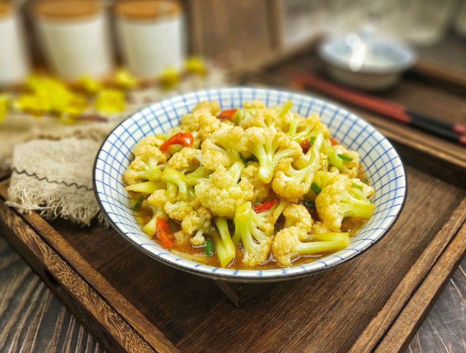

# 乾鍋花菜 (Dry Pot Organic Cauliflower)

## 📋 基本資訊 / Recipe Overview
- **料理名稱 (繁體)**：乾鍋花菜
- **料理名称 (简体)**：干锅花菜
- **English Title**：Sichuan-Hunan Dry Pot Organic Cauliflower with Chili and Garlic
- **素食流派 / Diet**：全素 / 纯素 Vegan (含干辣椒、花椒、大蒜、豆豉/豆瓣；可去五辛)
- **料理分類 / Category**：01-蔬菜本味类 / 湘川干锅 / 焦香爽脆
- **份量 / Servings**：2-3 人份
- **準備時間 / Prep Time**：8 分鐘
- **烹飪時間 / Cook Time**：6-8 分鐘
- **總計耗時 / Total Time**：15 分鐘
- **來源 / Source**：现代中华素菜 Top 100 · [01-蔬菜本味类.md](../01-蔬菜本味类.md) 第 40 道

## 📖 菜品特色 / Description
花菜煸香，干椒花椒，现代家常干香。

---

## 🌿 食材與調味清單 / Ingredients & Seasonings

### 主料
- 散花有机菜花（松花菜） 400g（梗长花散，口感最脆甜）
- 大蒜 5 瓣（切厚片）
- 生姜 1 小块（切姜片）
- 干红辣椒 8-10 根（剪段）
- 四川花椒粒 1 茶匙（约 3g）
- 鲜青红小辣椒 各 1 根（切斜圈配色增鲜辣）

### 秘制干锅酱汁
- 优质生抽 1.5 汤匙（约 22.5ml）
- 素蚝油 1 汤匙（约 15ml）
- 纯植物豆瓣酱 / 阳江豆豉 1/2 汤匙（约 7.5g）
- 白糖 1/2 茶匙（约 2.5g，提鲜和味）
- 香醋 1/2 茶匙（约 2.5ml，微量去涩增香）
- 食用油 2-3 汤匙（约 35ml）

---

## 🍳 烹飪步驟 / Step-by-Step Cooking Steps

### 步骤 1：有机花菜改刀与彻底控干
1. 挑选花球松散、长梗翠绿的有机菜花，顺着茎部分切成均匀的小朵，粗梗部分纵向剖开。
2. 放入淡盐水中浸泡 5 分钟洗净，捞出后**彻底甩干水分**（**绝对不要焯水**，焯水会吸水发软丧失脆度和焦香味）。

### 步骤 2：少油干煸出焦斑（干锅灵魂步）
1. 锅烧热倒入 1.5 汤匙食用油，下入控干的花菜。
2. 保持中大火不断翻炒煸烤 3-4 分钟，使花菜多余水汽蒸发，花朵和菜梗边缘煸出微微焦黄的焦斑、质地变脆韧（约七成熟），盛出备用。

### 步骤 3：小火爆香干锅香料
1. 原锅中再加 1 汤匙油，下入花椒粒、干红辣椒段、蒜片、姜片和豆豉/豆瓣酱。
2. 转小火慢炒出红亮油脂与浓烈香辣气味。

### 步骤 4：大火合炒裹汁
1. 倒入煸至微焦的花菜朵和青红椒圈，转大火快速合炒翻匀。
2. 顺锅边淋入生抽 1.5 汤匙、素蚝油 1 汤匙、白糖 1/2 茶匙与香醋 1/2 茶匙。
3. 最大火持续翻炒煸炒 1 分钟，让酱汁完全收干紧裹在花菜上，锅底干爽油亮，出锅倒入干锅保温盛器中享用。

---

## 💡 大厨秘诀 / Chef's Tips

1. **精选松花菜，拒绝焯水**：紧实白花菜水分多不易入味，松花菜梗长脆甜；直接下油锅干煸能激发出独特的焦香味，焯水则彻底破坏脆感。
2. **生煸焦斑是焦香来源**：耐心中火将菜花边缘煸出点点金黄焦斑，这是干锅菜“干香扑鼻”的核心技法。
3. **酱汁走锅边，干爽收汁**：调料必须趁锅极热时沿锅边淋入，利用锅温瞬间蒸发水分，留住浓香，干锅必须干爽无汤。

---
*食谱归档时间：2026-08-20 · 收录于 20260818-vegetarianism 本地菜谱库 (1Top 精选)*
