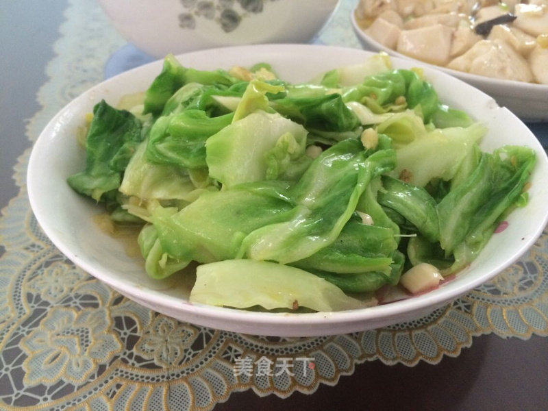

# 手撕包菜 (Hand-Torn Stir-Fried Cabbage)

## 📋 基本資訊 / Recipe Overview
- **料理名稱 (繁體)**：手撕包菜
- **料理名称 (简体)**：手撕包菜
- **English Title**：Hand-Torn Cabbage Stir-Fried with Dried Chilies and Sichuan Peppercorns
- **素食流派 / Diet**：全素 / 纯素 Vegan (含蒜五辛素；可依戒律去蒜做纯净素)
- **料理分類 / Category**：01-蔬菜本味类 / 川湘家常 / 旺火爆炒
- **份量 / Servings**：2-3 人份
- **準備時間 / Prep Time**：5 分鐘
- **烹飪時間 / Cook Time**：3 分鐘
- **總計耗時 / Total Time**：8 分鐘
- **來源 / Source**：现代中华素菜 Top 100 · [01-蔬菜本味类.md](../01-蔬菜本味类.md) 第 9 道

## 📖 菜品特色 / Description
包菜手撕，干辣椒蒜花椒爆香大火快炒，少许醋，脆嫩爽口。

---

## 🌿 食材與調味清單 / Ingredients & Seasonings

### 主料
- 卷心菜 / 圆白菜 / 扁包菜 400g
- 大蒜 4 瓣（切厚片）
- 干红辣椒 4-5 个（剪段去籽）
- 大红袍花椒 15 粒

### 调味汁料
- 食用植物油（加少许菜籽油更香） 2 汤匙（约 30ml）
- 优质生抽 1.5 汤匙（约 22ml）
- 陈醋 / 保宁醋 1 汤匙（约 15ml，锅边烹入）
- 白砂糖 1/3 茶匙（约 1.5g，提鲜中和焦辣）
- 食盐 1/2 茶匙（约 3g）
- 松茸鲜 / 素高汤粉 1/4 茶匙（约 1g）

---

## 🍳 烹飪步驟 / Step-by-Step Cooking Steps

### 步骤 1：手撕与极致沥水
1. 包菜去除根部硬芯，一片片剥下。
2. **纯手撕处理**：用手将包菜叶撕成 4-5cm 见方的大片（手撕断口不规则，比刀切更容易挂汁入味，且不会因金属刀口氧化发黑）。
3. 淘洗干净后，**必须用沥水篮或甩水器彻底甩干水分**（表面带水入锅会导致油温暴跌，瞬间变成“水煮菜”，软塌出水）。

### 步骤 2：热锅爆香花椒干椒
1. 炒锅大火烧热至微冒青烟，倒入 2 汤匙植物油。
2. 转小火，下入花椒粒和干辣椒段慢煸 10 秒至辣椒呈亮红微褐色、麻辣香气溢出（切勿炸焦）。
3. 下入蒜片大火爆香 5 秒。

### 步骤 3：大火猛炒压锅
1. 迅速将炉火调至**最大猛火**，下入全部沥干的包菜大片。
2. 保持大火，用锅铲快速翻炒并配合轻微压锅动作，让包菜紧贴高热锅壁快速吸油受热。
3. 猛烈翻炒 40-50 秒，直至包菜叶表面油亮、边缘微卷、呈半透明爽脆状。

### 步骤 4：烹醋调味与出锅
1. 迅速沿滚烫的锅边一圈淋入 1 汤匙陈醋与 1.5 汤匙生抽，瞬间激发出浓烈酱香与醋香。
2. 撒入食盐 1/2 茶匙、白糖 1/3 茶匙和松茸鲜粉。
3. 保持最大火猛力颠锅翻炒 10 秒，调料完全融合包裹即刻关火出锅。

---

## 💡 大厨秘诀 / Chef's Tips

1. **手撕不刀切**：手撕保留了植物纤维自然边缘，更容易锁住酱汁，口感清脆利落。
2. **沥水务必彻底**：包菜表面无多余生水是高温爆出“镬气”的绝对前提。
3. **全程猛火不停铲**：下锅到出锅控制在 1 分钟左右，包菜断生微卷即出，切忌加水加盖焖炒。

---
*食谱归档时间：2026-08-20 · 收录于 20260818-vegetarianism 本地菜谱库 (1Top 精选)*
