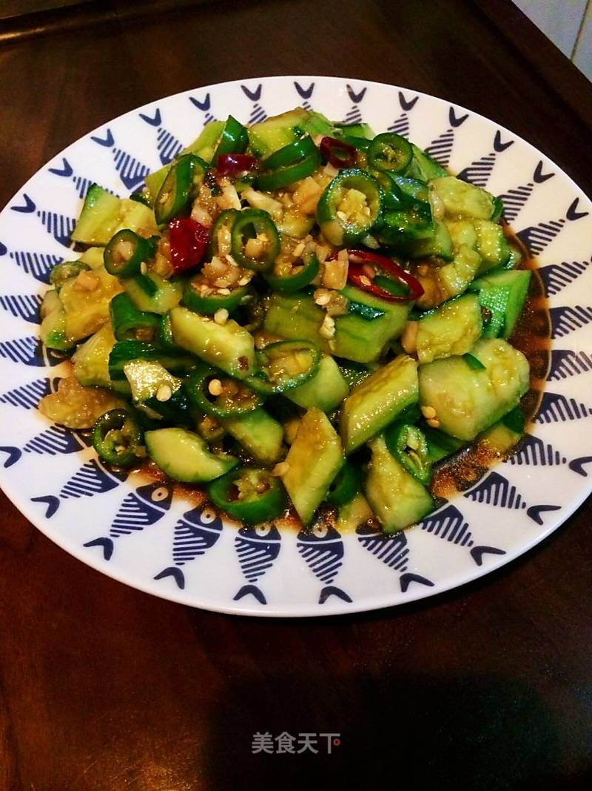

# 拍黃瓜 (Smashed Cucumber Salad / Pai Huang Gua)

## 📋 基本資訊 / Recipe Overview
- **料理名稱 (繁體)**：拍黃瓜
- **料理名称 (简体)**：拍黄瓜
- **English Title**：Classic Smashed Cucumber Salad with Garlic Vinegar Dressing
- **素食流派 / Diet**：全素 / 纯素 Vegan (含蒜；可去蒜做纯净素)
- **料理分類 / Category**：01-蔬菜本味类 / 夏日经典 / 爽口凉菜
- **份量 / Servings**：2-3 人份
- **準備時間 / Prep Time**：8 分鐘
- **烹飪時間 / Cook Time**：0 分鐘 (免开火)
- **總計耗時 / Total Time**：8 分鐘
- **來源 / Source**：现代中华素菜 Top 100 · [01-蔬菜本味类.md](../01-蔬菜本味类.md) 第 26 道

## 📖 菜品特色 / Description
夏天第一凉菜。拍裂腌水，蒜醋香油，可选辣椒油。

---

## 🌿 食材與調味清單 / Ingredients & Seasonings

### 主料
- 新鲜带刺黄瓜（旱黄瓜或水黄瓜） 2 根（约 400g）
- 大蒜 6-8 瓣（必须捣成细腻蒜泥）
- 香菜 2 株（切小段）
- 熟白芝麻 1 茶匙（点缀增香）

### 黄金调味汁配方
- 优质生抽 2 汤匙（约 30ml）
- 镇江香醋 / 陈醋 2 汤匙（约 30ml）
- 白糖 1 汤匙（约 12-15g，提鲜柔酸关键）
- 纯芝麻香油 1 汤匙（约 15ml）
- 红油辣椒 / 油泼辣子（选配） 1 汤匙（依个人口味增减）
- 食盐 1/2 茶匙（约 2.5g，用于杀水和调味）
- 花椒油 1/2 茶匙（约 2.5ml，增添微麻层次）

---

## 🍳 烹飪步驟 / Step-by-Step Cooking Steps

### 步骤 1：刀拍与改刀（入味核心）
1. 黄瓜洗净，切除头尾少许苦涩部分。
2. 将黄瓜平放在砧板上，用宽面菜刀平按在黄瓜上，手掌用力猛拍，将黄瓜整条拍裂拍松（**核心技巧**：拍裂产生不规则粗糙断口与毛细孔，吸汁能力是平切黄瓜的数倍）。
3. 将拍裂的黄瓜顺势斜刀切成 2-3 厘米的小块。

### 步骤 2：加盐杀水（脆爽不返水秘诀）
1. 将黄瓜块放入大碗中，撒入 **1/3 茶匙食盐**，轻轻抓拌均匀，静置 5 分钟。
2. 倒掉碗底腌出的多余涩水（此步可去除生涩味，使黄瓜肉质更紧实嘎嘣脆，拌好后长时间不吐水）。

### 步骤 3：捣蒜泥与调料汁
1. 大蒜剥皮放入石臼中捣成粘稠细腻的蒜泥（**秘诀**：捣成蒜泥比切蒜末风味更充分融合）。
2. 取小碗将生抽 2 汤匙、香醋 2 汤匙、白糖 1 汤匙、香油 1 汤匙、花椒油 1/2 茶匙及红油辣子充分搅拌至糖完全融化。

### 步骤 4：浇汁拌匀与装盘
1. 将蒜泥、香菜段、调好的料汁倒入黄瓜碗中。
2. 抓拌或颠拌均匀，撒上熟白芝麻即可装盘，冷藏冰镇 10 分钟口感更佳。

---

## 💡 大厨秘诀 / Chef's Tips

1. **必须“拍”不能“切”**：拍黄瓜破坏了细胞结构，断面粗糙不规则，能像海绵一样快速吸饱酸甜蒜香酱汁。
2. **轻腌倒掉涩水**：加少许盐腌 5 分钟倒掉生黄瓜水，不仅口感倍增爽脆，还能保证拌好后料汁不被稀释。
3. **大蒜捣泥胜于切碎**：蒜泥接触空气产生大蒜素，与醋、糖、香油乳化结合，形成浓郁醇厚的挂汁口感。

---
*食谱归档时间：2026-08-20 · 收录于 20260818-vegetarianism 本地菜谱库 (1Top 精选)*
