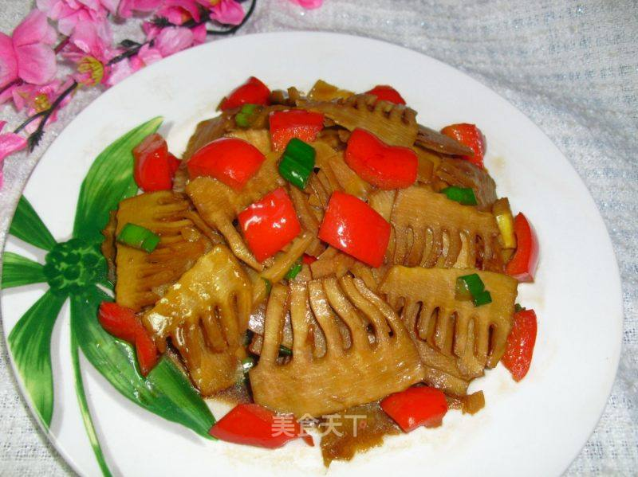

# 油焖春笋 (Hangzhou Braised Spring Bamboo Shoots)

## 📋 基本資訊 / Recipe Overview
- **料理名稱 (繁體)**：油燜春筍
- **料理名称 (简体)**：油焖春笋
- **English Title**：Hangzhou Braised Spring Bamboo Shoots
- **素食流派 / Diet**：纯素 Vegan (纯净素，无五辛)
- **料理分類 / Category**：01-蔬菜本味类 / 江南时令 / 经典名菜
- **份量 / Servings**：2-3 人份
- **準備時間 / Prep Time**：10 分鐘
- **烹飪時間 / Cook Time**：12 分鐘
- **總計耗時 / Total Time**：22 分鐘
- **來源 / Source**：现代中华素菜 Top 100 · [01-蔬菜本味类.md](../01-蔬菜本味类.md) 第 51 道

## 📖 菜品特色 / Description
春笋时令款，江南名素菜。“过把瘾”的江南春日极品，选用清明前后极嫩春笋，重油重糖焖透，红亮甘美，鲜嫩无渣。

---

## 🌿 食材與調味清單 / Ingredients & Seasonings

### 主料
- 新鲜春笋（雷笋或春笋尖） 500g

### 调味料
- 食用植物油 3 汤匙（约 45ml）
- 优质生抽 2 汤匙（约 30ml）
- 优质老抽 1 汤匙（约 15ml）
- 纯正冰糖 20g
- 绍兴黄酒 1 汤匙（约 15ml）
- 温水 / 清水 80ml
- 芝麻香油 1/2 茶匙（约 2.5ml）

---

## 🍳 烹飪步驟 / Step-by-Step Cooking Steps

### 步骤 1：春笋预处理
1. 春笋剥壳，切去老根，用刀背轻拍松动，切成 5cm 左右的长寸段。
2. 锅中烧沸水，加少许盐，放入春笋段焯烫 1-2 分钟捞出沥干（去除多余草酸与生涩味）。

### 步骤 2：重油煸炒出香
1. 净锅倒入足量植物油，油温五成热下入沥干的春笋段。
2. 中大火翻炒煸炒 3-4 分钟，至春笋表面起微黄起皱。

### 步骤 3：调味上色
1. 沿锅边烹入 1 汤匙黄酒去腥提香。
2. 加入生抽 2 汤匙、老抽 1 汤匙与冰糖 20g，大火快速翻匀上色。

### 步骤 4：加盖慢焖
1. 加入 80ml 温水，大火烧沸后盖上锅盖，转中小火焖煮 6-8 分钟使笋肉吸饱滋味。

### 步骤 5：大火浓缩收汁
1. 开盖调至大火，不断翻动春笋使酱汁浓缩挂壳。
2. 见锅中汤汁粘稠红亮、紧紧包裹在春笋上，淋入半茶匙香油，出锅装盘。

---

## 💡 大厨秘诀 / Chef's Tips

1. **焯水去草酸**：春笋草酸含量相对较高，沸水快焯 1 分钟能有效去涩，保持入口鲜甜爽口。
2. **冰糖熬出红润光泽**：冰糖在慢焖与收汁过程中逐渐焦化，赋予春笋琥珀般红润色泽与拔丝般的油亮质感。
3. **选笋诀窍**：挑笋体短粗、节密根白、笋尖未泛青的春笋，质地最为细嫩无渣。

---
*食谱归档时间：2026-08-20 · 收录于 20260818-vegetarianism 本地菜谱库 (1Top 精选)*
