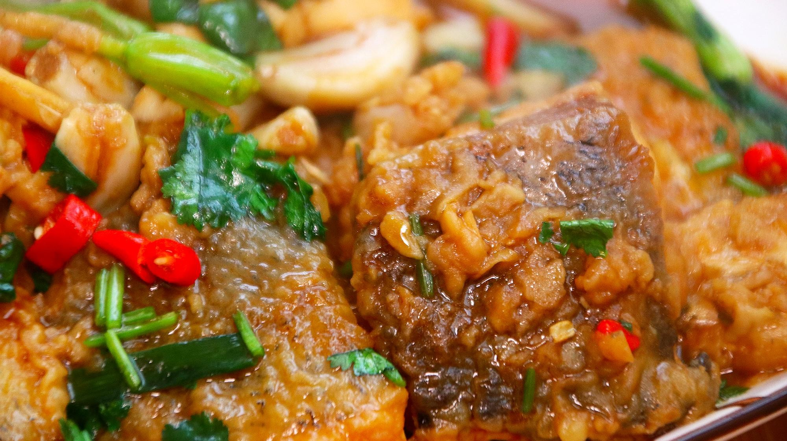

# 油焖笋 (Braised Bamboo Shoots in Sweet Soy Sauce)

## 📋 基本資訊 / Recipe Overview
- **料理名稱 (繁體)**：油燜筍
- **料理名称 (简体)**：油焖笋
- **English Title**：Braised Bamboo Shoots in Sweet Soy Sauce
- **素食流派 / Diet**：纯素 Vegan (纯净素，无五辛)
- **料理分類 / Category**：01-蔬菜本味类 / 杭帮名菜 / 浓油赤酱
- **份量 / Servings**：2-3 人份
- **準備時間 / Prep Time**：8 分鐘
- **烹飪時間 / Cook Time**：15 分鐘
- **總計耗時 / Total Time**：23 分鐘
- **來源 / Source**：现代中华素菜 Top 100 · [01-蔬菜本味类.md](../01-蔬菜本味类.md) 第 50 道

## 📖 菜品特色 / Description
杭帮节令。嫩笋重油重糖焖红亮，鲜甜酱香。江南传统名素菜，浓油赤酱，笋肉细嫩脆爽，咸甜浓郁，挂汁红润。

---

## 🌿 食材與調味清單 / Ingredients & Seasonings

### 主料
- 鲜嫩竹笋（雷笋、早竹笋或鞭笋） 500g

### 调味料
- 食用植物油（菜籽油或花生油） 3-4 汤匙（约 50ml，重油是灵魂）
- 优质生抽 2 汤匙（约 30ml）
- 优质老抽 1 汤匙（约 15ml，上色红亮）
- 冰糖 / 白砂糖 1.5 汤匙（约 20g，浓油赤酱核心）
- 绍兴花雕酒 / 黄酒 1 汤匙（约 15ml）
- 素高汤 / 温水 100ml
- 纯芝麻香油 1 茶匙（约 5ml）

---

## 🍳 烹飪步驟 / Step-by-Step Cooking Steps

### 步骤 1：剥笋与改刀
1. 竹笋剥去笋壳，削去根部老硬结节；用刀面轻拍笋身使其微裂。
2. 切成约 4-5cm 长的条或滚刀段。

### 步骤 2：重油煸透（关键步骤）
1. 炒锅烧热，倒入宽油（3-4 汤匙），油温四成热下入笋块。
2. 保持中火耐心煸炒 3-4 分钟，直到笋块水分部分蒸发、表面微呈金黄焦边、油光发亮。

### 步骤 3：烹酒上色
1. 沿锅边淋入绍兴花雕酒，利用高温挥发带走笋中涩气。
2. 下入生抽 2 汤匙、老抽 1 汤匙与冰糖 1.5 汤匙，快速翻炒使每块笋都均匀裹上酱色。

### 步骤 4：小火慢焖
1. 倒入素高汤或温水 100ml，大火烧沸。
2. 盖上锅盖，转小火慢焖 8-10 分钟，让咸甜酱汁充分渗透进笋的纤维缝隙中。

### 步骤 5：大火收汁挂油
1. 揭开锅盖转大火，快速翻炒收汁，见汤汁逐渐浓稠、变成红亮浓郁的挂霜油汁。
2. 淋入 1 茶匙香油翻匀，光润亮泽，即可出锅装盘。

---

## 💡 大厨秘诀 / Chef's Tips

1. **重油重糖，浓油赤酱**：笋极吸油，足量油能封住水分、润滑纤维；重糖与酱油慢熬焦化形成红亮挂汁，鲜甜醇厚。
2. **拍松再切条**：刀拍让笋身产生微裂纹，焖煮时酱汁能迅速渗入内部，入味透彻。
3. **煸透再焖**：先用宽油煸至笋表皮微起皱再加酱汁慢焖，最后大火收至“汁干亮油”，挂汁而不水。

---
*食谱归档时间：2026-08-20 · 收录于 20260818-vegetarianism 本地菜谱库 (1Top 精选)*
