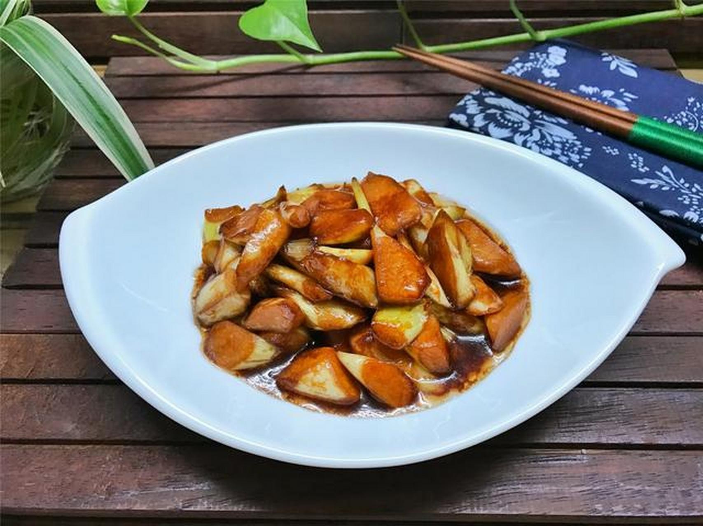

# 油焖茭白 (Braised Water Bamboo Shoots)

## 📋 基本資訊 / Recipe Overview
- **料理名稱 (繁體)**：油燜茭白
- **料理名称 (简体)**：油焖茭白
- **English Title**：Shanghainese Braised Water Bamboo Shoots in Sweet Soy Sauce
- **素食流派 / Diet**：全素 / 纯素 Vegan (纯素)
- **料理分類 / Category**：01-蔬菜本味类 / 本帮江浙 / 浓油赤酱素替
- **份量 / Servings**：2-3 人份
- **準備時間 / Prep Time**：8 分鐘
- **烹飪時間 / Cook Time**：8-10 分鐘
- **總計耗時 / Total Time**：18 分鐘
- **來源 / Source**：现代中华素菜 Top 100 · [01-蔬菜本味类.md](../01-蔬菜本味类.md) 第 88 道

## 📖 菜品特色 / Description
茭白油焖，酱香浓郁，色泽红亮油润，咸甜适口，外焦内糯，江南本帮名素菜，可作家常荤菜的绝佳素替。

---

## 🌿 食材與調味清單 / Ingredients & Seasonings

### 主料
- 新鲜嫩茭白 4 支（去壳净重约 400g）
- 生姜 2 片

### 焖烧调味汁配方
- 食用植物油（建议菜籽油或花生油） 2.5-3 汤匙（约 40ml，油焖需油量稍宽）
- 优质纯酿生抽 1.5 汤匙（约 22ml，提鲜入味）
- 酿造老抽 1/2 汤匙（约 7.5ml，上红亮酱色）
- 白砂糖 / 冰糖粉 1 汤匙（约 12-15g，油焖之灵魂）
- 热开水 / 素高汤 50ml
- 芝麻香油 1/2 茶匙（约 2.5ml）

---

## 🍳 烹飪步驟 / Step-by-Step Cooking Steps

### 步骤 1：滚刀改刀
1. 茭白剥去外壳，削除根部粗糙硬皮，洗净沥干。
2. 将茭白切成大小均匀的小滚刀块（或 5cm 长的一字粗条），滚刀块切面多，能最大程度吸附浓郁酱汁。

### 步骤 2：耐心宽油“煸透”（核心技法）
1. 炒锅烧热，倒入 2.5-3 汤匙植物油，油温 5 成热时下入姜片和茭白块。
2. 调至中小火，耐心翻炒煸煎 5-6 分钟，直至茭白表面水分收干、体积微微收缩，边缘呈现漂亮的微金黄焦香皱褶。

### 步骤 3：上色起香
1. 加入 **生抽 1.5 汤匙**、**老抽 1/2 汤匙** 与 **白糖 1 汤匙**。
2. 快速翻炒 30 秒，让每一块茭白都均匀裹上红润油亮的酱色，激发出浓郁酱香。

### 步骤 4：加盖油焖入味
1. 沿锅边倒入 50ml **热开水**（切勿用冷水），翻炒均匀。
2. 盖上锅盖，转小火慢焖 3-4 分钟，让咸甜酱汁慢慢渗透进茭白的纤维内部。

### 步骤 5：大火收汁亮油
1. 揭开锅盖，转大火快速翻炒收汁。
2. 待汤汁变浓稠、如糖浆般紧紧裹住茭白，淋入 **1/2 茶匙香油** 翻匀，亮油出锅装盘。

---

## 💡 大厨秘诀 / Chef's Tips

1. **“煸透”是油焖的灵魂**：油焖茭白切忌直接加水炖煮。必须用油将茭白表面煸至微黄微皱，脱水后的茭白才会形成海绵状微孔，后续焖煮时才能深层吸饱酱汁。
2. **重糖提鲜自挂芡**：正宗江浙油焖风味必须糖量充足，糖不仅平衡酱油的咸涩，在高温浓缩时还会产生焦糖化反应，使汤汁自然浓稠发亮，无需水淀粉勾芡。
3. **加水必用热水**：烹水必须加入沸水，避免冷水使高温油炸过的茭白组织骤冷收缩变硬。

---
*食谱归档时间：2026-08-20 · 收录于 20260818-vegetarianism 本地菜谱库 (1Top 精选)*
