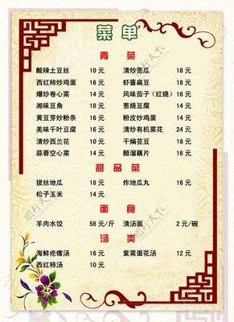

# 清炒卷心菜 (Crisp Stir-Fried Green Cabbage)

## 📋 基本資訊 / Recipe Overview
- **料理名稱 (繁體)**：清炒捲心菜
- **料理名称 (简体)**：清炒卷心菜
- **English Title**：Crisp Stir-Fried Green Cabbage
- **素食流派 / Diet**：纯素 Vegan
- **料理分類 / Category**：01-蔬菜本味类 / 家常快炒 / 脆嫩爽口
- **份量 / Servings**：2-3 人份
- **準備時間 / Prep Time**：5 分鐘
- **烹飪時間 / Cook Time**：3 分鐘
- **總計耗時 / Total Time**：8 分鐘
- **來源 / Source**：现代中华素菜 Top 100 · [01-蔬菜本味类.md](../01-蔬菜本味类.md) 第 66 道

## 📖 菜品特色 / Description
圆白菜快炒，可加醋干椒。

---

## 🌿 食材與調味清單 / Ingredients & Seasonings
### 主料
- 新鲜紧实卷心菜（圆白菜/包菜） 400g

### 配料
- 大蒜 3 瓣（切片；纯素可用生姜片 3g 替代）
- 干红辣椒 2 根（剪段去籽）

### 调味料
- 食用植物油 1.5 汤匙（约 20ml）
- 食盐 1/2 茶匙（约 3g）
- 纯酿生抽 1 汤匙（约 15ml）
- 香醋 / 米醋 1 茶匙（约 5ml）
- 白砂糖 1/3 茶匙（约 1.5g，提鲜化酸）

---

## 🍳 烹飪步驟 / Step-by-Step Cooking Steps
### 步骤 1：手撕菜叶与彻底沥干
1. 卷心菜剥去外层老叶，用手将其撕成 4-5cm 见方的适口小片；粗梗部分用刀背拍扁后再撕小。
2. 清水冲洗干净后，放入沥水篮中**充分甩干表面水分**（水分多会导致炒时变成水煮）。

### 步骤 2：炝香干椒与蒜片
1. 炒锅烧热倒入植物油，油温 5 成热时下入蒜片和干红辣椒段。
2. 小火慢炸至辣椒微呈棕红、蒜香浓烈四溢。

### 步骤 3：最大猛火，极速爆炒
1. 迅速将火调至最大猛火，倒入沥干的卷心菜片。
2. 保持大火不间断翻炒 1.5 分钟，使菜叶在高温油锅中迅速变软并微显半透明，炒出锅气焦斑。

### 步骤 4：调味烹醋，激香出锅
1. 见卷心菜八成熟微有焦边，撒入 **食盐 1/2 茶匙**、**白糖 1/3 茶匙** 与 **生抽 1 汤匙**。
2. 顺着滚烫锅壁淋入 **香醋 1 茶匙**，锅中瞬间腾起酸香醋雾。
3. 快速颠锅大火猛翻 10-15 秒，调味均匀即可关火出锅。

---

## 💡 大厨秘诀 / Chef's Tips
1. **手撕胜过刀切**：手撕使蔬菜细胞断裂面不规则，比平滑的刀切面更能吸附油香与酱汁，口感更为脆爽。
2. **沥水彻底是脆嫩核心**：带水下锅会使热油降温产生蒸汽焖菜，造成菜叶发黄出水；必须充分甩干水汽。
3. **锅边烹醋去生涩**：香醋不可直接倒在菜上，沿着烧热的锅沿淋入瞬间气化，只留扑鼻醋香与锅气，锁住爽脆。

---
*食谱归档时间：2026-08-20 · 收录于 20260818-vegetarianism 本地菜谱库 (1Top 精选)*
