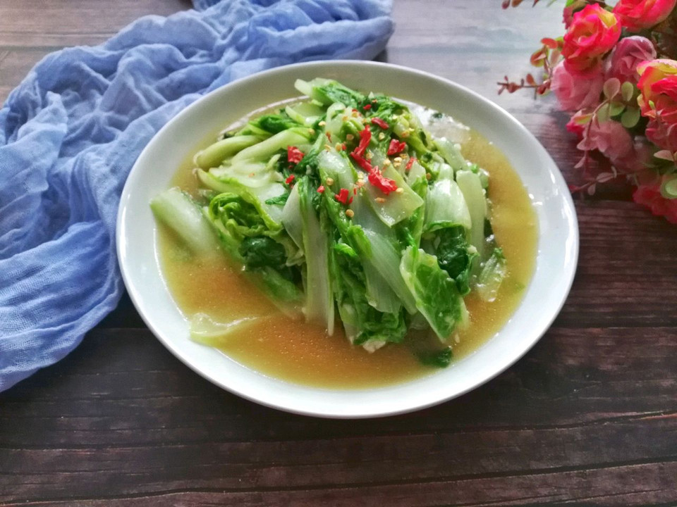

# 清炒小白菜 (Stir-Fried Baby Bok Choy with Garlic)

## 📋 基本資訊 / Recipe Overview
- **料理名稱 (繁體)**：清炒小白菜
- **料理名称 (简体)**：清炒小白菜
- **English Title**：Stir-Fried Baby Bok Choy with Garlic
- **素食流派 / Diet**：全素 / 纯素 Vegan (含大蒜；五辛素，可去蒜改纯净素)
- **料理分類 / Category**：01-蔬菜本味类 / 经典家常 / 快炒时蔬
- **份量 / Servings**：2-3 人份
- **準備時間 / Prep Time**：3 分鐘
- **烹飪時間 / Cook Time**：2 分鐘
- **總計耗時 / Total Time**：5 分鐘
- **來源 / Source**：现代中华素菜 Top 100 · [01-蔬菜本味类.md](../01-蔬菜本味类.md) 第 44 道

## 📖 菜品特色 / Description
最基础青菜，盐油蒜，全国都做。大火爆炒，梗脆叶嫩，汁水清甜，家常百搭。

---

## 🌿 食材與調味清單 / Ingredients & Seasonings

### 主料
- 新鲜小白菜（油白菜 / 青江菜） 400g
- 大蒜 4 瓣（去皮切薄片或拍碎）

### 调味料
- 食用植物油 1.5 汤匙（约 22ml）
- 食盐 1/2 茶匙（约 3g）
- 白砂糖 1/4 茶匙（约 1g，提鲜中和青涩）
- 纯芝麻香油（选配） 数滴

---

## 🍳 烹飪步驟 / Step-by-Step Cooking Steps

### 步骤 1：食材清洗与梗叶分切
1. 小白菜一片片剥开，彻底洗净根部泥沙，捞出放入沥水篮彻底沥干水分。
2. **梗叶分段**：将小白菜较厚实的菜梗切成 3-4cm 短段，菜叶切大段，**分开放置**。

### 步骤 2：热锅凉油，爆出蒜香
1. 炒锅烧热，倒入食用植物油。
2. 油热 5 成下入蒜片，中小火煸炒至蒜片微黄、香气散发。

### 步骤 3：先梗后叶，大火快翻
1. 炉火调至**最大旺火**。
2. 先倒入小白菜梗，快速翻炒 20-25 秒，至菜梗由白变微透明。
3. 随即倒入全部菜叶，大火连续颠锅翻炒 15-20 秒，使菜叶在高温油雾中迅速变软塌缩。

### 步骤 4：临出锅调味
1. 见菜叶刚转深绿断生，立即撒入 **食盐 1/2 茶匙** 与 **白糖 1/4 茶匙**。
2. 快速大火翻匀 5 秒，滴入两滴香油，即刻关火出锅装盘。

---

## 💡 大厨秘诀 / Chef's Tips

1. **梗叶分炒防生熟不均**：菜梗纤维厚、传热慢，菜叶轻薄易熟。先炒梗 20 秒再下叶，能确保菜梗脆嫩清甜的同时菜叶碧绿不烂。
2. **临出锅放盐防出汤**：盐分会产生渗透压使小白菜迅速脱水。最后放盐能在最短时间内入味，同时锁住菜汁在植物纤维内部。
3. **旺火速炒不加水**：全程不加一滴水，靠锅气与小白菜自身受热析出的微量清汁即可成菜。

---
*食谱归档时间：2026-08-20 · 收录于 20260818-vegetarianism 本地菜谱库 (1Top 精选)*
