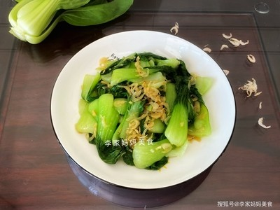

# 清炒油菜 (Stir-Fried Shanghai Bok Choy)

## 📋 基本資訊 / Recipe Overview
- **料理名稱 (繁體)**：清炒油菜
- **料理名称 (简体)**：清炒油菜
- **English Title**：Stir-Fried Shanghai Bok Choy (Rapeseed Greens)
- **素食流派 / Diet**：全素 / 纯素 Vegan (纯素)
- **料理分類 / Category**：01-蔬菜本味类 / 江南家常 / 基础经典
- **份量 / Servings**：2-3 人份
- **準備時間 / Prep Time**：5 分鐘
- **烹飪時間 / Cook Time**：2 分鐘
- **總計耗時 / Total Time**：7 分鐘
- **來源 / Source**：现代中华素菜 Top 100 · [01-蔬菜本味类.md](../01-蔬菜本味类.md) 第 93 道

## 📖 菜品特色 / Description
油菜心快炒，全国基础青菜。大火快翻，碧绿生青，清甜爽脆，牢牢锁住蔬菜本汁与丰富营养。

---

## 🌿 食材與調味清單 / Ingredients & Seasonings

### 主料
- 新鲜小油菜（上海青 / 青菜心） 400g
- 生姜 2 片（切细丝）

### 调味用料
- 食用植物油（建议花生油或猪油风味植物烹调油） 2 汤匙（约 30ml）
- 食盐 1/2 茶匙（约 2.5g）
- 白砂糖 1/3 茶匙（约 1.5g，提鲜中和青味）
- 清水 1 汤匙（沿锅边烹入产生水汽）

---

## 🍳 烹飪步驟 / Step-by-Step Cooking Steps

### 步骤 1：摘洗与彻底沥干（不发黄关键）
1. 小油菜一片片剥开，洗净叶柄凹槽处的泥沙。
2. 较粗的菜帮可纵向剖开成两半以便受热同步。
3. **极致沥水**：用脱水篮充分甩干水分（菜叶表面带生水下锅会导致油温骤降变“水煮菜”）。

### 步骤 2：热锅冷油爆姜
1. 炒锅大火烧至冒微烟，倒入 2 汤匙食用油，下入姜丝煸出清香。

### 步骤 3：旺火分批下菜
1. 调至**最大猛火**。
2. 先倒入较硬的油菜帮翻炒 15 秒，接着倒入全部菜叶。
3. 快速大火颠锅翻炒 30 秒，使油菜在滚热油膜包裹下迅速变翠绿断生。

### 步骤 4：烹水调味出锅
1. 见菜叶刚转软塌，沿锅壁烹入 1 汤匙清水激起蒸汽，撒入 **食盐 1/2 茶匙** 与 **白糖 1/3 茶匙**。
2. 保持最大火猛翻 10 秒使盐糖完全融化，即刻关火出锅装盘（全程下锅到出锅控制在 1 分钟左右）。

---

## 💡 大厨秘诀 / Chef's Tips

1. **菜叶必须甩干无水**：叶片表面有水会导致油温急降，青菜受热慢而变黄出汤；彻底沥干大火爆炒才能油润翠绿。
2. **先帮后叶分段炒**：帮厚叶薄，先炒帮 15 秒再下叶，保证帮叶成熟度完美一致。
3. **微量糖提鲜去青气**：十字花科蔬菜微带芥子油青涩味，少许白糖能中和青涩、激发本味鲜甜。

---
*食谱归档时间：2026-08-20 · 收录于 20260818-vegetarianism 本地菜谱库 (1Top 精选)*
