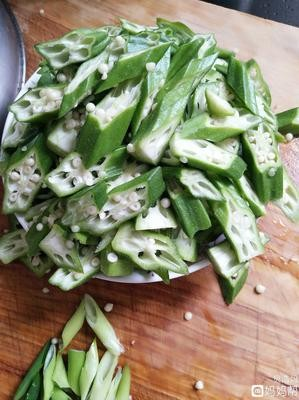

# 清炒秋葵 (Stir-Fried Okra with Garlic and Chili)

## 📋 基本資訊 / Recipe Overview
- **料理名稱 (繁體)**：清炒秋葵
- **料理名称 (简体)**：清炒秋葵
- **English Title**：Stir-Fried Okra with Garlic and Chili
- **素食流派 / Diet**：全素 / 纯素 Vegan (含大蒜；五辛素，可去蒜改纯素)
- **料理分類 / Category**：01-蔬菜本味类 / 润滑清爽 / 健康轻食
- **份量 / Servings**：2-3 人份
- **準備時間 / Prep Time**：5 分鐘
- **烹飪時間 / Cook Time**：3 分鐘
- **總計耗時 / Total Time**：8 分鐘
- **來源 / Source**：现代中华素菜 Top 100 · [01-蔬菜本味类.md](../01-蔬菜本味类.md) 第 57 道

## 📖 菜品特色 / Description
秋葵快炒或焯拌，减少黏液、保脆。整根焯水锁住黏液，斜切厚段大火蒜香快炒，外脆里嫩，滑而不腻。

---

## 🌿 食材與調味清單 / Ingredients & Seasonings

### 主料
- 新鲜嫩秋葵 300g
- 大蒜 4 瓣（切薄片或蒜末）
- 红椒 1/3 个（切细丝配色）

### 调味料
- 食用植物油 1.5 汤匙（约 22ml）
- 食盐 1/2 茶匙（约 3g）
- 白砂糖 1/4 茶匙（约 1g）
- 优质生抽 1 茶匙（约 5ml）

---

## 🍳 烹飪步驟 / Step-by-Step Cooking Steps

### 步骤 1：盐搓绒毛与整根焯水（防黏液流失关键）
1. **盐搓去毛**：取少许食盐在秋葵表面轻轻揉搓，去除表皮细绒毛，冲洗干净（**此时切勿切开蒂头**）。
2. **整根焯水**：锅中烧沸水加少许盐和油，将整根秋葵下锅焯烫 1 分钟，捞出立刻投入冰水过凉。
3. **改刀**：捞出沥干，切去蒂头，斜刀切成约 1.5cm 厚的斜段；红椒切丝。

### 步骤 2：热油爆香底料
1. 炒锅烧热倒入食用植物油。
2. 下入蒜片和红椒丝，中火煸炒出浓郁蒜香。

### 步骤 3：旺火速炒
1. 转最大火，倒入切好的秋葵段，大火快速颠翻炒制 30-40 秒。

### 步骤 4：调味出锅
1. 撒入 **食盐 1/2 茶匙**、**白糖 1/4 茶匙**，沿锅边烹入 **生抽 1 茶匙**。
2. 保持大火快速翻炒 10 秒出锅气，即刻关火出锅装盘（全程不加水、不盖盖焖煮）。

---

## 💡 大厨秘诀 / Chef's Tips

1. **整根焯水不切开**：切开后焯水黏液会大量析出导致汤水黏稠软烂，整根焯水能把丰富的果胶和多糖锁在秋葵内部。
2. **盐粒搓洗去绒毛**：揉搓能去除秋葵表皮的微刺绒毛，使入口顺滑不扎嘴。
3. **旺火干炒不加水**：炒秋葵严禁加水焖煮，大火快速干翻能保持干爽脆嫩，滑而不腻。

---
*食谱归档时间：2026-08-20 · 收录于 20260818-vegetarianism 本地菜谱库 (1Top 精选)*
