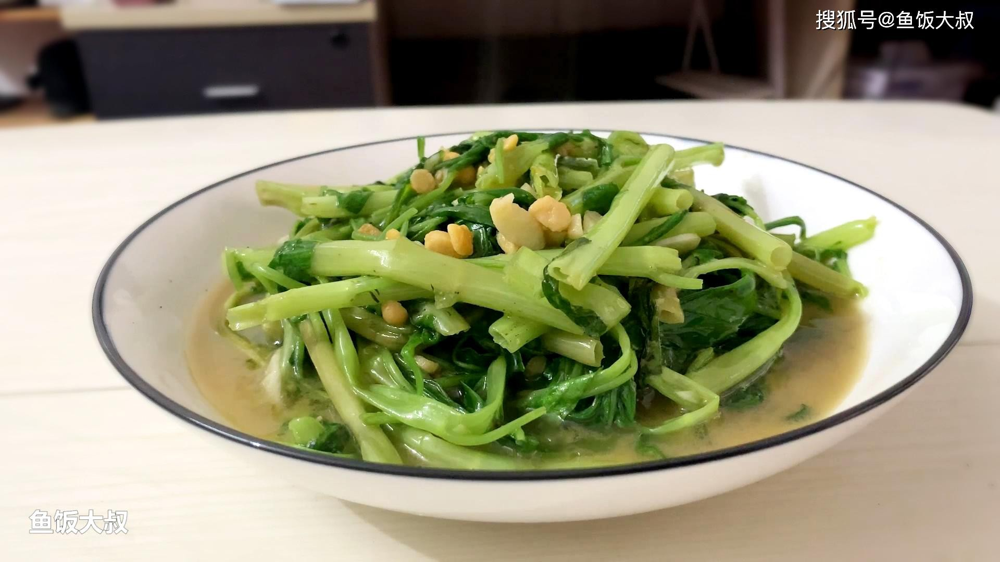

# 清炒空心菜 (Stir-Fried Water Spinach)

## 📋 基本資訊 / Recipe Overview
- **料理名稱 (繁體)**：清炒空心菜
- **料理名称 (简体)**：清炒空心菜
- **English Title**：Stir-Fried Water Spinach with Garlic and Chili
- **素食流派 / Diet**：全素 / 纯素 Vegan (含蒜五辛素；可依戒律去蒜做纯净素)
- **料理分類 / Category**：01-蔬菜本味类 / 南方家常 / 快手时蔬
- **份量 / Servings**：2-3 人份
- **準備時間 / Prep Time**：5 分鐘
- **烹飪時間 / Cook Time**：2 分鐘
- **總計耗時 / Total Time**：7 分鐘
- **來源 / Source**：现代中华素菜 Top 100 · [01-蔬菜本味类.md](../01-蔬菜本味类.md) 第 4 道

## 📖 菜品特色 / Description
南方高频菜。蒜爆香大火快炒，可加豆豉或辣椒，鲜香脆嫩。

---

## 🌿 食材與調味清單 / Ingredients & Seasonings

### 主料
- 新鲜嫩空心菜 400g
- 大蒜 4 瓣（切片或拍碎粗末）
- 干红辣椒 2 个（剪小段，选配）
- 阳江豆豉（选配增鲜） 1 茶匙（约 5g）

### 调味料
- 食用植物油（建议菜籽油或花生油） 2 汤匙（约 30ml）
- 食盐 1/2 茶匙（约 3g）
- 白砂糖 1/4 茶匙（约 1g，提鲜去涩）
- 米酒 / 纯粮白醋 1/2 茶匙（约 2.5ml，防黑抗氧化秘诀）
- 素高汤 / 清水 1 汤匙（约 15ml）

---

## 🍳 烹飪步驟 / Step-by-Step Cooking Steps

### 步骤 1：摘洗与梗叶分离
1. 挑选嫩空心菜，摘去老硬根茎，洗净泥沙。
2. **彻底沥干水分**：放入沥水篮充分甩干（表面水分多会导致入锅后水汽闷菜发黑发黄）。
3. **梗叶分开**：将空心菜切成 5cm 左右长段，并将较硬的“菜梗”与柔软的“菜叶”分别存放在两个容器中。

### 步骤 2：爆香底料
1. 炒锅（建议不沾锅或熟铁锅，避免未开生铁锅反应发黑）大火烧热，倒入 2 汤匙植物油。
2. 油温 6 成热时，下入蒜末、干辣椒段（及豆豉），快速煸炒 5 秒爆出复合浓香。

### 步骤 3：分段快炒
1. 保持**最大猛火**，先倒入**空心菜梗**，猛火快速翻炒 15 秒，使菜梗受热转为油亮深绿。
2. 紧接着倒入全部**空心菜叶**，迅速沿锅边淋入 1/2 茶匙米酒（或白醋）与 1 汤匙素高汤。
3. 快速大火翻炒颠锅 15-20 秒，高热蒸汽与酒香瞬间锁住翠绿，菜叶刚变软缩量。

### 步骤 4：调味出锅
1. 菜叶断生瞬间，立刻撒入 **食盐 1/2 茶匙** 与 **白糖 1/4 茶匙**。
2. 猛火翻炒 5 秒让咸甜味均匀裹附，即刻关火出锅装盘（全程从下菜到出锅控制在 45 秒内）。

---

## 💡 大厨秘诀 / Chef's Tips

1. **防发黑三大法则**：彻底沥干水分、使用不锈钢或不粘锅、烹入微量米酒或白醋抗多酚氧化。
2. **梗叶分次下锅**：菜梗纤维厚、菜叶娇嫩，先炒梗 15 秒再下叶，确保梗脆嫩、叶挺拔，生熟完美同步。
3. **起锅前放盐**：过早放盐会让空心菜细胞失水脱水，不仅汤汁变黑，菜体也会软塌失去爽脆感。

---
*食谱归档时间：2026-08-20 · 收录于 20260818-vegetarianism 本地菜谱库 (1Top 精选)*
