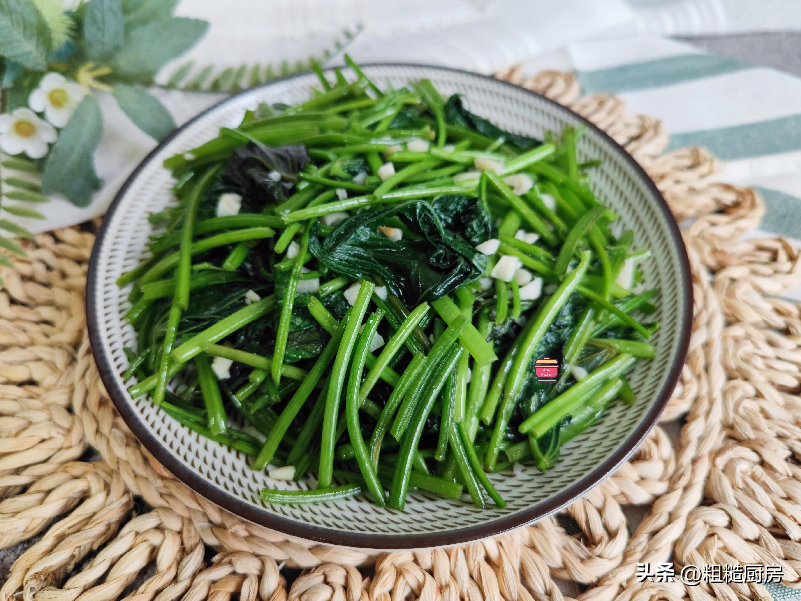

# 清炒红薯叶 (Sautéed Sweet Potato Leaves with Garlic (Yam Greens))

## 📋 基本資訊 / Recipe Overview
- **料理名稱 (繁體)**：清炒紅薯葉
- **料理名称 (简体)**：清炒红薯叶
- **English Title**：Sautéed Sweet Potato Leaves with Garlic (Yam Greens)
- **素食流派 / Diet**：纯素 Vegan（含蒜；纯素以生姜丝替代）
- **料理分類 / Category**：01-蔬菜本味类 / 闽粤台经典 / 鲜嫩甘甜
- **份量 / Servings**：2-3 人份
- **準備時間 / Prep Time**：6 分鐘
- **烹飪時間 / Cook Time**：2 分鐘
- **總計耗時 / Total Time**：8 分鐘
- **來源 / Source**：现代中华素菜 Top 100 · [01-蔬菜本味类.md](../01-蔬菜本味类.md) 第 81 道

## 📖 菜品特色 / Description
番薯叶蒜蓉，闽粤台家常，清甜。

---

## 🌿 食材與調味清單 / Ingredients & Seasonings
### 主料
- 新鲜幼嫩红薯叶（番薯叶/地瓜叶） 350g

### 配料
- 大蒜 5 瓣（剁碎成细蒜蓉；纯素以鲜生姜丝 5g 替代）

### 调味料
- 优质植物油（花生油或清亮植物油） 2 汤匙（约 30ml，红薯叶喜油润）
- 食盐 1/2 茶匙（约 3g）
- 白砂糖 1/3 茶匙（约 1.5g，去涩提甜）
- 香菇素蚝油 1/2 茶匙（约 2.5ml，增鲜润色）
- 纯净水 / 薄水淀粉 1.5 汤匙（约 20ml，锁水防黑关键）

---

## 🍳 烹飪步驟 / Step-by-Step Cooking Steps
### 步骤 1：撕除叶柄老筋（爽滑核心诀窍）
1. 摘取红薯叶时，从叶柄根部轻轻折断，**顺势撕下叶柄表面的一层老纤维薄膜（撕老筋）**，去除粗硬纤维。
2. 放入清水中洗净捞起，放入沥水篮彻底沥干表面水分。

### 步骤 2：热锅温油爆香蒜蓉
1. 炒锅烧热，注入 2 汤匙植物油（油量略宽于普通青菜）。
2. 油温 5 成热下入 2/3 蒜蓉（或姜丝），中小火煸炒至蒜蓉微黄出浓香。

### 步骤 3：最大猛火，极速翻炒
1. 转最大猛火，倒入沥干的红薯叶。
2. 用锅铲快速翻炒 20-30 秒，使每一片叶梗都充分裹上热蒜油，叶片迅速受热变软塌。

### 步骤 4：调味烹水，二次提香
1. 撒入 **食盐 1/2 茶匙**、**白糖 1/3 茶匙**、**素蚝油 1/2 茶匙** 及剩余 **1/3 生蒜蓉**。
2. 顺着锅边淋入 **1.5 汤匙清水或薄水淀粉**。

### 步骤 5：大火翻匀出锅
1. 保持大火快速颠锅翻炒 10 秒，让薄汁均匀挂在叶片上，红薯叶油亮翠绿、滑润多汁即可关火盛盘（全程炒制不超过 50 秒）。

---

## 💡 大厨秘诀 / Chef's Tips
1. **撕去叶柄外皮老筋**：红薯叶梗外皮富含粗硬木质化纤维，烹饪前顺向撕去表皮老筋，口感立刻由粗糙转为滑嫩无渣。
2. **多油大火防氧化变黑**：红薯叶多酚类氧化酶活跃，遇空气极易发黑；宽油能在表面形成保护膜隔绝空气，大火 45 秒内断生起锅。
3. **出锅前烹水或薄芡**：红薯叶质地易干粘，出锅前淋 1.5 汤匙水或薄水淀粉，能让菜肴油润滑亮，久放不发黑、不出涩水。

---
*食谱归档时间：2026-08-20 · 收录于 20260818-vegetarianism 本地菜谱库 (1Top 精选)*
