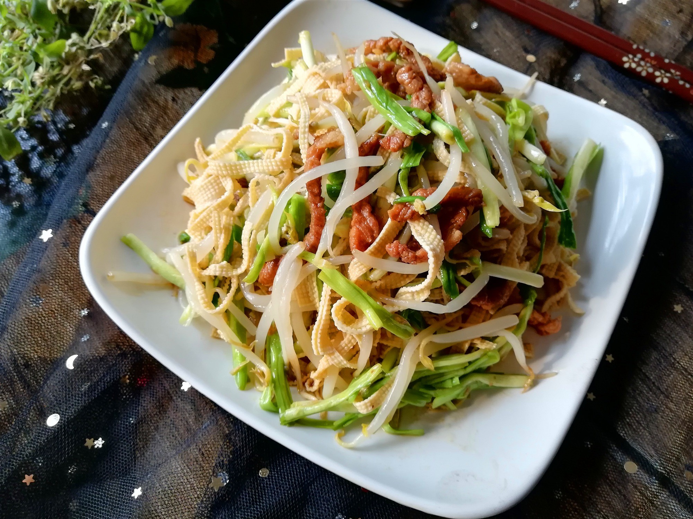

# 清炒綠豆芽 (Stir-Fried Mung Bean Sprouts)

## 📋 基本資訊 / Recipe Overview
- **料理名稱 (繁體)**：清炒綠豆芽
- **料理名称 (简体)**：清炒绿豆芽
- **English Title**：Crispy Stir-Fried Mung Bean Sprouts
- **素食流派 / Diet**：全素 / 纯素 Vegan (含蒜；可去蒜做纯净素)
- **料理分類 / Category**：01-蔬菜本味类 / 经典小炒 / 清爽脆嫩
- **份量 / Servings**：2-3 人份
- **準備時間 / Prep Time**：5 分鐘
- **烹飪時間 / Cook Time**：2-3 分鐘
- **總計耗時 / Total Time**：7-8 分鐘
- **來源 / Source**：现代中华素菜 Top 100 · [01-蔬菜本味类.md](../01-蔬菜本味类.md) 第 24 道

## 📖 菜品特色 / Description
大火快炒，可加醋辣椒蒜，脆嫩解腻。

---

## 🌿 食材與調味清單 / Ingredients & Seasonings

### 主料
- 新鲜绿豆芽 400g（选用无根或洗净摘去根须的脆嫩豆芽）
- 大蒜 3-4 瓣（切薄片或拍碎）
- 干红辣椒 2-3 根（剪成小段，去籽）
- 青葱或青椒丝（选配） 1 小撮（配色增香）

### 调味用料
- 食用植物油 2 汤匙（约 30ml）
- 白醋或米醋 1 汤匙（约 15ml，沿锅边烹入锁脆）
- 食盐 1/2 茶匙（约 3g）
- 白糖 1/4 茶匙（约 1g，和味提鲜）
- 纯芝麻油 1/2 茶匙（约 2.5ml，出锅点亮）

---

## 🍳 烹飪步驟 / Step-by-Step Cooking Steps

### 步骤 1：淘洗与彻底甩干
1. 绿豆芽放入大盆清水中漂洗，用漏勺捞出，洗净浮皮，沥干备用。
2. **控干关键**：用蔬菜甩干器或沥水篮彻底沥干，确保豆芽表面无多余附着水珠。

### 步骤 2：热锅爆香蒜椒
1. 铁锅置于大火上烧热，倒入食用油，烧至 5-6 成热。
2. 下入干辣椒段和蒜片，中小火爆出香辣气味（约 5-8 秒，注意不要炒焦干椒）。

### 步骤 3：猛火入锅，烹醋锁脆
1. 迅速将火转为**最大猛火**，倒入沥干水分的绿豆芽。
2. 豆芽入锅受热瞬间，立即沿高温锅边烹入 **白醋 1 汤匙**（高温醋蒸汽瞬间包裹豆芽表面，强化细胞壁果胶质，牢牢锁住爽脆口感并去除豆腥气）。
3. 快速大火颠锅翻炒 1 分钟左右，使豆芽受热均匀至通透断生。

### 步骤 4：撒盐收尾，光速出锅
1. 待豆芽由乳白转为微透、刚断生之际，迅速撒入 **食盐 1/2 茶匙** 与 **白糖 1/4 茶匙**。
2. 保持大火猛颠 5-10 秒，淋入少许香油，立即关火盛盘（严禁在锅内余温中久留）。

---

## 💡 大厨秘诀 / Chef's Tips

1. **绝不焯水**：焯水会使豆芽吸饱水分导致下锅后疯狂渗水，直接大火干炒才能保持根根硬挺清脆。
2. **烹醋时机重在入锅瞬间**：醋中的酸性物质能促使豆芽中的果胶质凝固变硬，入锅即烹醋是保持“咔嚓”脆感的顶级秘诀。
3. **全程大火且绝不盖盖**：盖盖会导致蒸汽回流将豆芽焖软出水；全程敞锅大火颠炒，2分钟内一气呵成。

---
*食谱归档时间：2026-08-20 · 收录于 20260818-vegetarianism 本地菜谱库 (1Top 精选)*
