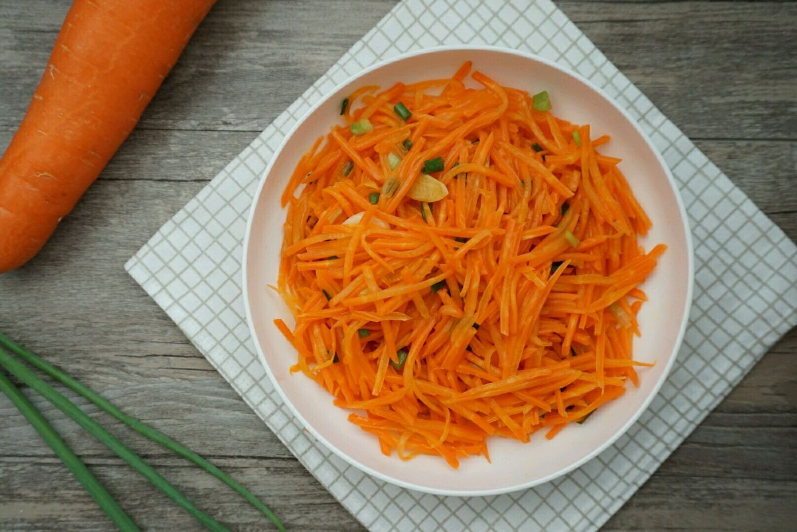

# 清炒胡萝卜丝 (Stir-Fried Shredded Carrots (Quick-Fried Carrot Julienne))

## 📋 基本資訊 / Recipe Overview
- **料理名稱 (繁體)**：清炒胡蘿蔔絲
- **料理名称 (简体)**：清炒胡萝卜丝
- **English Title**：Stir-Fried Shredded Carrots (Quick-Fried Carrot Julienne)
- **素食流派 / Diet**：纯素 Vegan（含葱花标明五辛素；纯素以生姜丝替代）
- **料理分類 / Category**：01-蔬菜本味类 / 家常素菜 / 脆爽微甜
- **份量 / Servings**：2-3 人份
- **準備時間 / Prep Time**：5 分鐘
- **烹飪時間 / Cook Time**：3-4 分鐘
- **總計耗時 / Total Time**：8 分鐘
- **來源 / Source**：现代中华素菜 Top 100 · [01-蔬菜本味类.md](../01-蔬菜本味类.md) 第 64 道

## 📖 菜品特色 / Description
胡萝卜丝快炒，可醋溜，家常配菜。

---

## 🌿 食材與調味清單 / Ingredients & Seasonings
### 主料
- 鲜嫩红心胡萝卜 2 根（约 350g）

### 配料
- 香葱 1 根（葱白切段、葱绿切花；纯素可用生姜丝 3g 替代）
- 干红辣椒（选配） 1-2 根（剪成细丝，增添微辣风味）

### 调味料
- 食用植物油 2 汤匙（约 30ml，胡萝卜素为脂溶性，油量略宽于普通青菜）
- 食盐 1/2 茶匙（约 3g）
- 白砂糖 1/3 茶匙（约 1.5g，去泥土生涩、激扬清甜）
- 香醋 / 米醋 1/2 茶匙（约 2.5ml，沿锅边烹入提脆增香）
- 纯净水 2 汤匙（约 30ml）

---

## 🍳 烹飪步驟 / Step-by-Step Cooking Steps
### 步骤 1：手工切丝，保持挺括
1. 胡萝卜洗净削去薄皮，先斜切成薄厚均匀的薄片，再顺着纤维切成细丝（约 2-3mm 粗细）。
2. **刀工建议**：手工切丝切口平整自然，比擦丝器擦出的丝更加爽脆挺拔、炒后不出水。

### 步骤 2：热油爆香葱姜
1. 炒锅充分烧热，倒入 2 汤匙植物油（胡萝卜素需油脂溶解，油量可略宽）。
2. 油温 5 成热时下入葱白段（或姜丝）和干辣椒丝，小火煸炒出香。

### 步骤 3：大火翻炒，油脂吸香
1. 转大火，倒入胡萝卜丝，快速翻炒 1.5-2 分钟。
2. 炒至胡萝卜丝颜色由生红转为鲜亮晶红，吸收油脂后变软半透明。

### 步骤 4：烹水微透，去除生涩
1. 沿锅边淋入 2 汤匙热水，继续大火翻炒 30 秒，利用水汽将胡萝卜内部彻底透熟，完全消除生胡萝卜的泥土腥味。

### 步骤 5：调味烹醋，脆爽出锅
1. 撒入 **食盐 1/2 茶匙** 与 **白糖 1/3 茶匙** 翻匀。
2. 顺着滚烫锅边烹入 **香醋 1/2 茶匙** 激发出锅气，撒入葱绿花，猛火颠炒 5 秒即可关火盛盘。

---

## 💡 大厨秘诀 / Chef's Tips
1. **油量稍宽利于胡萝卜素吸收**：胡萝卜素是脂溶性营养素，在充足温油中翻炒能充分释放其营养与天然甜香，口感滑润不干柴。
2. **白糖是去涩关键神笔**：胡萝卜自带泥土土腥生涩感，少许白砂糖能完美中和涩味，激发胡萝卜天然清甜。
3. **锅边烹少许香醋保脆爽**：临出锅沿高温锅壁淋少许香醋，醋酸受热挥发只留醋香与镬气，能令胡萝卜丝更加爽脆爽口。

---
*食谱归档时间：2026-08-20 · 收录于 20260818-vegetarianism 本地菜谱库 (1Top 精选)*
