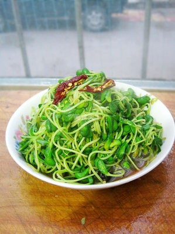

# 清炒苋菜 (Stir-Fried Chinese Amaranth with Ginger)

## 📋 基本資訊 / Recipe Overview
- **料理名稱 (繁體)**：清炒莧菜
- **料理名称 (简体)**：清炒苋菜
- **English Title**：Stir-Fried Chinese Amaranth with Ginger
- **素食流派 / Diet**：纯素 Vegan (纯净素，无五辛)
- **料理分類 / Category**：01-蔬菜本味类 / 夏季时令 / 清素本味
- **份量 / Servings**：2-3 人份
- **準備時間 / Prep Time**：5 分鐘
- **烹飪時間 / Cook Time**：2-3 分鐘
- **總計耗時 / Total Time**：7-8 分鐘
- **來源 / Source**：现代中华素菜 Top 100 · [01-蔬菜本味类.md](../01-蔬菜本味类.md) 第 46 道

## 📖 菜品特色 / Description
少蒜版，清甜，南方夏天高频。纯素做法以少许姜丝或原油急火滑炒，突出苋菜天然的清甜与嫩滑，汤汁紫红，清淡爽口。

---

## 🌿 食材與調味清單 / Ingredients & Seasonings

### 主料
- 新鲜红苋菜（或青红相间苋菜） 400g
- 生姜 1 小块（切极细姜丝）

### 调味料
- 食用植物油 1.5 汤匙（约 22ml）
- 食盐 1/2 茶匙（约 3g）
- 白砂糖 1/4 茶匙（约 1g，提鲜）
- 松茸鲜 / 素高汤粉 1/4 茶匙（选配，增鲜）
- 温水 1 汤匙（约 15ml）

---

## 🍳 烹飪步驟 / Step-by-Step Cooking Steps

### 步骤 1：食材择洗与改刀
1. 择去苋菜老根与黄叶，只留鲜嫩茎叶，清洗干净后沥干水分。
2. 切成 5cm 左右的长段；生姜去皮切细丝备用。

### 步骤 2：温油姜丝炝锅
1. 铁锅烧热，倒入食用植物油。
2. 下入姜丝，小火煸炒数秒，激发出生姜特有的清香。

### 步骤 3：大火急炒
1. 调至最大火，将苋菜全部倒入锅中。
2. 快速颠锅翻炒 30-40 秒，利用高热蒸汽让苋菜迅速受热塌软。
3. 待苋菜自然溢出红色汁水时，沿锅边淋入 1 汤匙温水润锅。

### 步骤 4：调味装盘
1. 撒入 **食盐 1/2 茶匙**、**白糖 1/4 茶匙** 与 **松茸鲜 1/4 茶匙**。
2. 大火快速翻炒 5-8 秒使调味料与红亮汤汁完全交融，立即出锅装盘。

---

## 💡 大厨秘诀 / Chef's Tips

1. **姜丝衬托清甜**：无蒜清炒更显苋菜天然甘爽之味，姜丝既能去土腥气又能调和苋菜的甘凉特性。
2. **急火短炒保嫩滑**：苋菜质地柔嫩，炒制时间不宜超过 1 分钟，久炒叶片易烂发暗。
3. **适度去筋**：若苋菜梗部较粗，摘洗时顺手撕掉外皮硬筋，入口更滑爽无渣。

---
*食谱归档时间：2026-08-20 · 收录于 20260818-vegetarianism 本地菜谱库 (1Top 精选)*
