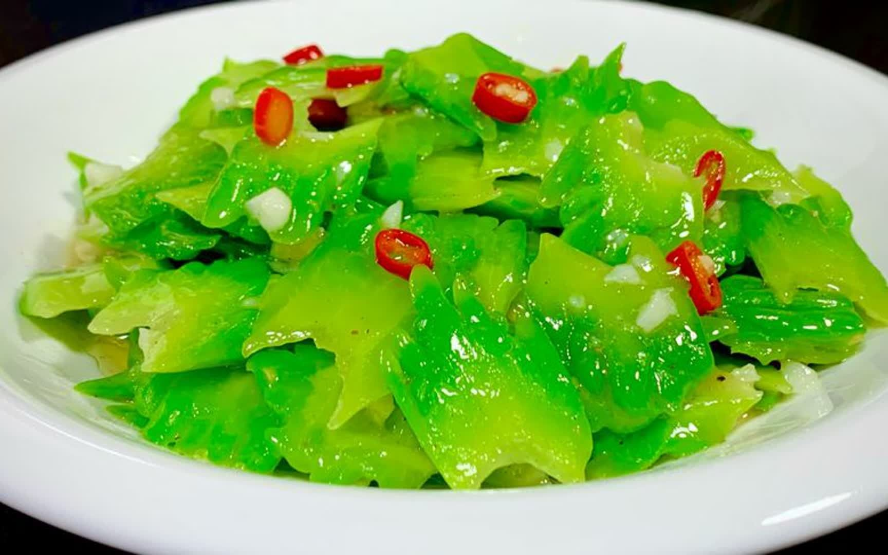

# 清炒苦瓜 (Stir-Fried Bitter Melon with Fermented Black Beans)

## 📋 基本資訊 / Recipe Overview
- **料理名稱 (繁體)**：清炒苦瓜
- **料理名称 (简体)**：清炒苦瓜
- **English Title**：Stir-Fried Bitter Melon with Fermented Black Beans
- **素食流派 / Diet**：全素 / 纯素 Vegan (含大蒜；五辛素，可去蒜改纯素)
- **料理分類 / Category**：01-蔬菜本味类 / 清热消暑 / 经典家常
- **份量 / Servings**：2-3 人份
- **準備時間 / Prep Time**：15 分鐘
- **烹飪時間 / Cook Time**：3 分鐘
- **總計耗時 / Total Time**：18 分鐘
- **來源 / Source**：现代中华素菜 Top 100 · [01-蔬菜本味类.md](../01-蔬菜本味类.md) 第 61 道

## 📖 菜品特色 / Description
苦瓜快炒，可加豆豉，苦后回甘。去尽白瓤，经盐抓腌或焯水后与蒜末豆豉大火快炒，翠绿爽口，咸香微苦，回味清甜。

---

## 🌿 食材與調味清單 / Ingredients & Seasonings

### 主料
- 新鲜翠绿苦瓜 1 根（约 350g）
- 优质豆豉 1 汤匙（约 15g，洗净稍剁碎）
- 大蒜 3 瓣（剁碎成蒜末）
- 红椒 1/3 个（切丝配色）

### 调味料
- 食用植物油 2 汤匙（约 30ml）
- 食盐 1/2 茶匙（腌制杀水用 1/3 茶匙 + 炒制用微量）
- 白砂糖 1/2 茶匙（约 2.5g，回甘关键调和剂）
- 优质生抽 1 茶匙（约 5ml）

---

## 🍳 烹飪步驟 / Step-by-Step Cooking Steps

### 步骤 1：去白瓤与斜切薄片（去苦核心）
1. **彻底刮瓤**：苦瓜纵向对半剖开，用不锈钢勺子用力刮除内部白色瓜瓤及**紧贴瓜肉的白色紧密薄膜**（刮至露出翠绿果肉）。
2. **切片**：将苦瓜斜刀切成 2-3mm 的均匀薄片；红椒切细丝。

### 步骤 2：盐腌杀水去涩
1. 苦瓜片放入碗中，加入 1/3 茶匙食盐抓拌均匀，静置腌制 10 分钟。
2. 倒掉渗出的苦水，用冷水快速漂洗一遍并用力挤干水分备用。

### 步骤 3：爆香豆豉与蒜末
1. 炒锅烧热倒入植物油。
2. 下入蒜末和豆豉碎，中小火慢煸出浓郁酱香红油。

### 步骤 4：大火猛炒与调味出锅
1. 转最大火，倒入挤干的苦瓜片与红椒丝，旺火快速翻炒 40-50 秒至苦瓜断生透亮。
2. 加入 **白砂糖 1/2 茶匙**、**生抽 1 茶匙** 与少许食盐，快速翻匀入味，即刻关火出锅。

---

## 💡 大厨秘诀 / Chef's Tips

1. **白膜刮得越干净越不苦**：苦瓜的苦味物质主要集中在内侧海绵状白瓤与白膜，彻底刮净能去除 80% 的生苦味。
2. **盐腌杀水保爽脆**：食盐脱去多余苦汁并收紧细胞组织，使苦瓜在炒制后依然清脆多汁。
3. **豆豉+白糖复合提味**：豆豉的发酵咸香能压制粗糙苦味，白糖与苦味中和产生美妙的“回甘”韵味。

---
*食谱归档时间：2026-08-20 · 收录于 20260818-vegetarianism 本地菜谱库 (1Top 精选)*
