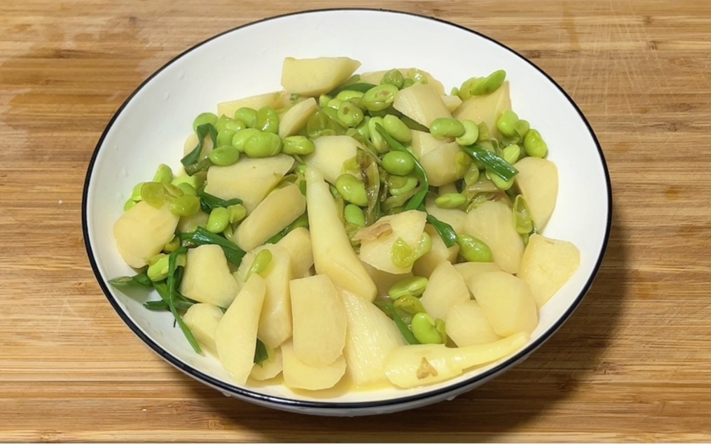

# 清炒茭白 (Stir-Fried Water Bamboo Shoots)

## 📋 基本資訊 / Recipe Overview
- **料理名稱 (繁體)**：清炒茭白
- **料理名称 (简体)**：清炒茭白
- **English Title**：Stir-Fried Water Bamboo Shoots (Jiangnan Style)
- **素食流派 / Diet**：全素 / 纯素 Vegan (纯素)
- **料理分類 / Category**：01-蔬菜本味类 / 江南淮扬 / 鲜甜清炒
- **份量 / Servings**：2-3 人份
- **準備時間 / Prep Time**：8 分鐘
- **烹飪時間 / Cook Time**：3-4 分鐘
- **總計耗時 / Total Time**：12 分鐘
- **來源 / Source**：现代中华素菜 Top 100 · [01-蔬菜本味类.md](../01-蔬菜本味类.md) 第 87 道

## 📖 菜品特色 / Description
茭白片清炒，江南夏秋名菜，鲜甜如笋，质地柔嫩脆爽，极简调味保留水乡本味清甜。

---

## 🌿 食材與調味清單 / Ingredients & Seasonings

### 主料
- 新鲜茭白 3-4 支（去壳后净重约 300g）
- 青红椒丝 25g（微量配色增香）
- 生姜 5g（切细丝；亦可用香葱段）

### 调味用料
- 食用植物油 2 汤匙（约 30ml）
- 食盐 1/2 茶匙（约 2.5g）
- 白砂糖 1/3 茶匙（约 1.5g，点睛之笔：激发茭白深层甜味）
- 优质生抽 1/2 茶匙（约 2.5ml，微量提鲜，不可多放以免染色）
- 开水 / 素高汤 2 汤匙（约 30ml）

---

## 🍳 烹飪步驟 / Step-by-Step Cooking Steps

### 步骤 1：去壳与切片
1. 茭白剥去绿色外壳，用刨刀削去根部老硬的外皮，清洗干净。
2. 将茭白斜切成厚度约 0.2 厘米的均匀菱形薄片（亦可顺丝切成粗丝）；青红椒切细丝。

### 步骤 2：热油煸香姜丝
1. 炒锅烧热，倒入 2 汤匙食用油，油温 5 成热时下入生姜丝煸炒出清香。

### 步骤 3：透油煸炒茭白
1. 下入切好的茭白片，调至中大火翻炒 1.5-2 分钟，让每一片茭白都均匀吸收油脂，组织微微变软。

### 步骤 4：烹入沸水微焖（断生关键）
1. 沿锅边烹入 2 汤匙开水（或素高汤），迅速盖上锅盖，利用高温蒸汽小火焖烧 30-40 秒，使茭白片内外熟透且柔嫩多汁。

### 步骤 5：调味与爽脆出锅
1. 揭盖转大火，加入青红椒丝，撒入 **食盐 1/2 茶匙**、**白糖 1/3 茶匙** 与 **生抽 1/2 茶匙**。
2. 大火快速颠翻 15-20 秒，炒干多余水气，见茭白油润光亮即可装盘出锅。

---

## 💡 大厨秘诀 / Chef's Tips

1. **清炒不建议焯水**：茭白水溶性糖分和清香味丰富，焯水会导致鲜甜流失；直接热油煸炒能锁住最地道的水乡风味。
2. **加少许开水蒸汽焖透**：茭白纤维紧密，单靠油炒不易熟透，沿锅边少许开水加盖焖 30 秒能使茭白软嫩与爽脆兼备。
3. **微量白糖是提鲜秘方**：江南大厨炒茭白必加少许糖，不仅不甜腻，反而能大幅提升茭白自身的“笋鲜味”。

---
*食谱归档时间：2026-08-20 · 收录于 20260818-vegetarianism 本地菜谱库 (1Top 精选)*
