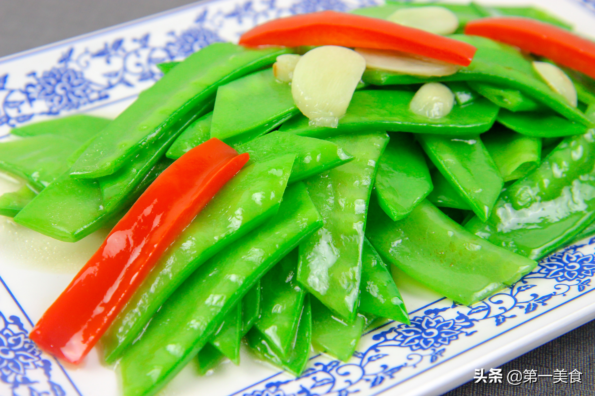

# 清炒荷兰豆 (Stir-Fried Snow Peas with Minced Garlic)

## 📋 基本資訊 / Recipe Overview
- **料理名稱 (繁體)**：清炒荷蘭豆
- **料理名称 (简体)**：清炒荷兰豆
- **English Title**：Stir-Fried Snow Peas with Minced Garlic
- **素食流派 / Diet**：全素 / 纯素 Vegan (含大蒜；五辛素，可去蒜改纯净素)
- **料理分類 / Category**：01-蔬菜本味类 / 脆嫩爽口 / 经典家常
- **份量 / Servings**：2-3 人份
- **準備時間 / Prep Time**：5 分鐘
- **烹飪時間 / Cook Time**：2 分鐘
- **總計耗時 / Total Time**：7 分鐘
- **來源 / Source**：现代中华素菜 Top 100 · [01-蔬菜本味类.md](../01-蔬菜本味类.md) 第 55 道

## 📖 菜品特色 / Description
荷兰豆大火快炒，翠绿甜脆。荷兰豆清甜无渣，旺火急翻，蒜香浓郁，豆荚清脆，色泽油亮如翡翠。

---

## 🌿 食材與調味清單 / Ingredients & Seasonings

### 主料
- 新鲜荷兰豆 350g
- 大蒜 3-4 瓣（切蒜片或蒜末）
- 红彩椒丝 少许（配色点缀）

### 调味料
- 食用植物油 1.5 汤匙（约 22ml）
- 食盐 1/2 茶匙（约 3g）
- 白砂糖 1/4 茶匙（约 1g，提鲜保甜）
- 素高汤 / 清水 1 汤匙
- 水淀粉 1 茶匙（选配）

---

## 🍳 烹飪步驟 / Step-by-Step Cooking Steps

### 步骤 1：双向撕除老筋（爽脆无渣核心）
1. 用手掐住荷兰豆一端的尖角，顺势向下撕掉背部的老筋；再捏住另一端尖角，撕去腹部的老筋。
2. 清水洗净后捞出沥干。

### 步骤 2：盐油沸水快焯 30 秒
1. 锅中烧开宽水，加入少许盐和数滴食用油。
2. 倒入处理好的荷兰豆，大火焯烫 30 秒至颜色转深翠绿，立即捞出投入冷水中过凉，沥干备用。

### 步骤 3：热锅爆香蒜片
1. 炒锅烧热，倒入食用植物油。
2. 油热下入蒜片和红椒丝，中火煸炒出蒜香味。

### 步骤 4：大火快炒与出锅调味
1. 转最大火，倒入沥干的荷兰豆，大火快速颠锅翻炒 30 秒。
2. 撒入 **食盐 1/2 茶匙** 与 **白糖 1/4 茶匙**，沿锅边点入 1 汤匙清水，翻炒 10 秒使调味完全融合，即刻出锅。

---

## 💡 大厨秘诀 / Chef's Tips

1. **两头两边撕净老筋**：荷兰豆两侧都有坚韧粗纤维，双向撕筋是入口无渣的关键。
2. **焯水不可超 30 秒**：荷兰豆薄脆易熟，短焯加冷水激透能锁住叶绿素并保持鼓胀饱满。
3. **临出锅放盐**：过早放盐会导致豆荚脱水发瘪，出锅前调味能保持豆荚饱满多汁。

---
*食谱归档时间：2026-08-20 · 收录于 20260818-vegetarianism 本地菜谱库 (1Top 精选)*
