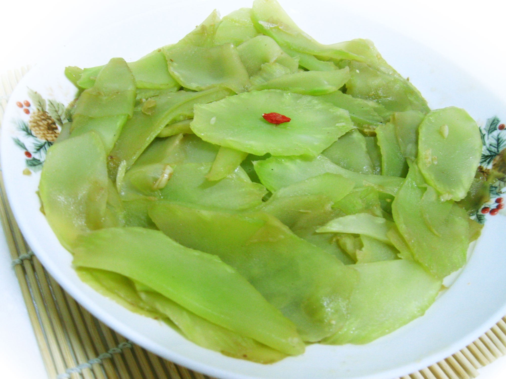

# 清炒莴笋 (Stir-Fried Stem Lettuce (Celtuce))

## 📋 基本資訊 / Recipe Overview
- **料理名稱 (繁體)**：清炒萵筍
- **料理名称 (简体)**：清炒莴笋
- **English Title**：Stir-Fried Stem Lettuce (Celtuce)
- **素食流派 / Diet**：全素 / 纯素 Vegan (含大蒜；五辛素，可去蒜改纯净素)
- **料理分類 / Category**：01-蔬菜本味类 / 脆嫩爽口 / 江南家常
- **份量 / Servings**：2-3 人份
- **準備時間 / Prep Time**：5 分鐘
- **烹飪時間 / Cook Time**：2-3 分鐘
- **總計耗時 / Total Time**：7-8 分鐘
- **來源 / Source**：现代中华素菜 Top 100 · [01-蔬菜本味类.md](../01-蔬菜本味类.md) 第 48 道

## 📖 菜品特色 / Description
莴笋片或丝，清炒或凉拌，脆甜。翠绿如玉，质地爽脆清甜，原汁原味。

---

## 🌿 食材與調味清單 / Ingredients & Seasonings

### 主料
- 鲜嫩莴笋 1 根（去皮后约 300g）
- 大蒜 2 瓣（切蒜片）
- 红椒 1/4 个（切菱形小片配色）

### 调味料
- 食用植物油 1.5 汤匙（约 22ml）
- 食盐 1/2 茶匙（约 3g，腌制 1/4 茶匙 + 炒制 1/4 茶匙）
- 白砂糖 1/4 茶匙（约 1g，提鲜回甘）
- 水淀粉 1 茶匙（极薄微芡，使菜品油亮光润）

---

## 🍳 烹飪步驟 / Step-by-Step Cooking Steps

### 步骤 1：深层削皮与改刀
1. **彻底去皮**：用削皮刀深层削去莴笋粗糙外皮和内部一圈白色筋膜，直至通体呈现晶莹翠绿肉质。
2. **切片**：莴笋对半剖开，斜刀切成 2mm 厚的菱形薄片；红椒切相应大小菱形片。

### 步骤 2：轻盐杀水（去苦保脆核心）
1. 莴笋片放入碗中，撒入 1/4 茶匙食盐抓拌均匀，静置腌制 3-5 分钟。
2. 待莴笋片微微发软出水后，用冷水快速漂洗一遍并彻底沥干（此步骤能带走草酸苦味并锁住脆度）。

### 步骤 3：爆香与大火快炒
1. 炒锅烧热倒油，下入蒜片与红椒片，中火煸炒出香味。
2. 转最大火，倒入沥干的莴笋片，旺火极速颠翻炒制 30-40 秒。

### 步骤 4：微调抱汁
1. 撒入剩余 **1/4 茶匙食盐** 与 **1/4 茶匙白糖**。
2. 淋入 1 茶匙薄水淀粉，快速颠锅 5 秒使微芡薄薄包裹莴笋片，油润透亮，即刻关火出锅。

---

## 💡 大厨秘诀 / Chef's Tips

1. **削皮需见翠绿肉**：莴笋表皮下白色纤维圈带有明显苦涩且咬不动，务必深削见绿。
2. **微盐抓腌更脆爽**：经少许盐抓出游离水分后，莴笋细胞质更紧密，大火快炒不仅不出一滴水，而且如翡翠般碧绿爽脆。
3. **不可久炒**：莴笋极其易熟，下锅翻炒半分钟断生即可，炒过头则软塌变黄失去脆感。

---
*食谱归档时间：2026-08-20 · 收录于 20260818-vegetarianism 本地菜谱库 (1Top 精选)*
