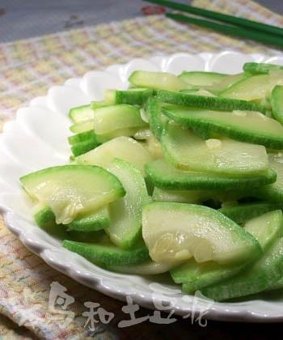

# 清炒西葫蘆 (Stir-Fried Zucchini / Summer Squash)

## 📋 基本資訊 / Recipe Overview
- **料理名稱 (繁體)**：清炒西葫蘆
- **料理名称 (简体)**：清炒西葫芦
- **English Title**：Quick Homestyle Stir-Fried Zucchini Slices with Garlic and Dried Chili
- **素食流派 / Diet**：全素 / 纯素 Vegan (含蒜、干椒；可去蒜做纯净素)
- **料理分類 / Category**：01-蔬菜本味类 / 家常快手 / 清鲜嫩滑
- **份量 / Servings**：2-3 人份
- **準備時間 / Prep Time**：5 分鐘
- **烹飪時間 / Cook Time**：3 分鐘
- **總計耗時 / Total Time**：8 分鐘
- **來源 / Source**：现代中华素菜 Top 100 · [01-蔬菜本味类.md](../01-蔬菜本味类.md) 第 39 道

## 📖 菜品特色 / Description
快炒保嫩，可加干椒，华北家常。

---

## 🌿 食材與調味清單 / Ingredients & Seasonings

### 主料
- 鲜嫩西葫芦 1-2 根（约 400g）
- 大蒜 3-4 瓣（切蒜片）
- 干红辣椒 2 根（切段）
- 枸杞（选配点缀） 8-10 粒

### 调味用料
- 食用植物油 1.5 汤匙（约 20-25ml）
- 食盐 1/2 茶匙（约 2.5g，出锅前放）
- 白糖 1/4 茶匙（约 1g，提鲜）
- 纯生抽 1/2 汤匙（约 7.5ml，沿边烹入提鲜）
- 纯芝麻香油 1/2 茶匙（约 2.5ml）

---

## 🍳 烹飪步驟 / Step-by-Step Cooking Steps

### 步骤 1：去瓤切片与控水技巧
1. 西葫芦洗净去头尾，纵向一剖为二。若中间瓜瓤较多较软，可用勺子轻轻刮去内瓤（**控水关键**：瓜瓤含水量极高，去瓤能有效防止炒制时大量出水变软塌）。
2. 将西葫芦斜刀切成 2-3 毫米厚的半圆形片。

### 步骤 2：炝锅激香
1. 炒锅大火烧热倒入食用油，下入蒜片和干辣椒段，中小火快速爆出蒜香与微辣香。

### 步骤 3：猛火极速翻炒
1. 调至**最大猛火**，倒入切好的西葫芦片。
2. 保持大火快速颠锅翻炒 1 分钟左右，使西葫芦片在高热油膜包裹下受热，颜色转为晶莹翠绿。

### 步骤 4：锅边烹生抽，最后调盐
1. 西葫芦刚变软断生之际，沿锅边快速淋入 1/2 汤匙生抽提鲜。
2. 撒入 **食盐 1/2 茶匙**、**白糖 1/4 茶匙**，放入洗净的枸杞。
3. 保持大火快速颠翻 10 秒拌匀，淋入香油，立刻关火盛盘（全程下锅到出锅控制在 90 秒内）。

---

## 💡 大厨秘诀 / Chef's Tips

1. **去瓤切片防出汤**：西葫芦含水量高达95%，去掉多水松软的内瓤切片，炒出来片片挺括、多汁而不溢汤。
2. **后放盐是保脆锁水金律**：西葫芦细胞壁脆弱，过早放盐会导致瞬间脱水变成“煮瓜汤”，务必起锅前最后几秒放盐。
3. **大火快炒忌盖锅盖**：盖盖会聚积水汽使西葫芦发黄发软，全程敞锅大火猛炒，保持翠绿嫩爽。

---
*食谱归档时间：2026-08-20 · 收录于 20260818-vegetarianism 本地菜谱库 (1Top 精选)*
