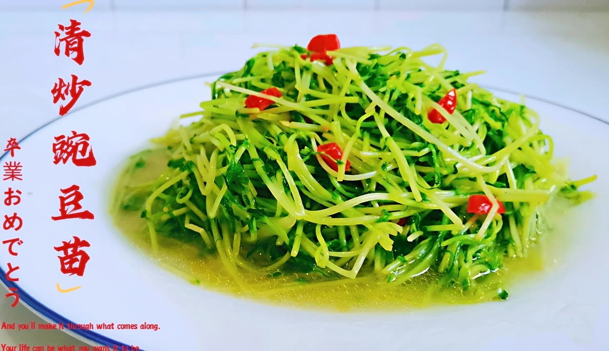

# 清炒豌豆 (Stir-Fried Fresh Sweet Peas)

## 📋 基本資訊 / Recipe Overview
- **料理名稱 (繁體)**：清炒豌豆
- **料理名称 (简体)**：清炒豌豆
- **English Title**：Stir-Fried Fresh Sweet Green Peas
- **素食流派 / Diet**：全素 / 纯素 Vegan (纯素)
- **料理分類 / Category**：01-蔬菜本味类 / 时令甜豆 / 鲜甜可口
- **份量 / Servings**：2-3 人份
- **準備時間 / Prep Time**：5 分鐘
- **烹飪時間 / Cook Time**：3-4 分鐘
- **總計耗時 / Total Time**：8 分鐘
- **來源 / Source**：现代中华素菜 Top 100 · [01-蔬菜本味类.md](../01-蔬菜本味类.md) 第 98 道

## 📖 菜品特色 / Description
嫩豌豆快炒，甜嫩多汁，颗粒饱满碧绿，极简调味保留春夏季最新鲜自然的豆香与甘甜。

---

## 🌿 食材與調味清單 / Ingredients & Seasonings

### 主料
- 新鲜嫩甜豌豆粒 300g
- 生姜末 1/2 茶匙（约 2.5g）
- 红彩椒丁 15g（微量点缀配色）

### 焯水调料（固色防皱皮关键）
- 食盐 1/2 茶匙（约 2.5g）
- 白砂糖 1/3 茶匙（约 1.5g）
- 食用植物油 1/2 茶匙

### 调味与挂芡
- 食用植物油 1.5 汤匙（约 22ml）
- 食盐 1/2 茶匙（约 2.5g）
- 白砂糖 1/3 茶匙（约 1.5g，引出天然豆甜）
- 清水 / 素高汤 2 汤匙（约 30ml）
- 薄水淀粉（玉米淀粉 1/2 茶匙 + 清水 1 汤匙）

---

## 🍳 烹飪步驟 / Step-by-Step Cooking Steps

### 步骤 1：鲜豌豆焯水与冰水浸凉
1. 锅内倒入宽水大火烧沸，加入 **1/2 茶匙食盐**、**1/3 茶匙白糖** 与 **1/2 茶匙植物油**。
2. 倒入鲜豌豆粒，大火焯烫 1.5-2 分钟至九成熟断生。
3. 捞出后立即投入冰水（或凉水）中浸凉，随后充分沥干水分（冰水急冷能锁住翠绿并防止表皮起皱萎缩）。

### 步骤 2：热油爆香姜末
1. 炒锅烧热，倒入 1.5 汤匙植物油，油温 5 成热时下入生姜末小火煸炒出香味。

### 步骤 3：大火翻炒
1. 倒入沥干水分的豌豆粒与红彩椒丁，转大火猛火翻炒 30 秒。

### 步骤 4：润汤调味
1. 加入 **食盐 1/2 茶匙**、**白糖 1/3 茶匙** 与 **2 汤匙清水/素高汤**。
2. 大火快速颠翻翻炒 20 秒，让咸甜味透过表皮渗透入豆粒。

### 步骤 5：薄芡亮油出锅
1. 淋入调匀的薄水淀粉，大火快速推匀，使每颗豌豆表面裹上一层晶莹剔透的薄亮芡，即刻关火装盘。

---

## 💡 大厨秘诀 / Chef's Tips

1. **焯水加糖油+冰水过凉**：焯水时加少许糖和油能固色提亮，冰水过凉能阻止余温使豌豆表皮起皱变暗，保持粒粒圆润饱满。
2. **鲜豆不宜直接生炒**：豌豆皮质韧实，直接生炒不易熟透且易炒焦爆裂；先焯至九成熟再大火快炒是酒店大厨的标准做法。
3. **极薄琉璃芡裹味**：豌豆表面光滑不易附味，薄薄一层水淀粉能让鲜甜味均匀附着在豆粒表面，入口多汁清甜。

---
*食谱归档时间：2026-08-20 · 收录于 20260818-vegetarianism 本地菜谱库 (1Top 精选)*
