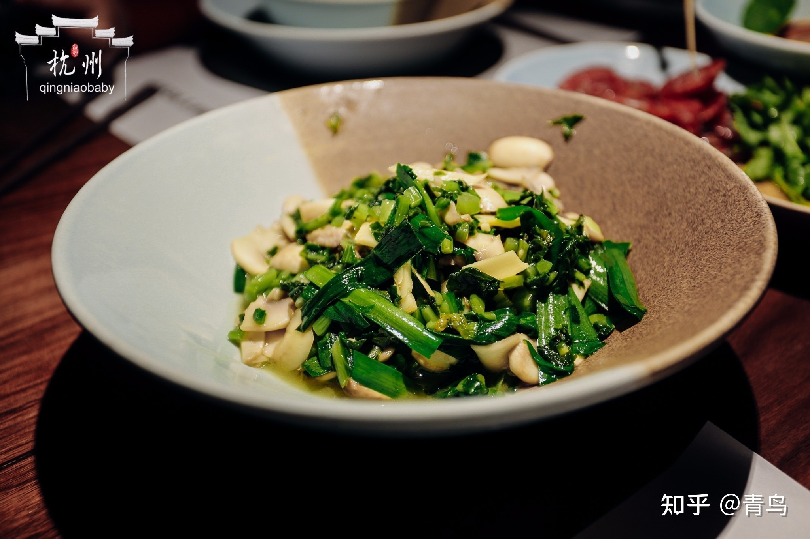

# 清炒雪里蕻 (Stir-Fried Fresh Potherb Mustard Greens (Fresh Xue Li Hong))

## 📋 基本資訊 / Recipe Overview
- **料理名稱 (繁體)**：清炒雪裏蕻
- **料理名称 (简体)**：清炒雪里蕻
- **English Title**：Stir-Fried Fresh Potherb Mustard Greens (Fresh Xue Li Hong)
- **素食流派 / Diet**：纯素 Vegan
- **料理分類 / Category**：01-蔬菜本味类 / 江南乡土菜 / 清鲜微辣
- **份量 / Servings**：2-3 人份
- **準備時間 / Prep Time**：8 分鐘
- **烹飪時間 / Cook Time**：3 分鐘
- **總計耗時 / Total Time**：11 分鐘
- **來源 / Source**：现代中华素菜 Top 100 · [01-蔬菜本味类.md](../01-蔬菜本味类.md) 第 77 道

## 📖 菜品特色 / Description
鲜雪里蕻快炒，未腌的本味。

---

## 🌿 食材與調味清單 / Ingredients & Seasonings
### 主料
- 新鲜未腌制嫩雪里蕻（鲜雪菜） 350g

### 配料
- 鲜生姜末 1 茶匙（约 5g）
- 干红辣椒 2 根（剪成细圈去籽，微辣开胃）
- 大蒜 2 瓣（切末；纯素免）

### 焯水调料
- 食盐 1 茶匙（约 5g）
- 食用植物油 1/2 汤匙（约 7.5ml）

### 调味料
- 纯香菜籽油（或熟植物油） 2 汤匙（约 30ml）
- 食盐 1/2 茶匙（约 3g）
- 白砂糖 1/2 茶匙（约 2.5g，去涩激鲜）
- 纯酿生抽 1/2 茶匙（约 2.5ml）
- 纯正芝麻香油 1/2 茶匙（约 2.5ml）

---

## 🍳 烹飪步驟 / Step-by-Step Cooking Steps
### 步骤 1：仔细淘洗除泥沙
1. 鲜雪里蕻根茎叶缝极易藏细沙，在流动清水中逐叶漂洗干净，沥去水分。

### 步骤 2：沸水轻焯除涩
1. 锅中烧沸水，加 1 茶匙盐和半汤匙油，将鲜雪里蕻整株下锅焯烫 30 秒至转翠绿。
2. 捞出迅速浸入冷水冲凉，用手轻轻攥干多余苦水，切成 1cm 左右的小细碎段。

### 步骤 3：菜油炝香姜椒
1. 炒锅烧热，注入 2 汤匙菜籽油（菜籽油与雪里蕻香气最契合）。
2. 油温 5 成热下姜末、干辣椒圈和蒜末，小火慢煸出香辣焦香。

### 步骤 4：大火爆炒菜碎
1. 倒入切碎的雪里蕻碎段，转大火快速翻炒 1 分钟，让菜碎在热油中充分受热，激发出独特的鲜芥清香。

### 步骤 5：调味润色出锅
1. 加入 **食盐 1/2 茶匙**、**白糖 1/2 茶匙** 与 **生抽 1/2 茶匙**。
2. 大火翻炒 20 秒使调味完全融合，淋入香油翻匀即可出锅装盘。

---

## 💡 大厨秘诀 / Chef's Tips
1. **鲜雪菜必须焯水攥干**：未腌制的新鲜雪里蕻草酸和辛冲味浓，焯水 30 秒过凉并轻挤水分，能去除麻涩，保留鲜嫩本味。
2. **切细碎炒更入味**：雪里蕻切成 1cm 碎段，比长段更能吸附菜油与姜椒香气，咀嚼脆爽。
3. **菜籽油与白糖点睛**：浓香菜籽油能压制雪里蕻的青气，少许白糖则让菜碎咀嚼时产生持久清甜余味。

---
*食谱归档时间：2026-08-20 · 收录于 20260818-vegetarianism 本地菜谱库 (1Top 精选)*
