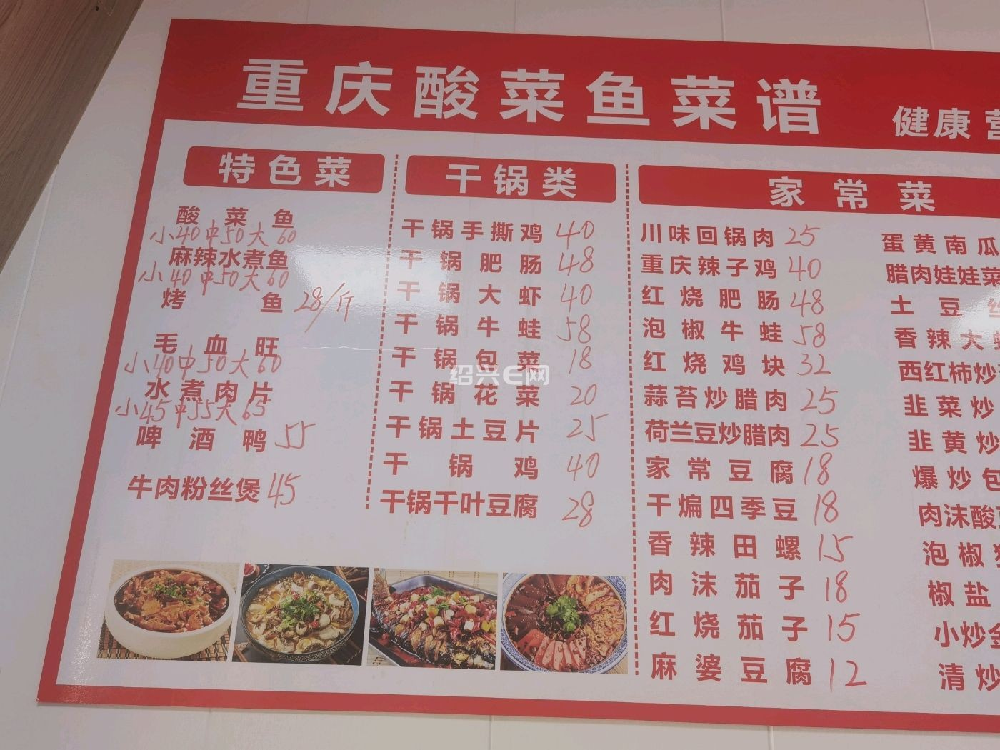

# 清炒韭菜 (Stir-Fried Chinese Chives)

## 📋 基本資訊 / Recipe Overview
- **料理名稱 (繁體)**：清炒韭菜
- **料理名称 (简体)**：清炒韭菜
- **English Title**：Quick Stir-Fried Fresh Chinese Garlic Chives
- **素食流派 / Diet**：全素 / 纯素 Vegan (含韭五辛素；纯素五辛斋食)
- **料理分類 / Category**：01-蔬菜本味类 / 春季时令 / 经典快炒
- **份量 / Servings**：2-3 人份
- **準備時間 / Prep Time**：5 分鐘
- **烹飪時間 / Cook Time**：1.5 分鐘
- **總計耗時 / Total Time**：6.5 分鐘
- **來源 / Source**：现代中华素菜 Top 100 · [01-蔬菜本味类.md](../01-蔬菜本味类.md) 第 22 道

## 📖 菜品特色 / Description
春韭快炒，可纯素不放蛋，香辣下饭。

---

## 🌿 食材與調味清單 / Ingredients & Seasonings

### 主料
- 新鲜嫩韭菜 350g
- 生姜丝（选配） 3g
- 干红辣椒（选配，微辣提香） 2 个（剪成细丝）

### 调味用料
- 食用植物油（花生油或清亮色拉油） 1.5 汤匙（约 22ml）
- 优质生抽 1 茶匙（约 5ml）
- 食盐 1/2 茶匙（约 3g）
- 白砂糖 1/4 茶匙（约 1g，提鲜去辛辣）
- 芝麻香油 1/4 茶匙（约 1.5ml）

---

## 🍳 烹飪步驟 / Step-by-Step Cooking Steps

### 步骤 1：摘洗与彻底沥水
1. 挑选脆嫩春韭，摘净枯黄叶片与泥根，清水洗净。
2. **彻底沥干水分**：韭菜平铺在沥水篮中充分沥干或用干布吸干表面水分（水分多会导致炒时大量出汤发软）。
3. 切成 4cm 长的段，并将较硬的“韭白（根部）”与柔软的“韭叶”分开放置。

### 步骤 2：热锅宽油爆香
1. 炒锅烧至大热（微冒烟），倒入 1.5 汤匙植物油。
2. 下姜丝与干辣椒丝快速爆香 3 秒。

### 步骤 3：大火分炒断生
1. 保持**最大猛火**，先下入较耐热的韭白部分，快速翻炒 10 秒。
2. 迅速下入全部韭菜叶，大火极速翻炒 15 秒至韭叶受热软化转深绿。

### 步骤 4：烹生抽与极速出锅
1. 沿锅边烹入 1 茶匙生抽，撒入食盐 1/2 茶匙、白糖 1/4 茶匙，滴入少许香油。
2. 猛烈颠锅翻炒 5 秒断生，立刻关火盛盘（全程炒制控制在 30-35 秒内）。

---

## 💡 大厨秘诀 / Chef's Tips

1. **韭白韭叶分段下锅**：韭白较粗耐热、韭叶娇嫩易熟，先下韭白 10 秒再下韭叶，成熟度一致不发烂。
2. **全程不超过 35 秒**：韭菜受热时间过长不仅出汤软烂，还会产生不悦的“烂韭菜气味”，断生即起最鲜脆。
3. **少许白糖去燥辣**：微量白糖能柔和韭菜的辛辣感，激发出春韭独特的甘甜鲜美。

---
*食谱归档时间：2026-08-20 · 收录于 20260818-vegetarianism 本地菜谱库 (1Top 精选)*
