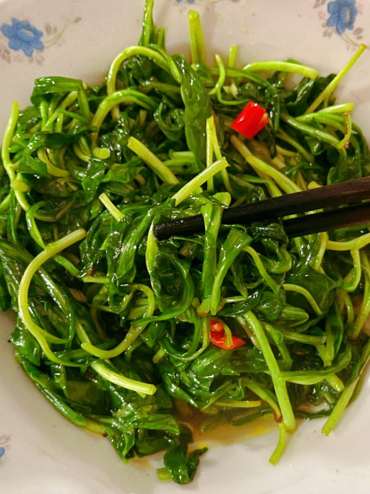

# 清炒马兰头 (Stir-Fried Kalimeris Indica (Jiangnan Spring Wild Greens))

## 📋 基本資訊 / Recipe Overview
- **料理名稱 (繁體)**：清炒馬蘭頭
- **料理名称 (简体)**：清炒马兰头
- **English Title**：Stir-Fried Kalimeris Indica (Jiangnan Spring Wild Greens)
- **素食流派 / Diet**：纯素 Vegan
- **料理分類 / Category**：01-蔬菜本味类 / 江南春季野菜 / 清鲜解毒
- **份量 / Servings**：2-3 人份
- **準備時間 / Prep Time**：8 分鐘
- **烹飪時間 / Cook Time**：2 分鐘
- **總計耗時 / Total Time**：10 分鐘
- **來源 / Source**：现代中华素菜 Top 100 · [01-蔬菜本味类.md](../01-蔬菜本味类.md) 第 79 道

## 📖 菜品特色 / Description
江南春野菜，清炒或拌香干。

---

## 🌿 食材與調味清單 / Ingredients & Seasonings
### 主料
- 新鲜嫩马兰头（春季野生或大棚嫩芽） 350g

### 配料
- 鲜生姜末 1 茶匙（约 5g）
- 大蒜 2 瓣（切末；纯素免）

### 焯水调料（去涩保色）
- 食盐 1 茶匙（约 5g）
- 食用植物油 1/2 汤匙（约 7.5ml）

### 调味品
- 纯正芝麻香油 1 汤匙（约 15ml，马兰头绝配灵魂）
- 优质植物油 1 汤匙（约 15ml）
- 食盐 1/2 茶匙（约 3g）
- 白砂糖 1/2 茶匙（约 2.5g，化解野菜涩味、提拔春鲜）
- 蘑菇精 / 素高汤粉 1/4 茶匙（选配）

---

## 🍳 烹飪步驟 / Step-by-Step Cooking Steps
### 步骤 1：摘择去杂，淘洗泥沙
1. 仔细剔除马兰头中的杂草、黄叶及老硬根茎，反复在清水中漂洗干净。

### 步骤 2：沸水飞水去草酸（关键步）
1. 锅中烧开足量沸水，加入 **1 茶匙食盐** 与 **半汤匙植物油**。
2. 下马兰头焯烫 30-40 秒（见叶片转深绿变软），立即捞出投入冷水中冲凉。
3. 用双手轻轻攥干多余水分（不用攥得太干，保留微量润泽），放在案板上粗切两刀。

### 步骤 3：热油爆香姜末
1. 炒锅烧热，倒入 1 汤匙植物油与 1/2 汤匙芝麻香油，下姜末（及蒜末）小火煸炒出香。

### 步骤 4：大火抖散翻炒
1. 倒入切好的马兰头，转大火快速用锅铲或筷子抖散翻炒 30 秒。

### 步骤 5：糖盐调和，重淋香油出锅
1. 撒入 **食盐 1/2 茶匙** 与 **白糖 1/2 茶匙** 翻炒均匀。
2. 出锅前淋入剩余 **1/2 汤匙纯正芝麻香油**，翻匀即可出锅装盘。

---

## 💡 大厨秘诀 / Chef's Tips
1. **野菜必先焯水过凉**：马兰头天然草酸与涩味较重，沸水焯烫 30 秒能去除 70% 草酸与苦涩，冷水冲凉可牢牢定住翠绿色泽。
2. **攥水力度恰到好处**：攥得过干炒出易柴硬塞牙，太湿又会沦为汤菜；轻攥至不滴水、手感松润最佳。
3. **麻油与白糖是灵魂搭档**：江南食俗“马兰头配麻油”，充沛的芝麻油包裹野菜纤维，配以微量白糖，满口生津、春意盎然。

---
*食谱归档时间：2026-08-20 · 收录于 20260818-vegetarianism 本地菜谱库 (1Top 精选)*
