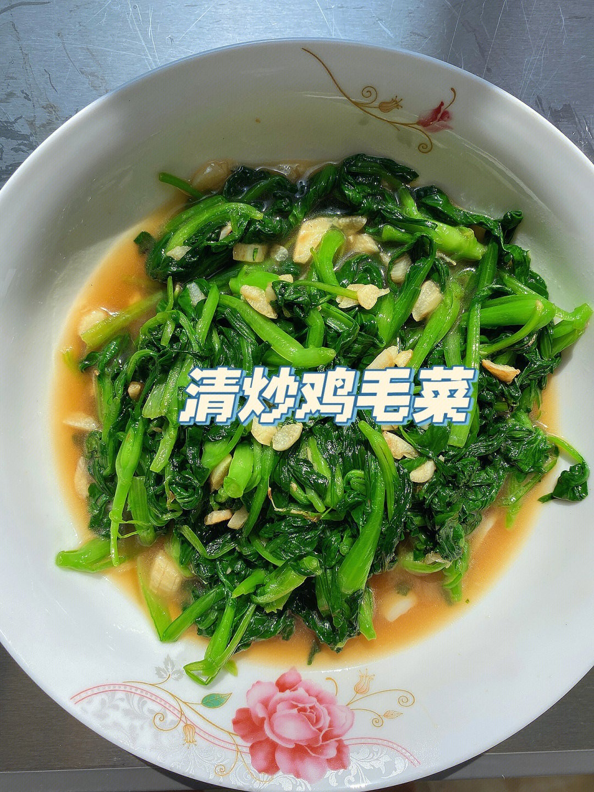

# 清炒鸡毛菜 (Shanghai Quick-Fried Baby Bok Choy (Stir-Fried Baby Greens))

## 📋 基本資訊 / Recipe Overview
- **料理名稱 (繁體)**：清炒雞毛菜
- **料理名称 (简体)**：清炒鸡毛菜
- **English Title**：Shanghai Quick-Fried Baby Bok Choy (Stir-Fried Baby Greens)
- **素食流派 / Diet**：纯素 Vegan
- **料理分類 / Category**：01-蔬菜本味类 / 江南家常 / 清甜脆嫩
- **份量 / Servings**：2-3 人份
- **準備時間 / Prep Time**：5 分鐘
- **烹飪時間 / Cook Time**：1.5 分鐘 (大火猛炒 45 秒)
- **總計耗時 / Total Time**：6.5 分鐘
- **來源 / Source**：现代中华素菜 Top 100 · [01-蔬菜本味类.md](../01-蔬菜本味类.md) 第 75 道

## 📖 菜品特色 / Description
上海小青菜，快炒清甜。

---

## 🌿 食材與調味清單 / Ingredients & Seasonings
### 主料
- 新鲜幼嫩鸡毛菜（上海青菜幼苗） 350g

### 配料
- 大蒜 3 瓣（切蒜末；纯净素以生姜末 3g 替代）

### 调味品
- 优质植物油（花生油或清香菜籽油） 1.5 汤匙（约 20ml）
- 食盐 1/2 茶匙（约 3g）
- 白砂糖 1/3 茶匙（约 1.5g，江南本帮灵魂提鲜）
- 蘑菇精 / 素高汤粉 1/4 茶匙（选配）

---

## 🍳 烹飪步驟 / Step-by-Step Cooking Steps
### 步骤 1：轻淘轻洗，彻底甩干水分
1. 鸡毛菜极其娇嫩，放入大盆冷水中轻轻漂洗掉泥沙，动作宜轻柔避免揉烂叶片。
2. 捞出后放入沥水篮中充分甩干表面水分（表面带水入锅会导致油温骤降，瞬间变成水煮烂菜）。

### 步骤 2：热锅热油，炝出蒜香
1. 炒锅置于大火上烧热至微冒轻烟，倒入 1.5 汤匙植物油。
2. 油温 5 成热下蒜末（或姜末），快速翻炒 5 秒爆出香味。

### 步骤 3：最大猛火，极速翻炒
1. 迅速将鸡毛菜全部倒入锅中。
2. 保持最大猛火，用锅铲快速兜底大翻炒 20-30 秒，菜叶受高热迅速收缩变深绿。

### 步骤 4：撒盐下糖，融化即起
1. 见菜叶七八成熟，立即均匀撒入 **食盐 1/2 茶匙** 与 **白糖 1/3 茶匙**。
2. 保持最大火猛烈翻颠 10-15 秒，使糖盐完全融化裹匀。

### 步骤 5：断生即刻装盘
1. 锅中菜叶刚完全断生、尚未析出大量汤汁前，立即关火装盘（全程下锅到盛盘不超过 45 秒）。

---

## 💡 大厨秘诀 / Chef's Tips
1. **水汽彻底甩干是脆嫩根本**：鸡毛菜含水率极高，入锅前必须甩干表面水分，借高热锅气快速断生。
2. **一抹白糖吊出清甜本味**：江南本帮名厨炒小青菜必放微量白砂糖，能中和青草微涩，瞬间激发蔬菜天然甘甜。
3. **闪电出锅锁住翠绿**：全程猛火快炒不盖盖，45 秒内出锅，最大程度保留脆弱的维生素 C 与碧绿色泽。

---
*食谱归档时间：2026-08-20 · 收录于 20260818-vegetarianism 本地菜谱库 (1Top 精选)*
