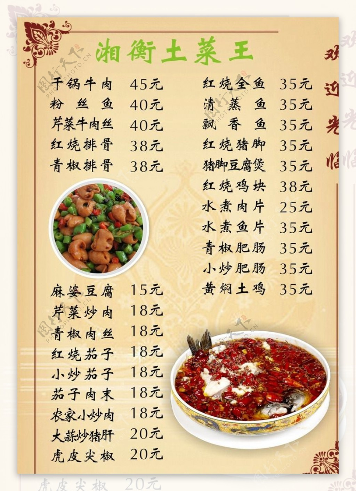

# 清蒸茄子 (Steamed Whole Eggplant with Dipping Sauce)

## 📋 基本資訊 / Recipe Overview
- **料理名稱 (繁體)**：清蒸茄子
- **料理名称 (简体)**：清蒸茄子
- **English Title**：Tender Steamed Whole Eggplant with Aromatic Dipping Sauce
- **素食流派 / Diet**：全素 / 纯素 Vegan (纯植物本味；蘸料含姜醋或蒜末可选)
- **料理分類 / Category**：01-蔬菜本味类 / 原汁原味 / 清淡健康
- **份量 / Servings**：2-3 人份
- **準備時間 / Prep Time**：5 分鐘
- **烹飪時間 / Cook Time**：12 分鐘
- **總計耗時 / Total Time**：17 分鐘
- **來源 / Source**：现代中华素菜 Top 100 · [01-蔬菜本味类.md](../01-蔬菜本味类.md) 第 34 道

## 📖 菜品特色 / Description
整条或切条清蒸，蘸汁，最本味。

---

## 🌿 食材與調味清單 / Ingredients & Seasonings

### 主料
- 鲜嫩紫长茄子 2-3 根（约 400g，表皮光亮紧实）

### 秘制本味蘸料汁（双重风味可选）
- 优质生抽 2 汤匙（约 30ml）
- 镇江香醋 / 老陈醋 1 汤匙（约 15ml）
- 纯芝麻香油 1 汤匙（约 15ml）
- 细姜末 1 茶匙（约 5g，温润暖胃）
- 大蒜泥（选配） 1 汤匙（约 10g）
- 白糖 1/2 茶匙（约 2.5g）
- 辣椒油 / 青线椒圈（选配） 1 茶匙

---

## 🍳 烹飪步驟 / Step-by-Step Cooking Steps

### 步骤 1：整条清蒸（锁住清甜汁水）
1. 茄子洗净去蒂，整条保留（亦可纵向划一浅刀透气），不切碎能最大限度锁住内部天然清甜的茄汁。
2. 蒸锅中加足量清水大火烧沸，水开上汽后将整茄放入蒸格。
3. 盖严锅盖，大火蒸 10-12 分钟，至用筷子可毫不费力地自上而下轻松贯穿。

### 步骤 2：手撕出条
1. 蒸好的茄子取出稍晾温凉。
2. 顺着茄子的天然纹理，用手撕成均匀的长条，整齐码入长盘中（手撕比刀切断口更自然，更容易吸附蘸汁）。

### 步骤 3：调制万能蘸水
1. 小碗中混合生抽 2 汤匙、香醋 1 汤匙、芝麻香油 1 汤匙、白糖 1/2 茶匙及姜末（或蒜泥、辣椒）。
2. 可以直接将料汁淋在茄条上，也可以作为独立蘸碟随夹随蘸。

---

## 💡 大厨秘诀 / Chef's Tips

1. **整条蒸锁水最甘甜**：切块蒸会导致茄汁流失入蒸水，整条蒸熟能完整封存茄子原汁原味的清甜与多汁感。
2. **大火足汽防变色**：水烧大滚后再放茄子，猛烈蒸汽阻断氧化，蒸出的茄肉洁白软嫩。
3. **姜醋调和寒凉**：茄子性凉，蘸料中加入优质生姜末与香醋香油，不仅温中健脾，更能衬托出茄肉丝丝入扣的清甜。

---
*食谱归档时间：2026-08-20 · 收录于 20260818-vegetarianism 本地菜谱库 (1Top 精选)*
