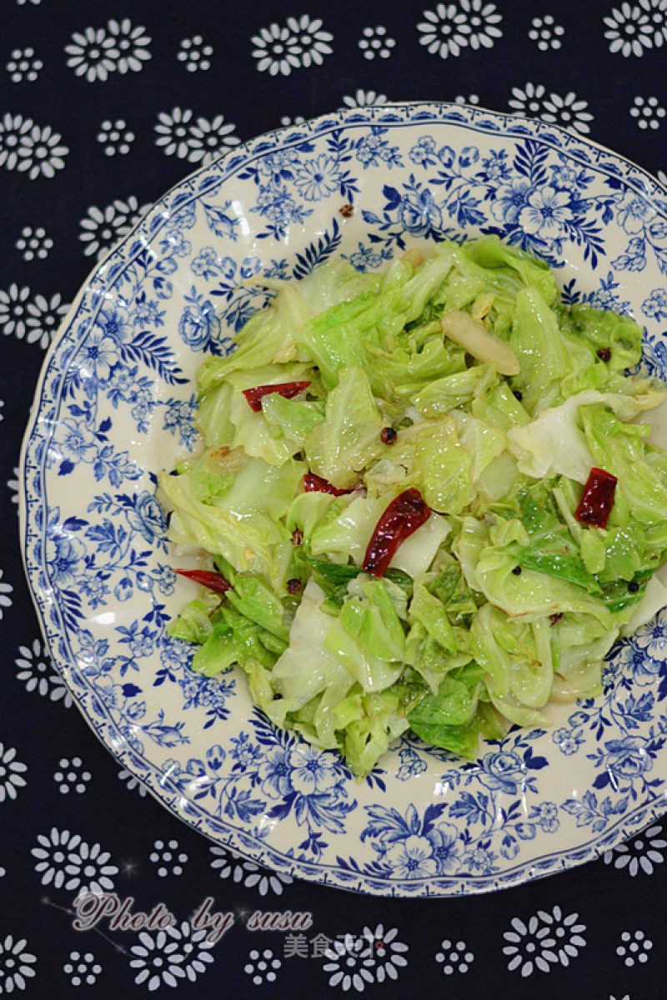

# 炝炒圆白菜 (Sichuan Spicy & Tangy Stir-Fried Cabbage (Qiang-Chao Cabbage))

## 📋 基本資訊 / Recipe Overview
- **料理名稱 (繁體)**：熗炒圓白菜
- **料理名称 (简体)**：炝炒圆白菜
- **English Title**：Sichuan Spicy & Tangy Stir-Fried Cabbage (Qiang-Chao Cabbage)
- **素食流派 / Diet**：纯素 Vegan
- **料理分類 / Category**：01-蔬菜本味类 / 川北经典 / 炝炒时蔬
- **份量 / Servings**：2-3 人份
- **準備時間 / Prep Time**：5 分鐘
- **烹飪時間 / Cook Time**：2-3 分鐘
- **總計耗時 / Total Time**：8 分鐘
- **來源 / Source**：现代中华素菜 Top 100 · [01-蔬菜本味类.md](../01-蔬菜本味类.md) 第 67 道

## 📖 菜品特色 / Description
热油炝椒再下菜，东北、华北家常。

---

## 🌿 食材與調味清單 / Ingredients & Seasonings
### 主料
- 新鲜圆白菜（手撕包菜） 400g

### 炝锅灵魂料头
- 四川大红袍花椒 1 茶匙（约 2g）
- 优质干红辣椒 5-6 根（剪段去籽）
- 大蒜 4 瓣（切厚片）
- 大葱白 1 小段（切马蹄葱；纯素以生姜丝 5g 替代）

### 调味品
- 菜籽油 / 花生油 2 汤匙（约 30ml）
- 食盐 1/2 茶匙（约 3g）
- 优质陈醋 / 保宁醋 1 汤匙（约 15ml）
- 纯酿生抽 1 汤匙（约 15ml）
- 白砂糖 1/2 茶匙（约 2.5g，川味复合提鲜）
- 蘑菇精 / 素高汤精 1/4 茶匙（选配）

---

## 🍳 烹飪步驟 / Step-by-Step Cooking Steps
### 步骤 1：手撕除梗，极致甩干
1. 圆白菜洗净，用手撕成 4-5cm 见方大片，去除粗硬主梗。
2. 放入脱水篮彻底甩干水分，确保菜叶干爽无积水。

### 步骤 2：慢火炝炸糊辣油（炝炒精髓）
1. 锅热倒入菜籽油，温油（约 4 成热）下入花椒粒，小火慢炸至花椒呈深褐色溢出麻香。
2. 紧接着下入干辣椒段、蒜片和葱白（或姜丝），慢煸至干辣椒变为**棕红发亮（糊辣壳香气）**，切忌炸焦发黑。

### 步骤 3：猛火入菜，极速翻颠
1. 将炉火调至最大猛火，至锅边微冒青烟。
2. 一口气倒入圆白菜片，快速翻炒颠锅 1 分钟左右，使菜叶充分裹上糊辣红油与锅气，见菜叶微塌边缘微焦。

### 步骤 4：锅边烹醋，激发出香
1. 加入 **食盐 1/2 茶匙**、**白糖 1/2 茶匙**、**生抽 1 汤匙**。
2. 沿锅边一圈猛烈淋入 **陈醋 1 汤匙**，高温瞬间激起浓烈的酸香麻辣雾气。

### 步骤 5：十秒出锅
1. 保持最大火猛翻 10 秒，让调味完全融合，即刻关火出锅装盘（全程不盖锅盖）。

---

## 💡 大厨秘诀 / Chef's Tips
1. **糊辣壳香气温油炸出**：花椒温油下，辣椒微热下，炸至棕红微褐即成糊辣香；过火则焦苦，欠火则不香。
2. **大火爆炒绝不加水**：全程大火蒸发菜叶表面微量水分，利用油温与镬气将圆白菜逼出清甜焦香。
3. **陈醋沿锅边烹入**：“烹醋”利用高温锅壁将生醋酸味转化为复合焦酸醇香，是炝炒菜爽口脆嫩的核心秘诀。

---
*食谱归档时间：2026-08-20 · 收录于 20260818-vegetarianism 本地菜谱库 (1Top 精选)*
