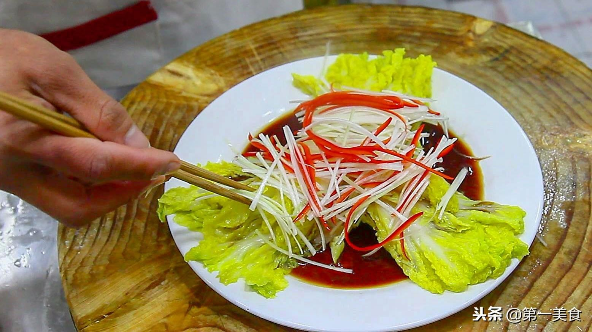

# 白灼娃娃菜 (Cantonese Poached Baby Cabbage)

## 📋 基本資訊 / Recipe Overview
- **料理名稱 (繁體)**：白灼娃娃菜
- **料理名称 (简体)**：白灼娃娃菜
- **English Title**：Cantonese Poached Baby Chinese Cabbage with Garlic Soy Sauce
- **素食流派 / Diet**：全素 / 纯素 Vegan (含蒜；可去蒜做纯净素)
- **料理分類 / Category**：01-蔬菜本味类 / 粤式白灼 / 清甜爽口
- **份量 / Servings**：2-3 人份
- **準備時間 / Prep Time**：5 分鐘
- **烹飪時間 / Cook Time**：3-4 分鐘
- **總計耗時 / Total Time**：8 分鐘
- **來源 / Source**：现代中华素菜 Top 100 · [01-蔬菜本味类.md](../01-蔬菜本味类.md) 第 92 道

## 📖 菜品特色 / Description
整棵剖开焯水淋汁，比上汤更清淡本味。娃娃菜嫩爽鲜甜，吸饱蒜香豉油汁，入口多汁回甘。

---

## 🌿 食材與調味清單 / Ingredients & Seasonings

### 主料
- 鲜嫩娃娃菜 2 棵（约 350g）
- 大蒜 6 瓣（剁成细碎蒜蓉）
- 红椒 1/3 个（切细丝配色）

### 焯水调料（锁色保脆关键）
- 食盐 1 茶匙（约 5g）
- 食用植物油 1/2 汤匙（约 7.5ml）

### 粤式复合白灼豉油汁
- 优质生抽 / 蒸鱼豉油（纯植物酿造） 2 汤匙（约 30ml）
- 素蚝油 1 汤匙（约 15ml）
- 白砂糖 1/2 茶匙（约 2.5g）
- 温开水 / 素高汤 2 汤匙（约 30ml）

### 激香淋油
- 植物油（花生油最佳） 2 汤匙（约 30ml）

---

## 🍳 烹飪步驟 / Step-by-Step Cooking Steps

### 步骤 1：改刀切瓣（保留根蒂）
1. 娃娃菜洗净外表，保留根部连接不要切除。
2. 将每棵娃娃菜纵向对半剖开，再各切成 3-4 瓣（一棵切成 6-8 长瓣），使叶片与菜帮紧密相连不散落。

### 步骤 2：宽水盐油，分段焯烫
1. 锅内加入足量宽水大火烧至完全沸腾，加入 **1 茶匙食盐** 与 **1/2 汤匙植物油**。
2. **先帮后叶**：手持菜叶端，先将较厚的菜帮部分浸入沸水中焯烫 40 秒；随后将整株娃娃菜完全推入水中，焯烫 30-40 秒至刚断生。
3. 迅速捞出，沥干水分。

### 步骤 3：码盘摆造型
1. 将沥干水分的娃娃菜整齐、层次分明地码入长条深盘中。

### 步骤 4：调配并浇淋豉油汁
1. 小碗中混合生抽 2 汤匙、素蚝油 1 汤匙、白糖 1/2 茶匙及温开水 2 汤匙搅拌均匀。
2. 将调好的白灼汁**沿盘子边缘缓缓淋入菜底**（切勿直接淋在菜顶冲淡蒜香）。

### 步骤 5：堆蒜泼油激香
1. 将剁好的蒜蓉与红椒丝均匀铺在娃娃菜顶端中央。
2. 净锅倒入 2 汤匙植物油，烧至 7-8 成热（微冒青烟）。
3. 趁热将滚油迅速均匀浇淋在蒜蓉与红椒丝上，“嗞啦”声中瞬间激发出浓郁蒜香，即可端盘享用。

---

## 💡 大厨秘诀 / Chef's Tips

1. **保留根蒂连带切瓣**：切娃娃菜时保留根部相连，焯水和摆盘时层次分明、整齐美观，吃时一口一整瓣多汁过瘾。
2. **先帮后叶分步烫**：娃娃菜帮肉质厚而叶片极嫩，先烫菜帮 40 秒再压入菜叶，能确保菜帮爽脆而菜叶不软烂发黄。
3. **底淋豉油顶泼油**：豉油汁沉于盘底让菜帮自然浸润吸味，热油只浇蒜末激香，菜身油润清爽不腻。

---
*食谱归档时间：2026-08-20 · 收录于 20260818-vegetarianism 本地菜谱库 (1Top 精选)*
