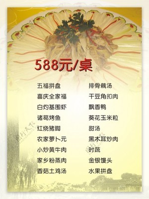

# 白灼时蔬拼盘 (Cantonese Assorted Poached Vegetables)

## 📋 基本資訊 / Recipe Overview
- **料理名稱 (繁體)**：白灼時蔬拼盤
- **料理名称 (简体)**：白灼时蔬拼盘
- **English Title**：Cantonese Assorted Poached Seasonal Vegetables Platter
- **素食流派 / Diet**：全素 / 纯素 Vegan (含蒜；可去蒜做纯净素)
- **料理分類 / Category**：01-蔬菜本味类 / 粤式宴席 / 缤纷白灼
- **份量 / Servings**：3-4 人份
- **準備時間 / Prep Time**：12 分鐘
- **烹飪時間 / Cook Time**：4-5 分鐘
- **總計耗時 / Total Time**：16 分鐘
- **來源 / Source**：现代中华素菜 Top 100 · [01-蔬菜本味类.md](../01-蔬菜本味类.md) 第 100 道

## 📖 菜品特色 / Description
多种时蔬分别焯水精致拼盘，淋统一蒜蓉豉油与滚烫热油，粤式素席经典压轴青菜，五彩缤纷，鲜甜脆嫩。

---

## 🌿 食材與調味清單 / Ingredients & Seasonings

### 主料（五彩时令鲜蔬）
- 西兰花 80g（切成小朵）
- 荷兰豆 50g（撕去老筋）
- 玉米笋 4-5 根（斜切对半）
- 鲜秋葵 4 根（整根焯水后斜切段）
- 娃娃菜 / 菜心 100g（切长条瓣）
- 水发黑木耳 40g（撕小朵）
- 红椒丝 10g（点缀配色）
- 大蒜 8 瓣（剁成细碎蒜蓉）

### 焯水锁色调料
- 食盐 1.5 茶匙（约 8g）
- 食用植物油 1 汤匙（约 15ml）

### 粤式秘制白灼豉油汁
- 纯植物酿造蒸鱼豉油 / 高档生抽 3 汤匙（约 45ml）
- 香菇素蚝油 1.5 汤匙（约 22ml）
- 白砂糖 1 茶匙（约 5g）
- 温开水 / 素高汤 3 汤匙（约 45ml）
- 芝麻香油 1/2 茶匙（约 2.5ml）

### 泼香热油
- 花生油 / 玉米油 2.5 汤匙（约 38ml）

---

## 🍳 烹飪步驟 / Step-by-Step Cooking Steps

### 步骤 1：时蔬改刀与分拣
1. 西兰花切小朵；荷兰豆撕去两边老筋；玉米笋斜切对半；娃娃菜纵切成长瓣；黑木耳撕小朵；秋葵洗净保留完整蒂部（整根焯水防黏液流失）。
2. 红椒切细丝，大蒜剁成细蒜蓉备用。

### 步骤 2：宽水盐油，梯次分步焯烫
1. 大锅中倒入充足宽水烧至沸腾，加入 **1.5 茶匙食盐** 和 **1 汤匙植物油**。
2. **分批次梯次下锅焯烫**：
   - **第一批（耐煮类）**：先下玉米笋、黑木耳、西兰花，焯烫 1.5 分钟；
   - **第二批（中度类）**：下入娃娃菜、整根秋葵，继续焯烫 1 分钟；
   - **第三批（极嫩类）**：最后下入荷兰豆，全锅焯烫 30-40 秒。
3. 将全部蔬菜迅速捞出，在常温纯净水中快速浸润过凉 10 秒（锁住脆绿），随后彻底沥干水分。
4. 将焯好的秋葵切去蒂部，斜切成小段。

### 步骤 3：艺术摆盘
1. 在大平盘中将各种时蔬按颜色（红、绿、黄、黑、白）以扇形或放射状环绕整齐码放，红椒丝点缀其间。

### 步骤 4：调配并浇入白灼豉油汁
1. 小碗中混合蒸鱼豉油 3 汤匙、素蚝油 1.5 汤匙、白糖 1 茶匙、温开水 3 汤匙及香油 1/2 茶匙搅拌均匀。
2. 将调好的豉油汁**沿盘周边缘缓缓浇入拼盘底部**。

### 步骤 5：堆蒜泼油，激香盛宴
1. 将蒜蓉均匀堆在拼盘中央。
2. 净锅烧热 2.5 汤匙花生油至 7-8 成热（微冒青烟），迅速均匀泼在蒜蓉上，“嗞啦”激发出浓烈蒜香即可上桌。

---

## 💡 大厨秘诀 / Chef's Tips

1. **阶梯式分步焯水**：不同蔬菜受热时间各异，耐煮的先下、薄嫩的后下，保证每种时蔬都在最佳断生时刻出锅，口感整齐划一。
2. **秋葵整根焯水**：秋葵整根入水可避免黏液外溢导致水质黏稠，焯熟后再切段更清爽。
3. **豉油垫底热油激蒜**：经典粤式白灼心法——豉油汁沉底让蔬菜各取其味，滚油激蒜香而不油腻，色香味俱佳。

---
*食谱归档时间：2026-08-20 · 收录于 20260818-vegetarianism 本地菜谱库 (1Top 精选)*
