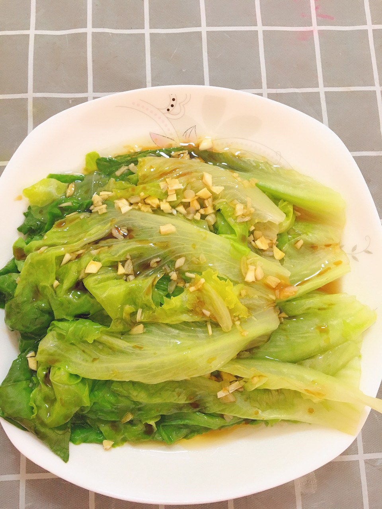

# 白灼生菜 (Cantonese Poached Lettuce with Sizzling Garlic Sauce)

## 📋 基本資訊 / Recipe Overview
- **料理名稱 (繁體)**：白灼生菜
- **料理名称 (简体)**：白灼生菜
- **English Title**：Cantonese Poached Lettuce with Sizzling Garlic Soy Sauce
- **素食流派 / Diet**：全素 / 纯素 Vegan (含蒜蓉；可去蒜做纯净素)
- **料理分類 / Category**：01-蔬菜本味类 / 粤菜经典 / 白灼时蔬
- **份量 / Servings**：2-3 人份
- **準備時間 / Prep Time**：4 分鐘
- **烹飪時間 / Cook Time**：2 分鐘 (水焯 20-30 秒)
- **總計耗時 / Total Time**：6 分鐘
- **來源 / Source**：现代中华素菜 Top 100 · [01-蔬菜本味类.md](../01-蔬菜本味类.md) 第 42 道

## 📖 菜品特色 / Description
滚水焯生菜，蒜蓉豉油，比炒更脆。

---

## 🌿 食材與調味清單 / Ingredients & Seasonings

### 主料
- 鲜脆生菜（罗马生菜、球生菜或结球生菜） 350g
- 大蒜 6-8 瓣（切细碎蒜蓉）
- 红椒丝 1 小撮（配色点缀）

### 焯水护色用料
- 食盐 1 茶匙（约 5g）
- 食用植物油 1/2 汤匙（约 7.5ml）

### 灵魂白灼汁
- 优质生抽 / 纯素蒸鱼豉油 2 汤匙（约 30ml）
- 素蚝油 1 汤匙（约 15ml）
- 白糖 1/2 茶匙（约 2.5g，平衡咸甜）
- 清水 / 素高汤 2 汤匙（约 30ml）

### 激香淋油
- 植物油（花生油或玉米油） 2 汤匙（约 30ml）

---

## 🍳 烹飪步驟 / Step-by-Step Cooking Steps

### 步骤 1：生菜挑选与改刀
1. 生菜一片片剥开，在流动清水中洗净，沥干水分。
2. 较长的生菜叶可中间折断成适口长段。

### 步骤 2：宽水滚烫，闪电焯水（保脆碧绿之魂）
1. 锅中倒入足量宽水（水量充足），大火烧至大滚沸腾。
2. 水中加入 **食盐 1 茶匙** 与 **植物油 1/2 汤匙**（盐入底味，油脂在水面形成保护膜，紧紧封存叶绿素）。
3. 倒入生菜叶，用筷子快速按下完全浸入热水中，**焯烫 15-20 秒**（见生菜变翠绿、刚变软立刻关火捞出，切忌超时，超时生菜必黄必软塌）。

### 步骤 3：沥水摆盘与调汁
1. 迅速捞出沥干水分，整齐摆入长盘中。
2. 小碗中混合生抽 2 汤匙、素蚝油 1 汤匙、白糖 1/2 茶匙与清水 2 汤匙搅拌均匀。
3. 将调好的白灼汁沿盘边四周均匀浇在生菜底部（不要直接倒在蒜蓉上）。

### 步骤 4：堆蒜泼油激香
1. 将剁好的细碎蒜蓉和红椒丝堆放在生菜中央。
2. 净锅烧热 2 汤匙植物油至 7-8 成热（微冒青烟）。
3. 将滚烫的热油迅速均匀泼淋在蒜蓉与红椒丝上，“嗞啦”声中瞬间爆出浓烈熟蒜焦香，即刻端桌享用。

---

## 💡 大厨秘诀 / Chef's Tips

1. **水宽、加盐油、闪电焯水**：水一定要宽，沸腾后加盐加油，生菜下锅 15-20 秒一变翠绿立刻捞出，比炒生菜更水灵脆爽。
2. **生菜必须彻底沥干**：捞出后充分控干水再摆盘，避免生菜自带过多水分冲淡盘底白灼豉油汁。
3. **热油泼蒜瞬间化生为熟**：生蒜堆放表面，滚油一浇瞬间激发出熟蒜浓香与甜味，与甘脆生菜和鲜甜豉油完美交融。

---
*食谱归档时间：2026-08-20 · 收录于 20260818-vegetarianism 本地菜谱库 (1Top 精选)*
