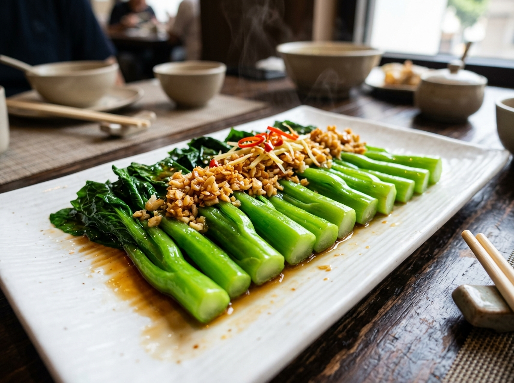

# 白灼菜心 (Cantonese Poached Choy Sum)

## 📋 基本資訊 / Recipe Overview
- **料理名稱 (繁體)**：白灼菜心
- **料理名称 (简体)**：白灼菜心
- **English Title**：Cantonese Poached Choy Sum with Sizzling Garlic Sauce
- **素食流派 / Diet**：全素 / 纯素 Vegan (含蒜；可依戒律去蒜做纯净素)
- **料理分類 / Category**：01-蔬菜本味类 / 粤菜经典 / 白灼时蔬
- **份量 / Servings**：2-3 人份
- **準備時間 / Prep Time**：5 分鐘
- **烹飪時間 / Cook Time**：2-3 分鐘
- **總計耗時 / Total Time**：7-8 分鐘
- **來源 / Source**：现代中华素菜 Top 100 · [01-蔬菜本味类.md](../01-蔬菜本味类.md) 第 1 道

## 📖 菜品特色 / Description
广东家常第一青菜。滚水加盐油焯至翠绿，蒜蓉、生抽、素蚝油淋热油，脆嫩清甜。

---

## 🌿 食材與調味清單 / Ingredients & Seasonings

### 主料
- 广东菜心（或宁夏菜心） 350g
- 大蒜 5-6 瓣（剁成细碎蒜蓉）
- 红椒（选配） 半个（切细丝点缀配色）
- 生姜（选配） 1 小块（切细丝提鲜）

### 焯水调料（锁色关键）
- 食盐 1 茶匙（约 5g）
- 食用植物油 1/2 汤匙

### 灵魂白灼汁配方
- 优质生抽 / 蒸鱼豉油（纯植物酿造） 2 汤匙（约 30ml）
- 素蚝油（香菇素蚝油） 1 汤匙（约 15ml）
- 白糖（提鲜平衡咸度） 1/2 茶匙（约 2.5g）
- 清水 / 素高汤 2 汤匙（约 30ml）

### 激香淋油
- 植物油（花生油或玉米油最佳） 2 汤匙（约 30ml）

---

## 🍳 烹飪步驟 / Step-by-Step Cooking Steps

### 步骤 1：食材处理与改刀
1. 挑选脆嫩菜心，洗净沥干，摘除发黄老叶，削去根部老硬外皮。
2. **改刀技巧**：若菜心根茎较粗，可用刀在根茎底部纵向剖开十字花刀或对半剖开，确保受热均匀且更容易吸味入味。

### 步骤 2：水宽火旺，分段焯烫
1. 锅内倒入足量宽水（水量需完全没过蔬菜），大火烧至完全沸腾。
2. 沸水中加入 **1 茶匙食盐** 与 **1/2 汤匙食用油**（盐入底味，油脂在水面形成保护层锁住叶绿素，使菜心油润碧绿）。
3. **分段下锅**：手持菜叶，先将较粗的菜茎部分浸入沸水中焯烫 30-40 秒；随后将整株菜心推入沸水中，用筷子快速按压浸没，继续焯烫 20-30 秒。
4. 全程焯水控制在 1 分钟左右，菜心颜色翠绿、刚断生立即捞出（切忌久煮，久煮易变软发黄）。

### 步骤 3：控水摆盘
1. 将捞出的菜心迅速沥干水分（亦可快速过一下常温纯净水增加爽脆度），头尾一致整齐码入长盘中。

### 步骤 4：调制酱汁
1. 小碗中混合生抽 2 汤匙、素蚝油 1 汤匙、白糖 1/2 茶匙及清水 2 汤匙搅拌均匀。
2. 将调好的白灼汁沿盘边均匀浇在菜心底部（不要直接淋在蒜末上，以免冲散）。

### 步骤 5：堆蒜泼油，激发出香
1. 将剁好的蒜蓉、红椒丝和姜丝均匀铺在菜心中央。
2. 净锅倒入 2 汤匙植物油，烧至 7-8 成热（微冒青烟）。
3. 趁热将滚烫的热油迅速均匀泼淋在蒜蓉与红椒丝上，“嗞啦”声中瞬间激发出浓郁蒜香，即可端盘享用。

---

## 💡 粤菜大厨秘诀 / Chef's Tips

1. **水宽、火旺、加盐油**：水少会导致菜下锅后温度骤降变“温水泡菜”，大火足水才能秒级锁住叶绿素。
2. **先茎后叶**：根茎纤维厚、叶片薄，分段下锅能让根茎熟透的同时菜叶保持挺拔爽脆。
3. **热油泼蒜是精髓**：生蒜遇高热滚油瞬间转化为熟蒜浓香，与底部的鲜甜豉油汁相得益彰，清甜与浓香兼备。

---
*食谱归档时间：2026-08-20 · 收录于 20260818-vegetarianism 本地菜谱库 (1Top 精选)*
