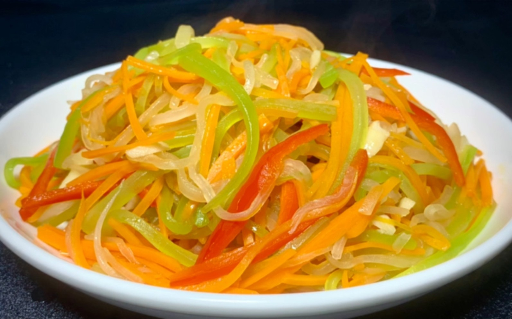

# 素炒三丝 (Stir-Fried Vegetarian Three Shreds (Bamboo Shoots, Carrots & Bell Pepper))

## 📋 基本資訊 / Recipe Overview
- **料理名稱 (繁體)**：素炒三絲
- **料理名称 (简体)**：素炒三丝
- **English Title**：Stir-Fried Vegetarian Three Shreds (Bamboo Shoots, Carrots & Bell Pepper)
- **素食流派 / Diet**：纯素 Vegan
- **料理分類 / Category**：01-蔬菜本味类 / 传统宴席素菜 / 经典小炒
- **份量 / Servings**：2-3 人份
- **準備時間 / Prep Time**：10 分鐘
- **烹飪時間 / Cook Time**：4 分鐘
- **總計耗時 / Total Time**：14 分鐘
- **來源 / Source**：现代中华素菜 Top 100 · [01-蔬菜本味类.md](../01-蔬菜本味类.md) 第 65 道

## 📖 菜品特色 / Description
胡萝卜、笋、青椒或芹菜丝合炒，宴席家常都用。

---

## 🌿 食材與調味清單 / Ingredients & Seasonings
### 主料（三丝组合）
- 鲜竹笋（或水发笋丝/冬笋） 120g
- 鲜红胡萝卜 100g
- 青圆椒（或细青椒/芹菜） 100g

### 辅料与配料
- 鲜生姜 1 小块（切细丝 5g）
- 大蒜 2 瓣（切细丝；纯净素免）

### 调味品
- 优质植物油 1.5 汤匙（约 20ml）
- 食盐 1/2 茶匙（约 3g）
- 纯酿生抽 1 茶匙（约 5ml）
- 白砂糖 1/4 茶匙（约 1g，提鲜）
- 蘑菇精 / 素高汤粉 1/3 茶匙（约 1.5g）
- 水淀粉 1 汤匙（玉米淀粉 1/2 茶匙 + 清水 1 汤匙调匀）
- 纯正芝麻香油 1/2 茶匙（约 2.5ml）

---

## 🍳 烹飪步驟 / Step-by-Step Cooking Steps
### 步骤 1：规范刀工，三丝齐整
1. 竹笋剥壳切除老根，切成长 5-6cm 的均匀细丝。
2. 胡萝卜去皮切成同样长短粗细的细丝。
3. 青椒去籽去筋，顺向切成同等细丝。

### 步骤 2：笋丝胡萝卜丝飞水去涩
1. 锅中烧开宽水，加入少许盐，下入竹笋丝和胡萝卜丝焯烫 45 秒。
2. 捞出迅速过凉水并彻底沥干水分（焯水可去除笋中草酸与生涩味，并让较硬的食材与易熟的青椒成熟度同步）。

### 步骤 3：炝香姜蒜
1. 炒锅烧热，倒入植物油，下姜丝与蒜丝，小火慢煸 10 秒出香。

### 步骤 4：顺次快炒，大火合炒
1. 转大火，先倒入焯过水的笋丝与胡萝卜丝，猛火翻炒 30 秒。
2. 紧接着倒入青椒丝，继续大火翻炒 20 秒至青椒丝变翠绿断生。

### 步骤 5：调味挂芡，琉璃出锅
1. 加入 **食盐 1/2 茶匙**、**白糖 1/4 茶匙**、**生抽 1 茶匙** 与 **蘑菇精 1/3 茶匙** 快速颠炒均匀。
2. 淋入 1 汤匙水淀粉勾极薄琉璃芡，快速翻颠数下使芡汁均匀包裹三丝，淋入半茶匙香油增亮提香，出锅装盘。

---

## 💡 大厨秘诀 / Chef's Tips
1. **三丝粗细齐整，同熟同步**：刀工规范是名席素炒三丝的基础；笋与胡萝卜质地坚实需先焯水，青椒质嫩后下，确保三种食材同时断生且保持脆嫩。
2. **猛火急炒防出汤**：全程保持大火，入锅翻炒总时间控制在 1 分钟左右，防止蔬菜细胞壁破裂吐水变软塌。
3. **薄芡挂味不堆汁**：出锅前勾少许薄薄的水淀粉（琉璃芡），能让调味料紧贴在细丝表面，盘底清爽无积水。

---
*食谱归档时间：2026-08-20 · 收录于 20260818-vegetarianism 本地菜谱库 (1Top 精选)*
