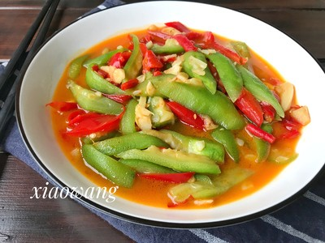

# 素炒丝瓜 (Stir-Fried Sponge Gourd (Luffa) with Ginger)

## 📋 基本資訊 / Recipe Overview
- **料理名稱 (繁體)**：素炒絲瓜
- **料理名称 (简体)**：素炒丝瓜
- **English Title**：Stir-Fried Sponge Gourd (Luffa) with Ginger
- **素食流派 / Diet**：纯素 Vegan (纯净素，无五辛)
- **料理分類 / Category**：01-蔬菜本味类 / 南方夏菜 / 原汁原味
- **份量 / Servings**：2-3 人份
- **準備時間 / Prep Time**：5 分鐘
- **烹飪時間 / Cook Time**：3 分鐘
- **總計耗時 / Total Time**：8 分鐘
- **來源 / Source**：现代中华素菜 Top 100 · [01-蔬菜本味类.md](../01-蔬菜本味类.md) 第 60 道

## 📖 菜品特色 / Description
清炒保本味，南方夏菜。无蒜少油纯素清炒，姜丝提气，凸显丝瓜天然的滑嫩清甜，汤汁清亮透明，消暑生津。

---

## 🌿 食材與調味清單 / Ingredients & Seasonings

### 主料
- 新鲜嫩丝瓜 2 根（约 400g）
- 生姜 1 小块（切极细姜丝）
- 枸杞 8-10 粒（温水泡发）

### 调味料
- 食用植物油 1.5 汤匙（约 22ml）
- 食盐 1/2 茶匙（约 3g）
- 白砂糖 1/4 茶匙（约 1g，激发本味甘甜）
- 温水 2 汤匙（约 30ml）

---

## 🍳 烹飪步驟 / Step-by-Step Cooking Steps

### 步骤 1：现切现炒防氧化
1. 待锅具与配料全部就绪后再处理丝瓜：用刀刮去外层粗皮，洗净切成滚刀块。
2. 生姜切极细姜丝；枸杞温水泡软备用。

### 步骤 2：姜丝炝锅
1. 炒锅烧热倒入食用植物油。
2. 下入细姜丝，小火煸炒数秒至透出清香。

### 步骤 3：大火翻炒与蒸汽快熟
1. 调至大火，倒入丝瓜块，快速颠锅翻炒 40 秒让热油包裹丝瓜。
2. 沿锅边淋入 2 汤匙温水，加盖中大火焖 30 秒，利用高热蒸汽快速让丝瓜内部熟透。

### 步骤 4：调味装盘
1. 揭盖见丝瓜肉转为半透明晶亮状态。
2. 撒入 **食盐 1/2 茶匙**、**白糖 1/4 茶匙** 及泡发枸杞，快速翻拌 5 秒使盐糖融化，即刻出锅装盘。

---

## 💡 大厨秘诀 / Chef's Tips

1. **现切现炒不给氧化时间**：丝瓜切开后立即下锅翻炒，油脂瞬间封闭表面，杜绝变黑。
2. **生姜中和寒性提鲜**：丝瓜性偏甘凉，微量姜丝既能祛除寒气，又能衬托出瓜肉的清甜鲜爽。
3. **不放酱油鸡精**：保持纯素清白透亮的清汤本味，少许白砂糖即可引导出天然瓜甜。

---
*食谱归档时间：2026-08-20 · 收录于 20260818-vegetarianism 本地菜谱库 (1Top 精选)*
