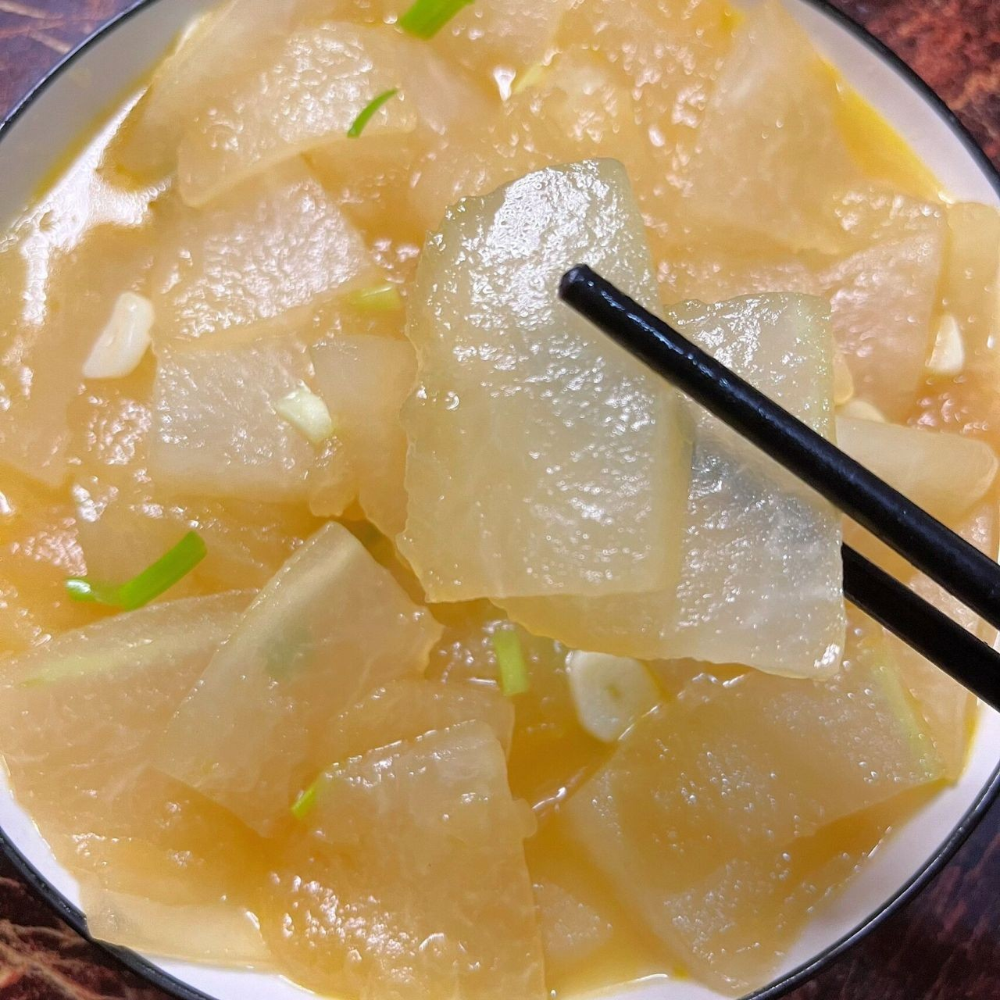

# 素炒冬瓜片 (Stir-Fried Winter Melon Slices)

## 📋 基本資訊 / Recipe Overview
- **料理名稱 (繁體)**：素炒冬瓜片
- **料理名称 (简体)**：素炒冬瓜片
- **English Title**：Stir-Fried Winter Melon Slices
- **素食流派 / Diet**：全素 / 纯素 Vegan (纯素)
- **料理分類 / Category**：01-蔬菜本味类 / 家常清热 / 晶莹滑嫩
- **份量 / Servings**：2-3 人份
- **準備時間 / Prep Time**：5 分鐘
- **烹飪時間 / Cook Time**：4 分鐘
- **總計耗時 / Total Time**：9 分鐘
- **來源 / Source**：现代中华素菜 Top 100 · [01-蔬菜本味类.md](../01-蔬菜本味类.md) 第 91 道

## 📖 菜品特色 / Description
冬瓜薄片快炒，比红烧更清爽。晶莹剔透，软滑爽口，鲜润化渣，利水消暑。

---

## 🌿 食材與調味清單 / Ingredients & Seasonings

### 主料
- 青皮冬瓜 350g（去皮去瓤后净重）
- 生姜 5g（切细姜丝）
- 枸杞 8 粒（温水泡发点缀）

### 调味用料
- 食用植物油 1.5 汤匙（约 22ml）
- 优质生抽 1 茶匙（约 5ml，增鲜微提色）
- 食盐 1/2 茶匙（约 2.5g）
- 白砂糖 1/4 茶匙（约 1g）
- 白胡椒粉 1 小撮（约 0.5g，去寒增香）
- 素高汤 / 清水 3 汤匙（约 45ml）
- 薄水淀粉（玉米淀粉 1/2 茶匙 + 清水 1 汤匙）

---

## 🍳 烹飪步驟 / Step-by-Step Cooking Steps

### 步骤 1：去瓤切薄片
1. 冬瓜削去深绿色硬皮，**彻底挖除内部酸软的瓜瓤和瓜籽**（瓜瓤水分过多易发酸，必须切除干净）。
2. 将冬瓜切成长 4-5 厘米、厚约 0.2-0.3 厘米的均匀薄片（薄片受热快，容易在短时间内炒透晶莹）。

### 步骤 2：姜丝爆香
1. 炒锅烧热，倒入 1.5 汤匙植物油，下入生姜丝中小火煸炒出香味。

### 步骤 3：中大火翻炒断生
1. 倒入冬瓜薄片，转中大火快速翻炒 1.5 分钟，直至冬瓜片边缘开始由实白转为微透明。

### 步骤 4：润汁微焖至透亮
1. 加入 **生抽 1 茶匙**、**食盐 1/2 茶匙**、**白糖 1/4 茶匙**、**白胡椒粉 0.5g** 以及 3 汤匙素高汤。
2. 翻炒均匀后加盖小火焖煮 1.5 分钟，至冬瓜片完全呈晶莹剔透状。

### 步骤 5：勾薄芡装盘
1. 揭盖放入泡发枸杞，淋入薄水淀粉快速翻炒推匀挂汁，关火出锅装盘。

---

## 💡 大厨秘诀 / Chef's Tips

1. **切片厚薄均匀（2-3毫米最佳）**：太厚难炒透需久煮，太薄易烂不成形；2-3毫米薄片能实现极速熟化且保持整齐美观。
2. **彻底切净瓜瓤**：冬瓜瓤含酸度高、口感松散，刮净贴近瓜肉的松软部分能确保成菜清甜爽口。
3. **微量白胡椒粉点睛**：冬瓜性偏凉，加入少许白胡椒粉既能驱除寒气，又能让清淡的瓜味变得鲜香回甘。

---
*食谱归档时间：2026-08-20 · 收录于 20260818-vegetarianism 本地菜谱库 (1Top 精选)*
