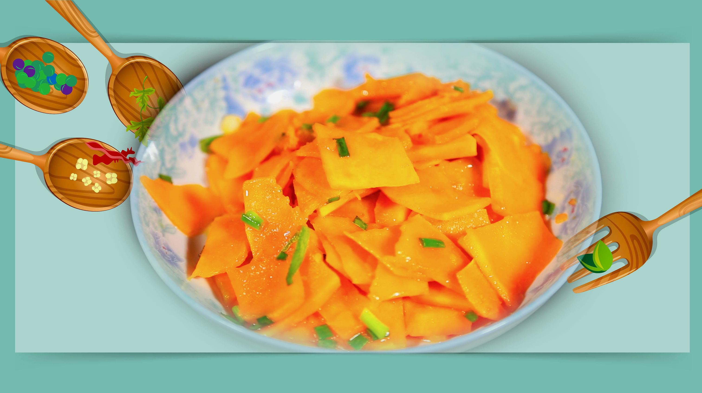

# 素炒南瓜 (Stir-Fried Pumpkin with Garlic (Chinese Sautéed Pumpkin))

## 📋 基本資訊 / Recipe Overview
- **料理名稱 (繁體)**：素炒南瓜
- **料理名称 (简体)**：素炒南瓜
- **English Title**：Stir-Fried Pumpkin with Garlic (Chinese Sautéed Pumpkin)
- **素食流派 / Diet**：纯素 Vegan（含大蒜；戒五辛者可去蒜改用姜丝）
- **料理分類 / Category**：01-蔬菜本味类 / 家常素菜 / 甜糯清鲜
- **份量 / Servings**：2-3 人份
- **準備時間 / Prep Time**：8 分鐘
- **烹飪時間 / Cook Time**：6-8 分鐘
- **總計耗時 / Total Time**：15 分鐘
- **來源 / Source**：现代中华素菜 Top 100 · [01-蔬菜本味类.md](../01-蔬菜本味类.md) 第 63 道

## 📖 菜品特色 / Description
南瓜块或丝清炒，甜软。

---

## 🌿 食材與調味清單 / Ingredients & Seasonings
### 主料
- 新鲜熟甜老南瓜（或板栗南瓜） 400g（去皮去瓤后净重约 350g）

### 配料
- 大蒜 3-4 瓣（切薄片；纯净素以鲜生姜丝 5g 替代）
- 香葱（选配） 1 根（切葱花；五辛素适用）

### 调味品
- 优质植物油 1.5 汤匙（约 20ml）
- 食盐 1/2 茶匙（约 3g）
- 白砂糖 1/3 茶匙（约 1.5g，提鲜激发出南瓜自身糖分）
- 纯酿生抽 1/2 茶匙（约 2.5ml，微量增香，避免深色）
- 清水 / 素高汤 3-4 汤匙（约 45-60ml，焖煮导热用）

---

## 🍳 烹飪步驟 / Step-by-Step Cooking Steps
### 步骤 1：去皮切片，规范厚度
1. 南瓜洗净，切去外层硬皮并刮净瓜瓤与瓜籽。
2. 将南瓜切成厚度约 **0.5 厘米的均匀薄片**（或 1.5 厘米见方小块）。
3. **刀工要点**：切片厚薄务必均匀，太薄翻炒易碎成泥，太厚受热慢不易熟透。

### 步骤 2：热锅凉油，爆香蒜姜
1. 炒锅烧热，倒入 1.5 汤匙植物油。
2. 油温 5 成热时下入蒜片（或姜丝），中小火煸炒 10 秒至蒜香浓郁微黄。

### 步骤 3：大火翻炒，热油包裹
1. 转中大火，倒入南瓜片快速翻炒 1-2 分钟。
2. 使每一片南瓜都均匀裹上一层晶亮油膜，翻炒至南瓜边缘微微发亮通透。

### 步骤 4：烹水加盖，微焖透心
1. 沿锅边均匀淋入 3-4 汤匙清水（或素高汤）。
2. 迅速盖上锅盖，转中小火焖煮 2-3 分钟，利用蒸汽热力将南瓜内部焖至软熟（以锅铲能轻易切断南瓜但南瓜仍保持完整片状为准）。

### 步骤 5：调味收汁，裹亮出锅
1. 揭开锅盖，调入 **食盐 1/2 茶匙**、**白糖 1/3 茶匙** 与 **生抽 1/2 茶匙**。
2. 转大火快速轻柔颠锅翻炒 15-20 秒，将剩余的少量汤汁收浓，使南瓜原汁自然挂满瓜片，撒上葱花即可出锅装盘。

---

## 💡 大厨秘诀 / Chef's Tips
1. **切片厚薄 0.5cm 为黄金标准**：南瓜淀粉糖分高，太薄加热后极易碎烂散架；0.5cm 厚片既能快速熟透，又能保持完整油润品相。
2. **水少焖煮，切忌煮成南瓜汤**：加水仅作导热媒介，3-4 汤匙即可，靠锅内密闭蒸汽让南瓜自内而外软糯回甜。
3. **后放盐防脱水碎烂**：出锅前调盐，避免过早加盐破坏南瓜植物细胞壁导致大量出水化渣。

---
*食谱归档时间：2026-08-20 · 收录于 20260818-vegetarianism 本地菜谱库 (1Top 精选)*
