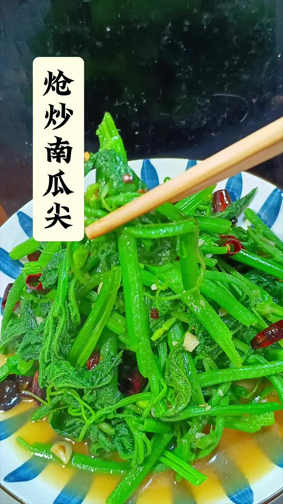

# 素炒南瓜尖 (Stir-Fried Pumpkin Shoots)

## 📋 基本資訊 / Recipe Overview
- **料理名稱 (繁體)**：素炒南瓜尖
- **料理名称 (简体)**：素炒南瓜尖
- **English Title**：Stir-Fried Pumpkin Shoots (Tender Pumpkin Vine Shoots)
- **素食流派 / Diet**：全素 / 纯素 Vegan (含蒜、干辣椒；可去蒜做纯净素)
- **料理分類 / Category**：01-蔬菜本味类 / 西南华南乡土时令 / 快炒青菜
- **份量 / Servings**：2-3 人份
- **準備時間 / Prep Time**：15 分鐘
- **烹飪時間 / Cook Time**：2-3 分鐘
- **總計耗時 / Total Time**：18 分鐘
- **來源 / Source**：现代中华素菜 Top 100 · [01-蔬菜本味类.md](../01-蔬菜本味类.md) 第 82 道

## 📖 菜品特色 / Description
南瓜嫩尖快炒，西南、华南特色乡野时令菜。撕去外皮老筋与表面绒毛，蒜香微辣大火快炒，口感清脆甘甜，齿颊留香。

---

## 🌿 食材與調味清單 / Ingredients & Seasonings

### 主料
- 鲜嫩南瓜尖（南瓜藤嫩梢及幼叶） 350g
- 大蒜 4 瓣（剁碎成蒜蓉）
- 干辣椒 2-3 个（剪成小段）

### 去绒毛与洗涤用料
- 食盐 1 茶匙（约 5g，用于淡盐温水揉洗去除叶片细毛）
- 温水（约 40℃） 适量

### 炒制调料
- 食用植物油（建议菜籽油或花生油） 2 汤匙（约 30ml）
- 食盐 1/2 茶匙（约 3g）
- 素蚝油 / 松茸鲜 1 茶匙（约 5ml）
- 白砂糖 1/4 茶匙（约 1g，提鲜中和生涩）

---

## 🍳 烹飪步驟 / Step-by-Step Cooking Steps

### 步骤 1：细致撕皮与去绒毛（核心前处理）
1. **顺藤撕皮**：从南瓜尖粗端（切口处）开始，用指甲掐住外层老皮向下顺撕，将藤茎表面较韧的外皮和粗硬绒毛彻底撕净（幼嫩顶端可保留，较硬茎部必须撕净）。
2. **盐水揉洗**：撕好后摘成 4-5 厘米长段，将嫩叶与嫩茎一同放入盆中，撒入 1 茶匙食盐，加入 40℃ 左右温水，用双手轻轻揉搓叶片表面，使叶背细毛软化脱落，随后用清水冲洗 2-3 遍，彻底沥干水分。

### 步骤 2：辅料改刀备料
1. 大蒜拍碎切成蒜末；干辣椒剪成小段，轻轻抖掉内部辣椒籽。

### 步骤 3：热锅温油爆香辅料
1. 炒锅烧热，倒入 2 汤匙食用油，油温升至 5 成热时下入蒜末和干辣椒段。
2. 转中小火慢煸出浓郁的蒜香与椒香（注意火候，切勿将蒜末和辣椒煸焦变黑）。

### 步骤 4：大火猛炒，极速断生
1. 迅速将炉火调至**最大旺火**。
2. 先倒入较硬的南瓜尖茎段快速翻炒 15 秒，紧接着下入全部嫩叶。
3. 保持大火快速颠锅翻炒 30-40 秒，让南瓜尖在滚热油气中受热变翠绿断生。

### 步骤 5：调味收汁出锅
1. 见叶片微微软缩翠绿，立即撒入 **食盐 1/2 茶匙**、**白糖 1/4 茶匙** 与 **素蚝油 1 茶匙**。
2. 保持最大火猛翻 10 秒使调味完全融合包裹，即刻关火出锅装盘。

---

## 💡 大厨秘诀 / Chef's Tips

1. **撕皮务尽防扎喉**：南瓜尖的粗纤维和表皮绒毛是影响口感的主要原因，必须顺着纤维撕干净外皮，才能保证滑嫩脆爽。
2. **盐水轻揉去叶毛**：南瓜叶带毛，用淡盐温水轻轻搓洗能破坏绒毛附着力，洗净后口感丝滑不涩。
3. **猛火急炒保脆嫩**：南瓜尖组织薄嫩多汁，全程大火爆炒在 1-2 分钟内完成，炒久易发黑出水变软。

---
*食谱归档时间：2026-08-20 · 收录于 20260818-vegetarianism 本地菜谱库 (1Top 精选)*
