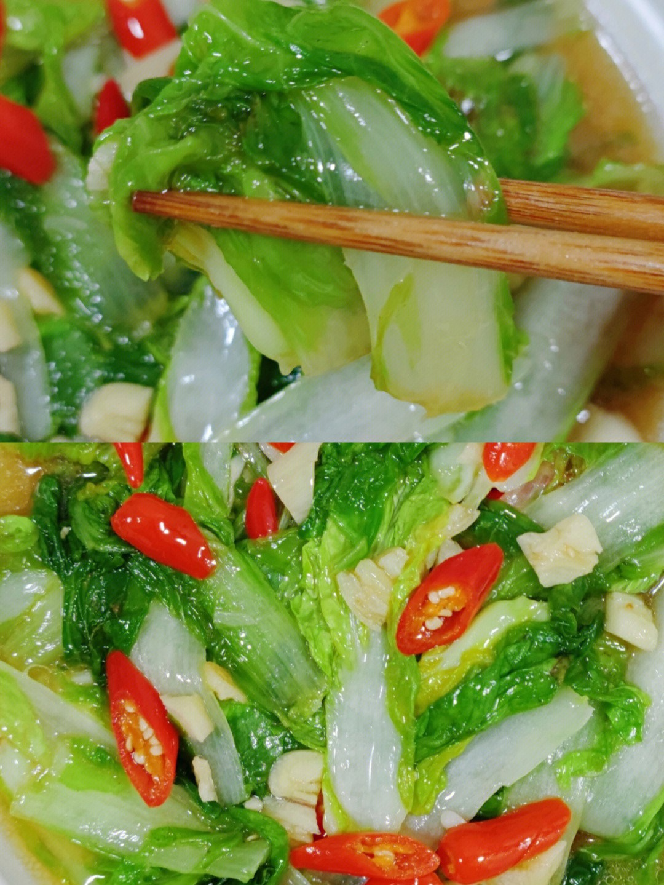

# 素炒大白菜 (Stir-Fried Chinese Cabbage (Sautéed Napa Cabbage))

## 📋 基本資訊 / Recipe Overview
- **料理名稱 (繁體)**：素炒大白菜
- **料理名称 (简体)**：素炒大白菜
- **English Title**：Stir-Fried Chinese Cabbage (Sautéed Napa Cabbage)
- **素食流派 / Diet**：纯素 Vegan
- **料理分類 / Category**：01-蔬菜本味类 / 经典家常 / 清甜原味
- **份量 / Servings**：2-3 人份
- **準備時間 / Prep Time**：6 分鐘
- **烹飪時間 / Cook Time**：4 分鐘
- **總計耗時 / Total Time**：10 分鐘
- **來源 / Source**：现代中华素菜 Top 100 · [01-蔬菜本味类.md](../01-蔬菜本味类.md) 第 68 道

## 📖 菜品特色 / Description
大白菜帮叶分开炒，比醋溜更淡。

---

## 🌿 食材與調味清單 / Ingredients & Seasonings
### 主料
- 鲜甜大白菜（胶东或黄芽白菜） 450g

### 配料
- 鲜生姜 1 小块（切细丝 5g）
- 大蒜 3 瓣（切薄片；纯净素免）
- 大葱白 1 小段（切丝；可选）
- 干红辣椒 1 根（剪段；可选点缀）

### 调味品
- 优质植物油 1.5 汤匙（约 20ml）
- 食盐 1/2 茶匙（约 3g）
- 纯酿生抽 1 茶匙（约 5ml，提鲜不重色）
- 白砂糖 1/3 茶匙（约 1.5g，吊出白菜本味清甜）
- 水淀粉 1 汤匙（淀粉 1/2 茶匙 + 水 1 汤匙，锁汁防出汤）
- 纯正芝麻香油 2-3 滴

---

## 🍳 烹飪步驟 / Step-by-Step Cooking Steps
### 步骤 1：帮叶分离，斜刀片帮
1. 大白菜洗净沥干，用刀将白菜帮与白菜叶切开分放。
2. **白菜帮斜刀片切（抹刀片）**：刀刃倾斜 45 度，将白菜帮片成厚约 3mm 的薄片（增大受热面积，更易入味脆嫩）。
3. 白菜叶手撕或切成大块备用。

### 步骤 2：爆香姜蒜
1. 炒锅烧热，注入植物油，油温 5 成热下姜丝、蒜片和葱白，小火煸出香味。

### 步骤 3：先炒菜帮，大火煸脆
1. 转大火，先倒入白菜帮片，猛火翻炒 1-1.5 分钟。
2. 炒至白菜帮边缘由白转为半透明、微出水分且断生脆嫩。

### 步骤 4：后下菜叶，合炒调味
1. 倒入白菜叶，继续大火翻炒 30 秒至菜叶软化变塌。
2. 迅速加入 **食盐 1/2 茶匙**、**生抽 1 茶匙** 与 **白糖 1/3 茶匙** 翻炒均匀。

### 步骤 5：薄芡锁汁，滴油出锅
1. 沿锅中淋入 1 汤匙水淀粉，快速大火颠锅翻拌 10 秒，使芡汁紧紧裹住白菜出汁，滴入 2-3 滴香油，立即出锅装盘。

---

## 💡 大厨秘诀 / Chef's Tips
1. **帮叶必须分开下锅**：白菜帮厚实多汁需炒透，菜叶极薄易烂；先帮后叶能保证帮脆嫩多汁、叶鲜软不黑烂。
2. **斜刀片帮破纤维**：斜刀切断白菜纵向粗纤维，受热面积成倍增加，既容易熟透，又能完美吸附底油姜香。
3. **薄薄勾芡防塌汤**：大白菜含水量极高，出锅前淋少许琉璃芡，能将鲜甜汤汁封在菜体表面，盛盘不析出大量寡水。

---
*食谱归档时间：2026-08-20 · 收录于 20260818-vegetarianism 本地菜谱库 (1Top 精选)*
