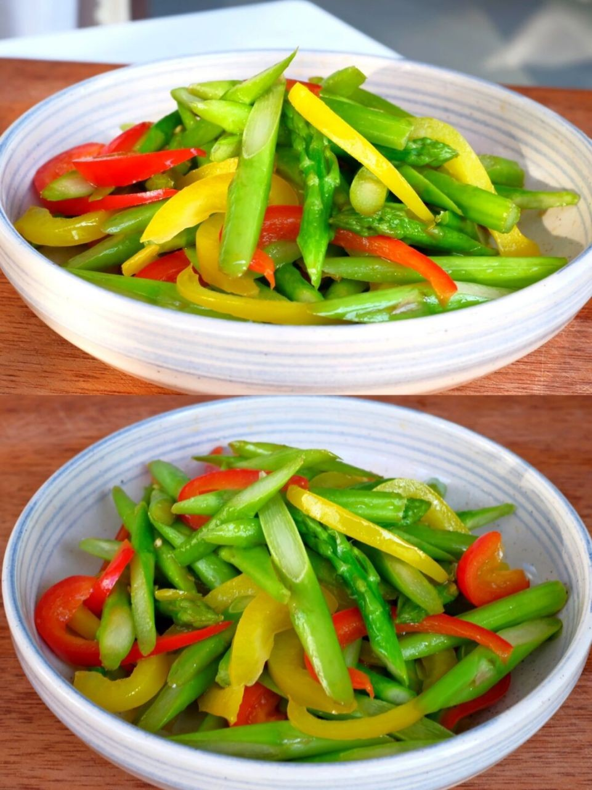

# 素炒彩椒 (Stir-Fried Tri-Color Bell Peppers)

## 📋 基本資訊 / Recipe Overview
- **料理名稱 (繁體)**：素炒彩椒
- **料理名称 (简体)**：素炒彩椒
- **English Title**：Stir-Fried Tri-Color Bell Peppers
- **素食流派 / Diet**：全素 / 纯素 Vegan (纯素)
- **料理分類 / Category**：01-蔬菜本味类 / 缤纷时蔬 / 快炒甜脆
- **份量 / Servings**：2-3 人份
- **準備時間 / Prep Time**：5 分鐘
- **烹飪時間 / Cook Time**：2-3 分鐘
- **總計耗時 / Total Time**：8 分鐘
- **來源 / Source**：现代中华素菜 Top 100 · [01-蔬菜本味类.md](../01-蔬菜本味类.md) 第 85 道

## 📖 菜品特色 / Description
彩椒快炒，红黄绿三色相间，颜色好看，口感脆甜多汁，富含天然维生素C。

---

## 🌿 食材與調味清單 / Ingredients & Seasonings

### 主料
- 红彩椒 100g
- 黄彩椒 100g
- 绿彩椒（或绿甜椒） 100g
- 大蒜 3 瓣（切蒜片；无蒜版可用生姜 5g 切菱形片）

### 复合琉璃芡汁
- 素蚝油 1 茶匙（约 5ml）
- 食盐 1/2 茶匙（约 2.5g）
- 白砂糖 1/4 茶匙（约 1g）
- 玉米淀粉 1/2 茶匙（约 2g）
- 清水 2 汤匙（约 30ml）

### 烹调用油
- 食用植物油 1.5 汤匙（约 22ml）

---

## 🍳 烹飪步驟 / Step-by-Step Cooking Steps

### 步骤 1：菱形切块
1. 红、黄、绿彩椒洗净，去蒂去籽，用刀削去内部过厚的白色海绵组织。
2. 将彩椒切成大小均匀的菱形小块（约 2.5cm 见方），大小一致能保证受热均匀。

### 步骤 2：预调碗芡
1. 小碗中混合素蚝油 1 茶匙、食盐 1/2 茶匙、白糖 1/4 茶匙、玉米淀粉 1/2 茶匙及清水 2 汤匙，搅拌均匀备用。

### 步骤 3：热油爆香
1. 炒锅烧热，倒入食用植物油，油温 5 成热时下入蒜片（或姜片）煸炒出香味。

### 步骤 4：大火极速翻炒
1. 调至**最大猛火**，将三色彩椒块一齐倒入锅中。
2. 快速颠锅大火翻炒 40-50 秒，使彩椒均匀裹上热油，颜色变得格外鲜艳明亮、刚至断生状态。

### 步骤 5：淋芡裹汁出锅
1. 将调好的芡汁重新搅匀，沿锅边淋入锅中。
2. 保持大火快速翻炒 10 秒，让透明的薄芡均匀包裹在每块彩椒表面，亮油关火装盘。

---

## 💡 大厨秘诀 / Chef's Tips

1. **全程猛火短炒**：彩椒水分充沛且质地脆嫩，炒制时间严控在 1 分钟左右，切忌加水久煮，否则外皮起皱软塌出水。
2. **勾极薄琉璃芡**：彩椒外皮光滑不易挂味，勾一层轻薄透明的水淀粉能锁住汁水与调料，成菜晶莹油亮。
3. **去内膜口感更脆甜**：削去白色的内膜筋不仅使口感更为纯粹爽脆，还能去除残余生涩。

---
*食谱归档时间：2026-08-20 · 收录于 20260818-vegetarianism 本地菜谱库 (1Top 精选)*
