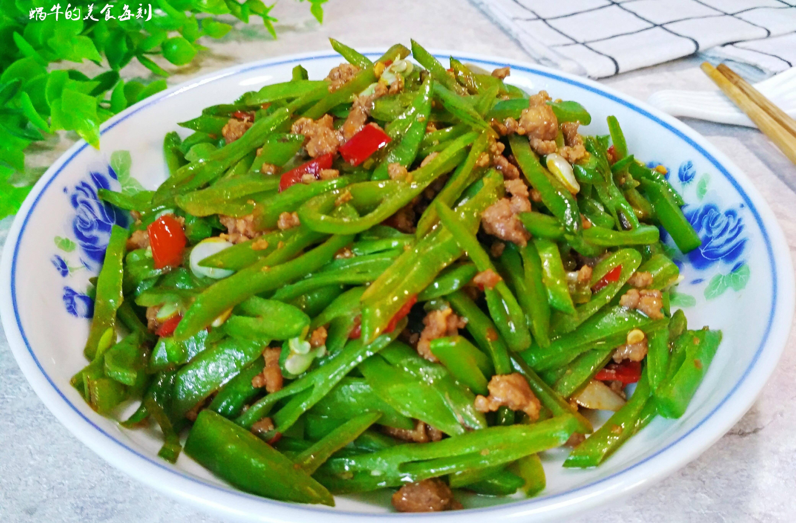

# 素炒扁豆 (Stir-Fried Flat Green Beans)

## 📋 基本資訊 / Recipe Overview
- **料理名稱 (繁體)**：素炒扁豆
- **料理名称 (简体)**：素炒扁豆
- **English Title**：Stir-Fried Flat Green Beans (Hyacinth Beans)
- **素食流派 / Diet**：全素 / 纯素 Vegan (含蒜；可去蒜做纯净素)
- **料理分類 / Category**：01-蔬菜本味类 / 家常时令 / 焖炒透熟
- **份量 / Servings**：2-3 人份
- **準備時間 / Prep Time**：8 分鐘
- **烹飪時間 / Cook Time**：6-8 分鐘
- **總計耗時 / Total Time**：15 分鐘
- **來源 / Source**：现代中华素菜 Top 100 · [01-蔬菜本味类.md](../01-蔬菜本味类.md) 第 99 道

## 📖 菜品特色 / Description
扁豆清炒（非干煸），家常经典。撕去老筋斜切成丝，水油焖透确保完全熟透安全，鲜脆爽口，酱香入味。

---

## 🌿 食材與調味清單 / Ingredients & Seasonings

### 主料
- 新鲜扁豆 / 白扁豆 / 油豆 300g
- 大蒜 4 瓣（切片，分两半）
- 生姜丝 3g

### 焖炒调料
- 食用植物油 2 汤匙（约 30ml）
- 优质生抽 1 汤匙（约 15ml）
- 香菇素蚝油 1 茶匙（约 5ml）
- 食盐 1/2 茶匙（约 2.5g）
- 白砂糖 1/4 茶匙（约 1g）
- 沸水 100ml（焖透关键）

---

## 🍳 烹飪步驟 / Step-by-Step Cooking Steps

### 步骤 1：撕老筋与斜切丝（安全与口感关键）
1. 扁豆折断两头，顺势向下撕除两侧的粗硬老筋（老筋必须彻底撕净）。
2. 洗净沥干，斜刀切成约 0.5 厘米宽的细条或斜段（切丝切段大大缩短熟化时间，更易熟透入味）。

### 步骤 2：炝锅起香
1. 炒锅倒入 2 汤匙植物油烧热，下入姜丝和一半蒜片，中小火煸出香味。

### 步骤 3：煸炒变翠绿
1. 倒入扁豆丝，转中大火翻炒 2 分钟，直至扁豆变成油润翠绿色、表面微起小泡。

### 步骤 4：加开水加盖焖透（必须彻底熟透）
1. 加入 **生抽 1 汤匙** 和 **素蚝油 1 茶匙** 翻炒上色。
2. 倒入 **100ml 沸水**，翻匀后立即盖上锅盖，转中小火焖煮 4-5 分钟，让蒸汽将扁豆内部彻底焖熟透、完全失去生豆腥味。

### 步骤 5：大火收汁与出锅
1. 揭开锅盖转大火翻炒收汁，撒入剩余蒜片、**食盐 1/2 茶匙** 与 **白糖 1/4 茶匙**。
2. 大火快速翻炒至汤汁收浓、紧紧包裹在扁豆表面，亮油关火装盘。

---

## 💡 大厨秘诀 / Chef's Tips

1. **彻底撕净两侧老筋**：老筋粗硬难嚼且阻碍热量渗透，撕除干净才能保证软脆适口。
2. **加开水加盖焖透（安全第一法则）**：扁豆含天然植物血凝素和皂苷，未熟透易引发食物中毒；烹饪时必须加水盖盖焖烧至彻底变软熟透。
3. **斜切细丝助熟入味**：斜切增大切面面积，开水加盖焖烧既加速毒素灭活，又能让鲜咸酱汁深层渗入。

---
*食谱归档时间：2026-08-20 · 收录于 20260818-vegetarianism 本地菜谱库 (1Top 精选)*
