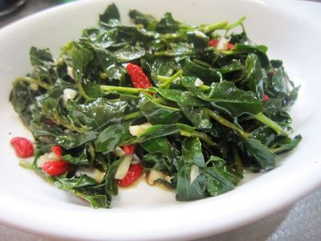

# 素炒枸杞叶 (Sautéed Chinese Boxthorn Leaves (Goji Greens with Garlic))

## 📋 基本資訊 / Recipe Overview
- **料理名稱 (繁體)**：素炒枸杞葉
- **料理名称 (简体)**：素炒枸杞叶
- **English Title**：Sautéed Chinese Boxthorn Leaves (Goji Greens with Garlic)
- **素食流派 / Diet**：纯素 Vegan（含蒜；纯素以生姜丝替代）
- **料理分類 / Category**：01-蔬菜本味类 / 岭南闽南药膳 / 时令养生
- **份量 / Servings**：2-3 人份
- **準備時間 / Prep Time**：6 分鐘
- **烹飪時間 / Cook Time**：1.5 分鐘 (快炒 35 秒)
- **總計耗時 / Total Time**：7.5 分鐘
- **來源 / Source**：现代中华素菜 Top 100 · [01-蔬菜本味类.md](../01-蔬菜本味类.md) 第 78 道

## 📖 菜品特色 / Description
枸杞叶蒜蓉炒，两广、闽南时令。

---

## 🌿 食材與調味清單 / Ingredients & Seasonings
### 主料
- 新鲜幼嫩枸杞叶（摘取嫩叶与嫩梢尖） 300g

### 配料
- 优质宁夏干枸杞子 15 粒（温水泡发 5 分钟，红绿相映添清甜）
- 大蒜 4 瓣（剁碎成细蒜蓉；纯素以鲜生姜丝 5g 替代）

### 调味料
- 食用植物油（花生油配少量芝麻油） 1.5 汤匙（约 20ml）
- 食盐 1/2 茶匙（约 3g）
- 白砂糖 1/4 茶匙（约 1g）
- 广东米酒 / 黄酒 1/2 茶匙（约 2.5ml）
- 清水 1 汤匙（约 15ml）

---

## 🍳 烹飪步驟 / Step-by-Step Cooking Steps
### 步骤 1：细心择叶，彻底沥干
1. 顺着枸杞嫩茎自上而下小心摘取嫩叶和顶部嫩心（避开茎部硬刺），老硬老叶弃用。
2. 清水漂洗干净，放入沥水篮彻底沥干表面水分。

### 步骤 2：爆香金银蒜
1. 炒锅烧热倒油，油温 5 成热下入 2/3 蒜蓉（或姜丝），中小火慢煸出浓郁蒜香。

### 步骤 3：最大猛火，叶果齐下
1. 调至最大猛火，倒入全部枸杞叶与泡软的枸杞果。
2. 快速翻炒 15-20 秒，叶片在高温下迅速变软转深碧绿。

### 步骤 4：烹酒入汽，调味提香
1. 顺锅边烹入 **米酒 1/2 茶匙** 与 **清水 1 汤匙**，产生瞬间蒸汽。
2. 撒入 **食盐 1/2 茶匙**、**白糖 1/4 茶匙**，并加入剩余的 **1/3 生蒜末**。

### 步骤 5：闪电翻匀出锅
1. 猛火颠锅翻炒 10 秒即刻关火出锅装盘（从入锅到盛盘不超过 40 秒，防叶片发黄出苦水）。

---

## 💡 大厨秘诀 / Chef's Tips
1. **只摘嫩叶防扎嘴**：枸杞老茎多硬刺且纤维粗，只取翠绿嫩叶与顶尖，入口细腻无渣。
2. **40 秒闪电快炒**：枸杞叶质地薄嫩，久炒会析出过多苦汁并使叶片发黑发黄，极速断生是碧绿爽滑的关键。
3. **搭配枸杞果与米酒**：枸杞叶微带回甘微苦，配以红枸杞果的天然果糖与米酒醇香，甘苦相融，清心润燥。

---
*食谱归档时间：2026-08-20 · 收录于 20260818-vegetarianism 本地菜谱库 (1Top 精选)*
