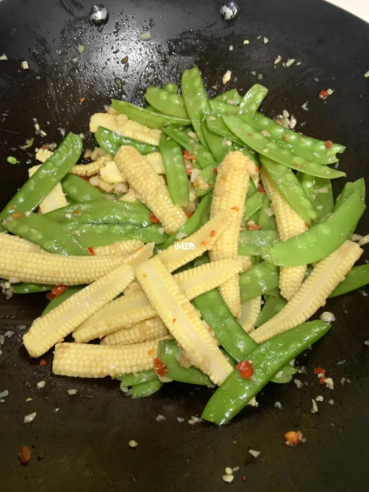

# 素炒玉米笋 (Stir-Fried Baby Corn)

## 📋 基本資訊 / Recipe Overview
- **料理名稱 (繁體)**：素炒玉米筍
- **料理名称 (简体)**：素炒玉米笋
- **English Title**：Stir-Fried Baby Corn with Wood Ear and Carrots
- **素食流派 / Diet**：全素 / 纯素 Vegan (纯素)
- **料理分類 / Category**：01-蔬菜本味类 / 爽脆清炒 / 宴席家常
- **份量 / Servings**：2-3 人份
- **準備時間 / Prep Time**：8 分鐘
- **烹飪時間 / Cook Time**：3-4 分鐘
- **總計耗時 / Total Time**：12 分鐘
- **來源 / Source**：现代中华素菜 Top 100 · [01-蔬菜本味类.md](../01-蔬菜本味类.md) 第 86 道

## 📖 菜品特色 / Description
玉米笋快炒或做配，甜脆清香。配以少许胡萝卜与黑木耳，色彩分明，口感层次丰富。

---

## 🌿 食材與調味清單 / Ingredients & Seasonings

### 主料
- 新鲜或真空包装玉米笋 250g
- 水发黑木耳 50g（撕成小朵）
- 胡萝卜 30g（切菱形薄片配色）
- 生姜 2 片（切末或姜丝）/ 大蒜 3 瓣（切片）

### 焯水调料
- 食盐 1/2 茶匙
- 食用植物油 1/2 汤匙

### 炒制调味汁
- 素蚝油 1 汤匙（约 15ml）
- 食盐 1/3 茶匙（约 2g）
- 白砂糖 1/4 茶匙（约 1g）
- 素高汤 / 清水 2 汤匙（约 30ml）
- 玉米淀粉 1/2 茶匙（加 1 汤匙水调成水淀粉）
- 植物油 1.5 汤匙（约 22ml）

---

## 🍳 烹飪步驟 / Step-by-Step Cooking Steps

### 步骤 1：食材改刀
1. 玉米笋洗净，沥干水分，斜刀一分为二切成斜段（斜切增大横截面更易入味）。
2. 胡萝卜切菱形薄片，水发木耳洗净撕成适口小朵。

### 步骤 2：水油焯烫断生
1. 锅内加宽水大火烧沸，加入 1/2 茶匙食盐和 1/2 汤匙植物油。
2. 放入玉米笋段、胡萝卜片与木耳，焯烫 1.5-2 分钟至玉米笋八成熟。
3. 捞出后迅速放入凉水中过凉，沥干水分备用（过凉能锁住金黄色泽与爽脆口感）。

### 步骤 3：热锅炝香
1. 炒锅烧热，倒入 1.5 汤匙植物油，油热后下入姜末（或蒜片）爆香。

### 步骤 4：大火快炒
1. 倒入沥干水分的玉米笋、胡萝卜与黑木耳，转大火猛火翻炒 1 分钟。

### 步骤 5：调味挂汁
1. 加入素蚝油、盐、白糖和 2 汤匙素高汤翻炒均匀。
2. 淋入调好的薄水淀粉，大火翻炒 10 秒至芡汁收紧光亮，出锅装盘。

---

## 💡 大厨秘诀 / Chef's Tips

1. **焯水去涩保脆度**：玉米笋质地紧密且带轻微生青草味，先焯水 2 分钟能去除杂味并确保炒制时内外受热一致。
2. **过冷水防止余温变软**：焯烫后快速过冷水让植物纤维紧缩，保持“咬下去咔嚓脆”的口感。
3. **斜切更易挂汁**：玉米笋斜刀切开能露出密集的细小幼粒，更易吸附鲜醇的素蚝油芡汁。

---
*食谱归档时间：2026-08-20 · 收录于 20260818-vegetarianism 本地菜谱库 (1Top 精选)*
